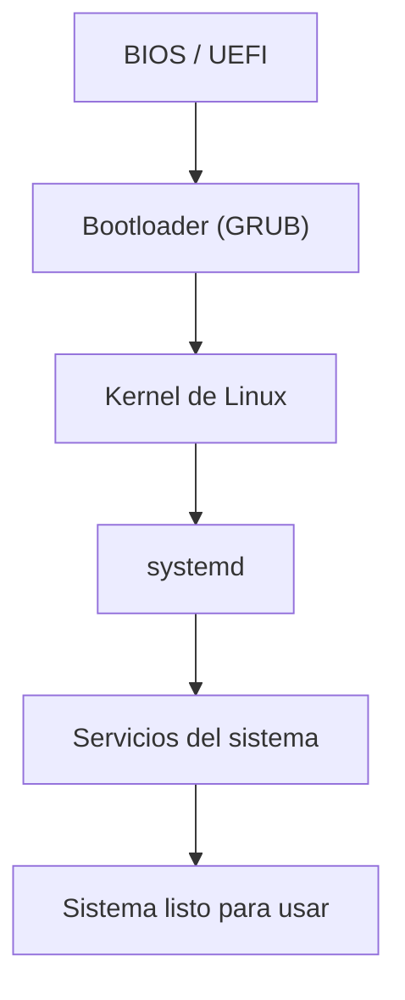

# Arranque del sistema (boot process)

El **arranque del sistema** es el proceso que ocurre desde que se enciende la computadora hasta que el sistema operativo está listo para usarse.

En Linux, este proceso ocurre en varias etapas.

Cada etapa prepara el sistema para la siguiente hasta que finalmente el sistema queda completamente operativo.

---

# Etapas principales del arranque

El proceso de arranque en Linux normalmente sigue estas etapas:

1. Firmware (BIOS o UEFI)
2. Bootloader
3. Kernel de Linux
4. Inicialización del sistema
5. Servicios del sistema

Cada etapa tiene un papel específico en iniciar el sistema.

---

# Firmware: BIOS o UEFI

Cuando se enciende la computadora, el primer software que se ejecuta es el **firmware del hardware**.

Puede ser:

```
BIOS
UEFI
```

El firmware realiza tareas iniciales como:

- verificar el hardware
- inicializar dispositivos
- buscar un dispositivo de arranque

Después de esto, el firmware carga el **bootloader**.

---

# Bootloader

El **bootloader** es un programa pequeño encargado de cargar el sistema operativo.

En muchos sistemas Linux se utiliza:

```
GRUB
```

El bootloader permite:

- seleccionar el sistema operativo
- elegir diferentes versiones del kernel
- iniciar el kernel de Linux

---

# Kernel de Linux

Después de que el bootloader carga el kernel, el **kernel de Linux** toma el control del sistema.

El kernel se encarga de:

- detectar hardware
- montar el sistema de archivos
- iniciar procesos esenciales
- preparar el entorno del sistema

El kernel es el núcleo del sistema operativo.

---

# Inicialización del sistema

Después de que el kernel se carga, el sistema ejecuta el **proceso de inicialización**.

En sistemas Linux modernos, este proceso es gestionado por:

```
systemd
```

`systemd` se encarga de:

- iniciar servicios del sistema
- preparar el entorno de usuario
- configurar recursos del sistema

---

# Inicio de servicios

Finalmente, el sistema inicia diferentes **servicios del sistema**.

Por ejemplo:

- servicios de red
- servicios de registro (logging)
- servidores SSH
- otros servicios necesarios

Una vez que estos servicios están activos, el sistema está listo para ser utilizado.

---

# Flujo simplificado del arranque

El proceso completo puede resumirse así:



---

# Importancia del proceso de arranque

Comprender el proceso de arranque es útil cuando:

- el sistema no inicia correctamente
- se necesita cambiar el kernel
- se investigan problemas del sistema
- se administran servidores

Los administradores de sistemas suelen analizar el arranque cuando diagnostican problemas.

---

# Idea clave de esta lección

El arranque de Linux es un proceso en varias etapas que inicia desde el firmware del hardware y termina cuando los servicios del sistema están activos.

---

# Repaso

- El arranque inicia con BIOS o UEFI.
- El bootloader carga el kernel.
- El kernel inicializa el sistema.
- `systemd` inicia los servicios.
- Finalmente el sistema queda listo para usarse.