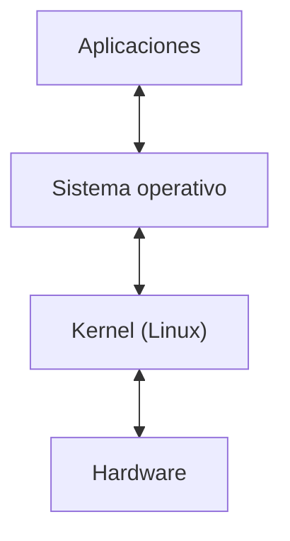

# ¿Qué es Linux?

Cuando escuchamos la palabra **Linux**, muchas personas piensan inmediatamente en un sistema operativo, similar a Windows o macOS.  

Pero técnicamente, **Linux no es todo el sistema operativo**.  
Linux es el núcleo del sistema operativo, también llamado **kernel**.

---

## El kernel: el corazón del sistema

El **kernel** es el programa central que permite que el software interactúe con el hardware de la computadora.

El kernel se encarga de tareas fundamentales como:

- administrar la **memoria**
- controlar el **procesador**
- gestionar **dispositivos** como discos, teclado o red
- coordinar los **procesos** que se ejecutan en el sistema

En otras palabras, el kernel es el intermediario entre el hardware y los programas.

---

---

## Entonces, ¿por qué todo el mundo le llama Linux?

En la práctica, cuando la gente dice **Linux**, normalmente se refiere a un sistema operativo completo basado en el kernel Linux.

Estos sistemas incluyen:

- el **kernel Linux**
- herramientas del sistema
- una terminal
- administradores de paquetes
- programas básicos
- a veces una interfaz gráfica

A estas combinaciones se les llama **distribuciones de Linux**.

Más adelante veremos ejemplos como:

- Ubuntu  
- Debian  
- Fedora  
- Arch Linux  

---

## Una característica fundamental: software libre

Linux es software libre y de código abierto.

Esto significa que:

- cualquiera puede **ver el código**
- cualquiera puede **modificarlo**
- cualquiera puede **distribuirlo**

Gracias a esto, miles de desarrolladores en todo el mundo contribuyen constantemente a mejorar Linux.

---

## ¿Por qué Linux es tan importante?

Hoy en día Linux está en todas partes.

Por ejemplo:

- la mayoría de **servidores de internet**
- infraestructura cloud
- supercomputadoras
- Android
- routers y dispositivos embebidos

Incluso muchas empresas tecnológicas gigantes dependen de Linux.

---

## Idea clave de esta lección

Linux es el **kernel**, el núcleo de un sistema operativo.  

Pero cuando la gente habla de **Linux**, normalmente se refiere a un sistema operativo completo construido alrededor de ese kernel.
