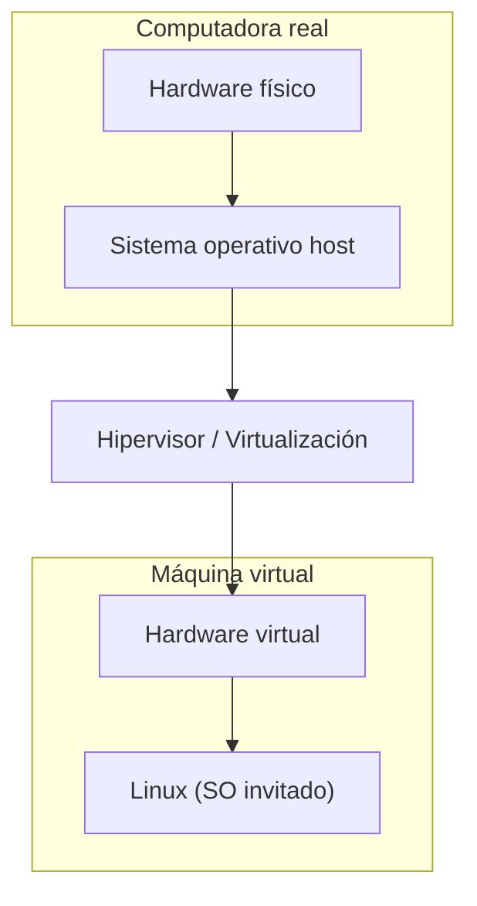

# Introducción práctica a instalación de Linux en máquina virtual

Una de las mejores formas de aprender Linux es **instalarlo y usarlo directamente**.

Pero muchas personas tienen una preocupación válida:

> ¿Qué pasa si rompo algo en mi computadora?
> 

La solución más común es utilizar una **máquina virtual**.

Esto permite experimentar con Linux de forma segura, sin afectar tu sistema principal.

---

# ¿Qué es una máquina virtual?

Una **máquina virtual (VM)** es una computadora simulada que corre dentro de otra computadora.

Tu computadora real ejecuta un programa especial llamado **hipervisor**, que permite crear sistemas operativos virtuales.

Dentro de esa máquina virtual puedes instalar Linux como si fuera una computadora independiente.

Visualmente, se vería algo así:

Desde el punto de vista del sistema operativo invitado, parece que está ejecutándose en una máquina real.

---

# ¿Por qué usar una máquina virtual para aprender Linux?

Las máquinas virtuales son ideales para aprender porque permiten:

**Experimentar sin riesgos**

Si algo falla, puedes borrar la máquina virtual y crear otra.

**Tener varios sistemas operativos**

Puedes ejecutar Linux dentro de Windows o macOS.

**Aprender administración de sistemas**

Muchos entornos profesionales usan máquinas virtuales o tecnologías similares.

**Crear entornos de prueba**

Puedes instalar software, romper configuraciones y aprender sin miedo.

---

# Software común para crear máquinas virtuales

Existen varios programas que permiten crear máquinas virtuales.

Algunos de los más populares son:

**VirtualBox**

- gratuito
- fácil de usar
- muy común para aprendizaje

**VMware Workstation / VMware Fusion**

- muy estable
- ampliamente usado en entornos profesionales

**UTM (especialmente en Mac con Apple Silicon)**

- diseñado para ejecutar máquinas virtuales en Macs modernos

Todos estos programas permiten crear y ejecutar sistemas Linux.

---

# Qué necesitas antes de instalar Linux

Antes de crear una máquina virtual normalmente necesitas tres cosas.

## 1. Un software de virtualización

Por ejemplo:

- VirtualBox
- VMware
- UTM

Este software será el encargado de crear la máquina virtual.

---

## 2. Una imagen ISO de Linux

Para instalar Linux necesitas descargar una **imagen ISO**.

Una ISO es un archivo que contiene todo lo necesario para instalar el sistema operativo.

Algunas distribuciones populares para empezar son:

- Ubuntu
- Linux Mint
- Fedora

Estas distribuciones ofrecen instaladores fáciles de usar.

---

## 3. Recursos de tu computadora

La máquina virtual utilizará parte de los recursos de tu computadora real, como:

- memoria RAM
- espacio en disco
- procesador

Normalmente se recomienda al menos:

- **2 GB de RAM para la VM**
- **20 GB de disco**

Aunque esto puede variar según la distribución.

---

# Flujo general de instalación

El proceso general para instalar Linux en una máquina virtual suele seguir estos pasos.

## Paso 1: Crear una nueva máquina virtual

En el software de virtualización eliges:

- nombre de la máquina
- sistema operativo (Linux)
- recursos asignados (RAM, CPU)

---

## Paso 2: Asignar la imagen ISO

Después seleccionas la **imagen ISO** de Linux que descargaste.

La máquina virtual usará esa imagen para arrancar el instalador del sistema.

---

## Paso 3: Iniciar la máquina virtual

Cuando arrancas la máquina virtual, el instalador de Linux se ejecuta.

A partir de ese momento el proceso es muy parecido a instalar un sistema operativo en una computadora normal.

---

## Paso 4: Seguir el instalador de Linux

El instalador suele pedir:

- idioma
- zona horaria
- usuario
- contraseña
- configuración básica del disco

La mayoría de distribuciones modernas hacen este proceso bastante sencillo.

---

## Paso 5: Reiniciar el sistema

Una vez terminado el proceso, la máquina virtual reinicia y Linux queda listo para usarse.

En ese momento ya puedes comenzar a explorar el sistema.

---

# Qué aprenderás usando una máquina virtual

Una máquina virtual te permitirá practicar cosas como:

- navegar el sistema de archivos
- usar la terminal
- instalar software
- administrar usuarios
- ejecutar comandos
- configurar servicios

Y si algo sale mal, puedes **recrear el sistema fácilmente**.

---

# Idea clave de esta lección

Una máquina virtual permite ejecutar Linux dentro de tu computadora sin modificar tu sistema principal.

Es una herramienta ideal para aprender, experimentar y practicar administración de sistemas de forma segura.

---

# Repaso

- Una máquina virtual es una computadora simulada dentro de otra computadora.
- Se ejecuta gracias a un software de virtualización.
- Necesitas una imagen ISO de Linux para instalar el sistema.
- Puedes experimentar con Linux sin afectar tu sistema principal.
- Es una de las formas más comunes de aprender Linux.