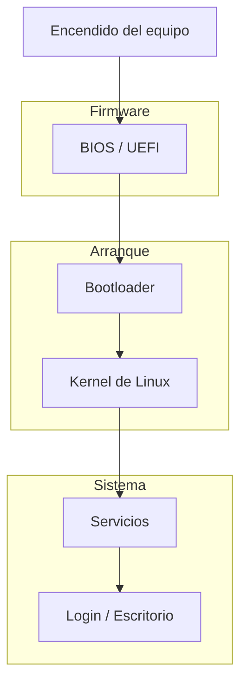

# Primer arranque y exploración del sistema

Después de instalar Linux, llega uno de los momentos más interesantes: **el primer arranque del sistema**.

En este punto el sistema ya está instalado en el disco y se ejecuta directamente desde la computadora o desde la máquina virtual.

El objetivo de esta lección es **orientarte dentro del sistema** y entender qué estás viendo.

---

## El proceso de arranque

Cuando enciendes la computadora, ocurre una serie de pasos antes de que puedas usar el sistema.

De forma simplificada, el flujo suele ser así:



No necesitas memorizar todos estos pasos ahora, pero es útil saber que el sistema pasa por varias fases antes de estar listo.

Más adelante exploraremos algunos de estos componentes con más detalle.

---

## Pantalla de inicio de sesión

Después del arranque normalmente aparece una **pantalla de inicio de sesión**.

Aquí debes introducir:

- tu **nombre de usuario**
- tu **contraseña**

Estas credenciales fueron definidas durante la instalación.

Una vez que inicias sesión, el sistema carga tu entorno de trabajo.

---

## El escritorio de Linux

Si instalaste una distribución con entorno gráfico, lo primero que verás será el **escritorio**.

Dependiendo de la distribución, puede verse diferente, pero normalmente incluye:

- barra de aplicaciones
- menú de programas
- gestor de archivos
- panel de configuración
- notificaciones del sistema

Algunos entornos gráficos comunes en Linux son:

- GNOME
- KDE Plasma
- XFCE
- Cinnamon

Cada uno tiene su propio diseño, pero todos permiten realizar tareas básicas con ventanas, menús y aplicaciones.

---

## El gestor de archivos

Uno de los primeros lugares que muchas personas exploran es el **gestor de archivos**.

Es la aplicación que permite navegar por carpetas y archivos de forma visual.

Aquí puedes:

- abrir documentos
- copiar archivos
- mover carpetas
- organizar tu información

En Linux, tu información personal normalmente se encuentra en tu **directorio personal**.

Este suele tener una ruta como:

```
/home/tu_usuario
```

Ahí es donde viven tus archivos, documentos, descargas y configuraciones personales.

---

## Abrir la terminal

Aunque el entorno gráfico es útil, una parte importante del aprendizaje de Linux ocurre en la **terminal**.

La terminal permite interactuar directamente con el sistema mediante comandos.

Normalmente puedes abrirla desde:

- el menú de aplicaciones
- un buscador de programas
- un atajo de teclado

Una vez abierta, verás algo similar a esto:

```bash
usuario@equipo:~$
```

Esto se llama **prompt de la terminal** y significa que el sistema está listo para recibir comandos.

No te preocupes si todavía no sabes qué escribir.

En los próximos módulos comenzaremos a trabajar con comandos paso a paso.

---

## Primeros elementos que conviene explorar

Cuando inicias Linux por primera vez, hay algunos lugares útiles que puedes revisar para familiarizarte con el sistema.

Por ejemplo:

**El menú de aplicaciones**

Para ver qué programas vienen instalados.

**El gestor de archivos**

Para entender cómo está organizado el sistema.

**La terminal**

Para empezar a interactuar con el sistema de forma directa.

**La configuración del sistema**

Para revisar opciones de red, idioma, teclado y apariencia.

---

## No es necesario entender todo de inmediato

Al inicio es normal sentirse un poco perdido.

Linux puede parecer diferente a otros sistemas operativos, especialmente si vienes de Windows o macOS.

Pero recuerda algo importante:

No necesitas entender todo el sistema desde el primer día.

Lo importante es **explorar poco a poco** y empezar a familiarizarte con sus componentes.

Con el tiempo muchas cosas que ahora parecen extrañas se volverán completamente naturales.

---

## Idea clave de esta lección

Después de instalar Linux, el sistema pasa por un proceso de arranque que termina en una pantalla de inicio de sesión.

Una vez dentro, puedes comenzar a explorar el entorno gráfico, el gestor de archivos y la terminal para familiarizarte con el sistema.

---

## Repaso

- El sistema pasa por varias etapas antes de arrancar completamente.
- Después del arranque aparece la pantalla de inicio de sesión.
- El escritorio permite interactuar con el sistema mediante ventanas y aplicaciones.
- El gestor de archivos permite navegar por carpetas.
- La terminal permite interactuar con Linux mediante comandos.