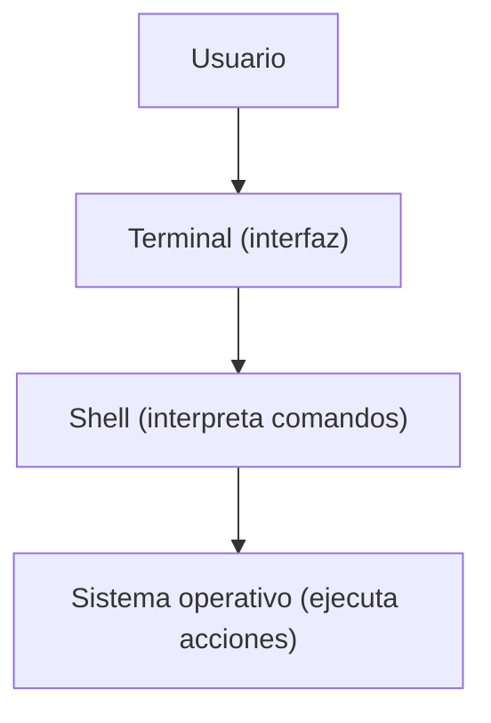

# La terminal: qué es y por qué es tan importante

Cuando muchas personas piensan en Linux, lo primero que imaginan es una **pantalla negra llena de texto**.

Esa imagen corresponde a una de las herramientas más importantes del sistema: **la terminal**.

Aunque Linux también tiene interfaces gráficas modernas, la terminal sigue siendo una de las formas más poderosas de interactuar con el sistema.

---

## ¿Qué es la terminal?

La **terminal** es una aplicación que permite interactuar con el sistema operativo mediante **comandos de texto**.

En lugar de hacer clic en botones o menús, el usuario escribe instrucciones que el sistema ejecuta.

Por ejemplo, un comando simple podría verse así:

```bash
usuario@equipo:~$ ls
```

Ese comando le pide al sistema que **liste los archivos del directorio actual**.

La terminal recibe el comando, lo envía a la **shell**, y el sistema ejecuta la acción correspondiente.

```bash
usuario@equipo:~$ ls
documentos/  fotos/  proyectos/  notas.txt
```
---

## Terminal y shell no son lo mismo

Es común que las palabras **terminal** y **shell** se usen como si fueran lo mismo, pero en realidad cumplen funciones diferentes.

- **Terminal:** la aplicación o ventana donde escribes comandos.
- **Shell:** el programa que interpreta esos comandos.

Podemos imaginarlo así:



En muchos sistemas Linux, la shell más común es **Bash**.

---

## ¿Por qué la terminal es tan importante en Linux?

Hay varias razones por las que la terminal sigue siendo fundamental.

### Control preciso

La terminal permite controlar el sistema con mucha precisión.

Muchas configuraciones y herramientas del sistema funcionan directamente mediante comandos.

---

### Velocidad

Para muchas tareas, escribir un comando puede ser más rápido que navegar por múltiples ventanas o menús.

Por ejemplo:

- buscar archivos
- instalar programas
- revisar procesos
- administrar permisos

---

### Automatización

Una de las mayores ventajas de la terminal es que los comandos pueden combinarse para crear **scripts**.

Un script es un conjunto de comandos que automatiza una tarea.

Esto permite realizar operaciones repetitivas de forma automática.

---

### Administración de servidores

La mayoría de servidores Linux se administran principalmente mediante terminal.

En muchos casos, los servidores ni siquiera tienen entorno gráfico.

Por eso la terminal es una habilidad esencial para:

- administradores de sistemas
- desarrolladores
- ingenieros DevOps
- profesionales de ciberseguridad

---

## La terminal no es solo para expertos

Al principio la terminal puede parecer intimidante.

Pero en realidad es simplemente otra forma de interactuar con el sistema.

Y como cualquier herramienta, se vuelve natural con la práctica.

Además, muchos comandos de Linux son:

- simples
- consistentes
- muy bien documentados

En este curso aprenderás a usarlos paso a paso.

---

## Idea clave de esta lección

La terminal es una herramienta que permite interactuar con Linux mediante comandos de texto.

Aunque Linux tiene interfaces gráficas, la terminal sigue siendo una forma central y muy poderosa de operar el sistema.

---

## Repaso

- La terminal permite interactuar con Linux usando comandos.
- La terminal es la ventana donde escribimos instrucciones.
- La shell es el programa que interpreta esos comandos.
- La terminal ofrece control, velocidad y automatización.
- Es una herramienta esencial en entornos técnicos y profesionales.