## La capa de acceso y el medio físico

### Idea clave

La capa de acceso transmite datos a través de medios físicos como cable, radio o luz.

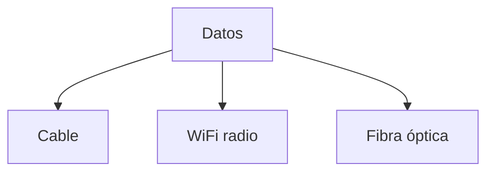

### Explicación

- Cable → señales eléctricas
- WiFi → ondas de radio
- Fibra → luz

---

## Alcance de las tecnologías

### Idea clave

Cada tecnología tiene un alcance limitado.

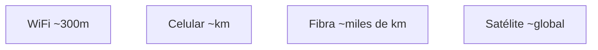

### Explicación

- WiFi → corto alcance
- Fibra → largas distancias
- Siempre se necesita más de un salto

---

## Un solo salto

### Idea clave

La capa de acceso solo cubre un tramo del camino.

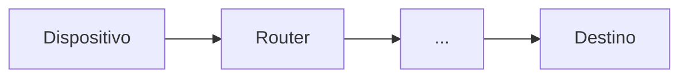

### Explicación

- Solo conecta al primer router
- El resto del camino lo hace Internet

---

## WiFi: comunicación por radio

### Idea clave

El WiFi usa ondas de radio para enviar datos.

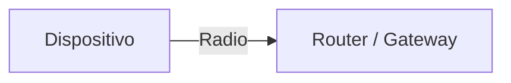

### Explicación

- El dispositivo tiene un transmisor de radio
- Envía datos al router cercano
- El router reenvía a Internet

---

## Red compartida en el aire

### Idea clave

Todos los dispositivos dentro del rango reciben todas las señales.

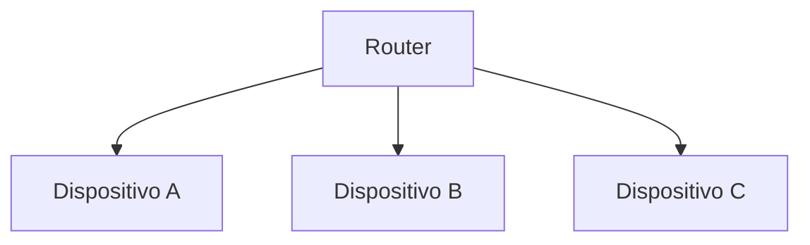

### Explicación

- Todos “escuchan” todo
- Luego deciden qué ignorar
- El aire es un medio compartido

---

## Problema de privacidad

### Idea clave

Cualquier dispositivo puede captar los datos transmitidos.

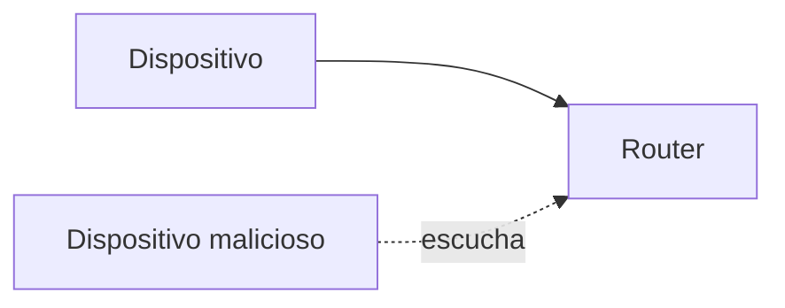

### Explicación

- Los datos viajan por el aire
- Otros pueden captarlos
- Se requiere seguridad (tema posterior)

---

## Dirección MAC

### Idea clave

Cada dispositivo tiene un identificador único en la red local.

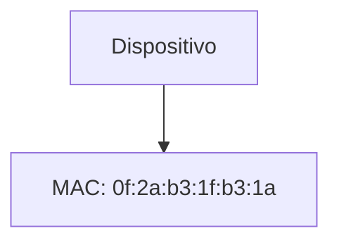

### Explicación

- Número de 48 bits
- Único para cada dispositivo
- Identifica origen y destino en WiFi

---

## Uso de direcciones MAC

### Idea clave

Cada paquete incluye dirección de origen y destino.

### Explicación

- Similar a “remitente” y “destinatario”
- Permite a cada dispositivo filtrar mensajes

---

## Descubrimiento de la puerta de acceso

### Idea clave

El dispositivo necesita saber a qué router enviar datos.

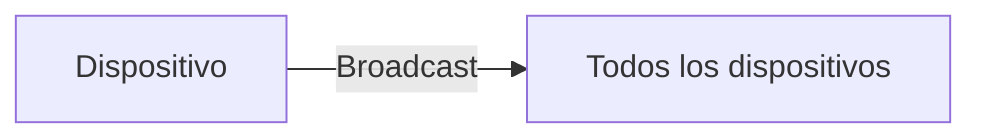

---

## Mensaje de difusión (broadcast)

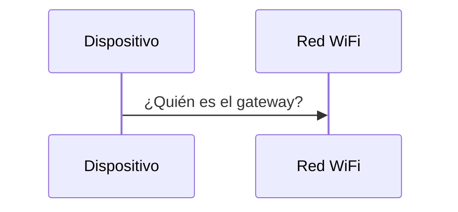

### Idea clave

Se envía a todos usando una dirección especial.

- Dirección destino: `ff:ff:ff:ff:ff:ff`
- Todos reciben el mensaje

---

## Respuesta del router

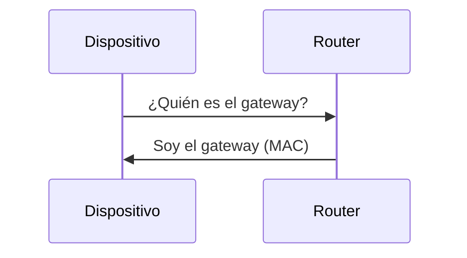

### Explicación

- El router responde con su MAC
- El dispositivo ya sabe a quién enviar datos

---

## Comunicación normal

### Idea clave

Después del descubrimiento, ya no se usa broadcast.

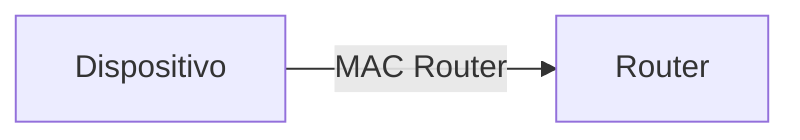

### Explicación

- Se envían paquetes directamente
- Más eficiente
- Menos carga en la red

---

## Uso limitado del broadcast

### Idea clave

El broadcast debe usarse lo menos posible.

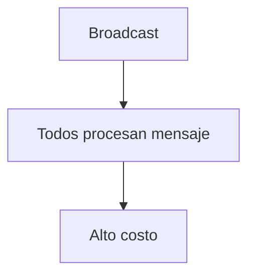

### Explicación

- Todos los dispositivos reciben el mensaje
- Genera trabajo innecesario
- Se usa solo cuando es necesario

---

## Insight clave (muy importante)

El WiFi es un medio compartido donde todos escuchan, pero solo algunos actúan.

- Todos reciben paquetes
- Solo procesan los que les corresponden
- Se usa MAC para identificar destinatarios

> Este modelo hace posible redes inalámbricas eficientes

---

## Resumen

- La capa de acceso transmite datos físicamente
- WiFi usa ondas de radio
- Todos los dispositivos reciben todos los paquetes
- Cada dispositivo tiene una dirección MAC única
- Los paquetes incluyen origen y destino
- Se usa broadcast para descubrir el router
- Luego se usa comunicación directa
- El aire es un medio compartido que requiere coordinación