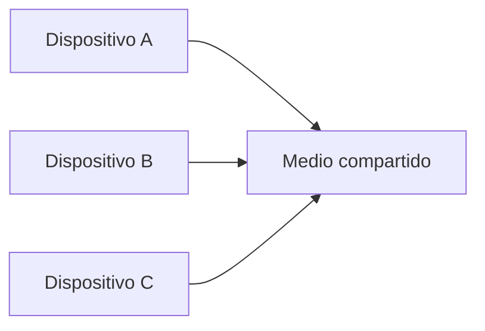
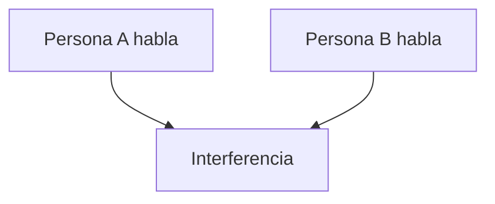
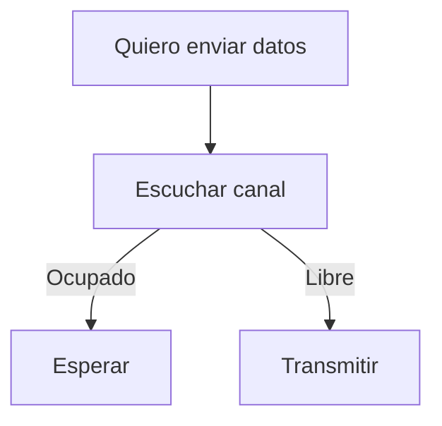
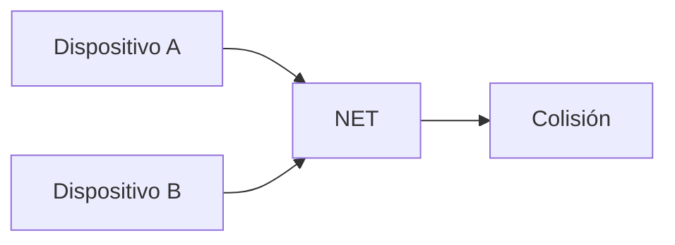
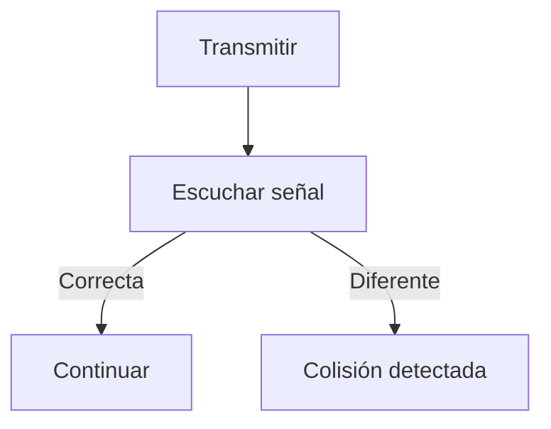
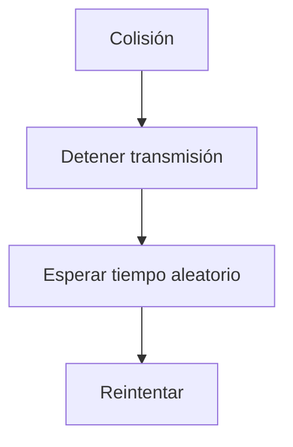
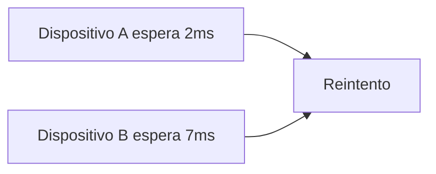
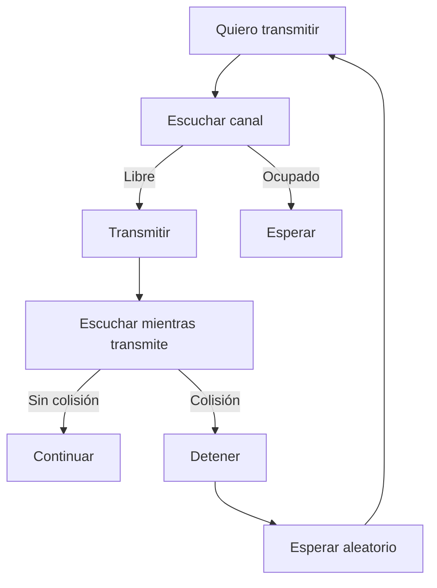
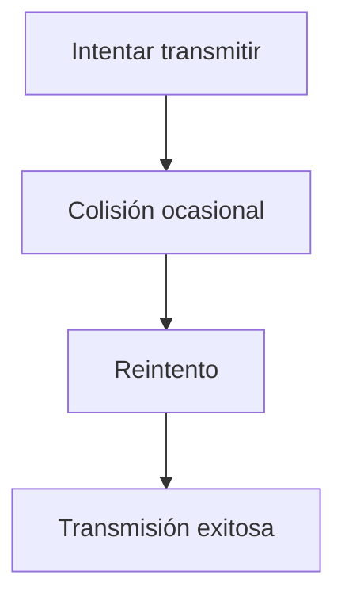
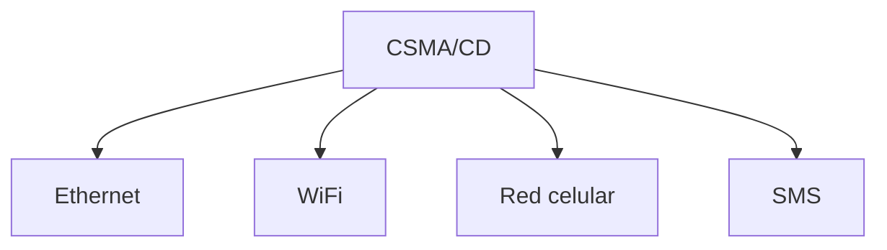

## El problema del medio compartido

### Idea clave

Cuando varios dispositivos usan el mismo medio, deben coordinarse.

### Explicación

- Todos usan la misma frecuencia o cable
- Si transmiten al mismo tiempo → problema
- Se necesita coordinación

---

## Analogía: conversación humana

### Idea clave

Hablar en grupo tiene el mismo problema que transmitir datos.

### Explicación

- Si todos hablan al mismo tiempo
- Nadie entiende nada
- Se requiere “cortesía”

---

## Técnica 1: Escucha de portadora

### Idea clave

Antes de transmitir, el dispositivo escucha si el canal está libre.

### Explicación

- Si alguien está transmitiendo → esperar
- Si hay silencio → enviar

---

## Problema: transmisión simultánea

### Idea clave

Dos dispositivos pueden detectar silencio al mismo tiempo.

### Explicación

- Ambos comienzan a transmitir
- Los datos se corrompen
- Ningún mensaje llega correctamente

---

## Detección de colisiones

### Idea clave

El dispositivo escucha mientras transmite para detectar errores.

### Explicación

- Si lo que recibe ≠ lo que envía
- Entonces ocurrió una colisión
- Se detiene la transmisión

---

## Qué ocurre después de una colisión

### Idea clave

El dispositivo detiene la transmisión y reintenta.

### Explicación

- Ambos dispositivos se detienen
- Esperan tiempos distintos
- Evitan repetir la colisión

---

## Tiempo de espera aleatorio

### Idea clave

Cada dispositivo espera un tiempo diferente antes de reintentar.

### Explicación

- Reduce probabilidad de colisión repetida
- Mejora eficiencia

---

## Proceso completo: CSMA/CD

### Idea clave

Este ciclo se repite continuamente.

---

## Por qué funciona

### Idea clave

Aunque parece caótico, es eficiente en la práctica.

### Explicación

- Las colisiones son raras
- El sistema se auto-regula
- Escala bien con muchos dispositivos

---

## Uso en diferentes tecnologías

### Idea clave

Este mecanismo se usa en varias redes.

---

## Insight clave (muy importante)

La coordinación en redes compartidas se basa en reglas simples de comportamiento.

- Escuchar antes de hablar
- Detectar errores
- Reintentar inteligentemente

> Igual que en interacciones humanas

---

## Resumen

- El medio de transmisión es compartido
- Se necesita coordinación para evitar interferencias
- Se usa “escucha de portadora” antes de transmitir
- Pueden ocurrir colisiones
- Los dispositivos detectan colisiones
- Se detienen y esperan
- Reintentan con tiempos aleatorios
- CSMA/CD permite uso eficiente del medio