## Problema: alta carga en la red

### Idea clave

Cuando muchos dispositivos transmiten constantemente, CSMA/CD puede no ser suficiente.

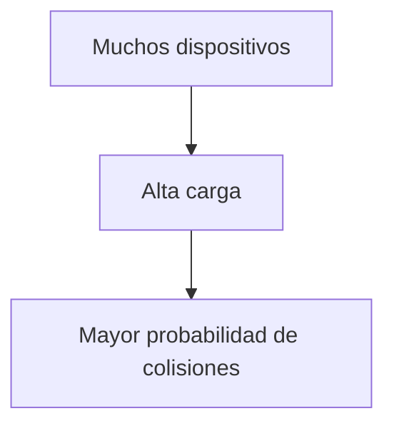

### Explicación

- Más tráfico → más colisiones
- Más colisiones → menor eficiencia

---

## Solución alternativa: el testigo (token)

### Idea clave

Solo el dispositivo que tiene el “testigo” puede transmitir.

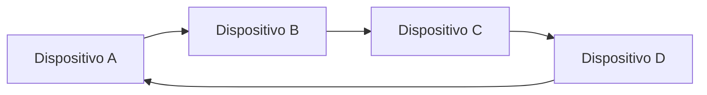

### Explicación

- El testigo circula entre los dispositivos
- Define quién puede usar la red
- Evita colisiones completamente

---

## Funcionamiento del token

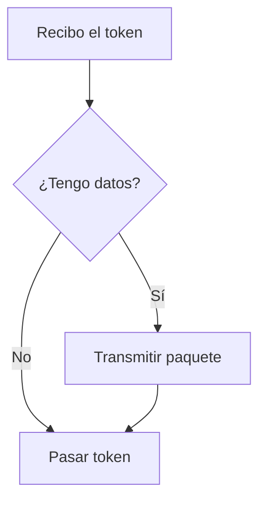

### Idea clave

Transmitir solo cuando tienes permiso.

---

## Analogía: hablar con una pelota

### Idea clave

Solo quien tiene la pelota puede hablar.

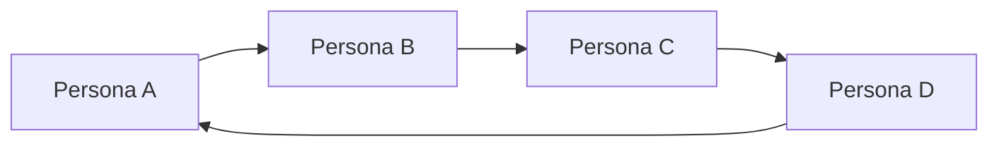

### Explicación

- La pelota = token
- Nadie interrumpe
- Comunicación ordenada

---

## Ventaja: cero colisiones

### Idea clave

El método elimina completamente las colisiones.

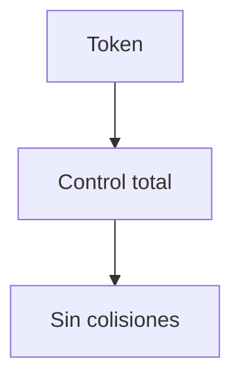

### Explicación

- No hay competencia
- No hay interferencias
- Uso eficiente bajo alta carga

---

## Desventaja: latencia

### Idea clave

Un dispositivo debe esperar su turno aunque la red esté libre.

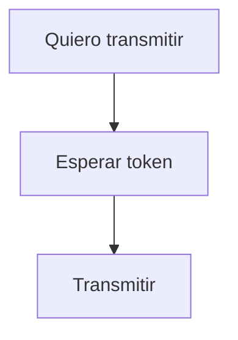

### Explicación

- Puede haber retrasos innecesarios
- Incluso si nadie más transmite

---

## Problema con pocos dispositivos activos

### Idea clave

El token puede desperdiciar tiempo.

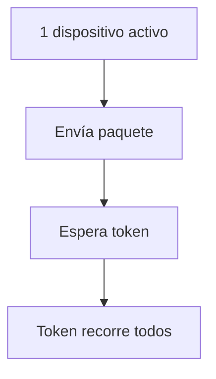

### Explicación

- El token pasa por equipos inactivos
- Se pierde tiempo
- Baja eficiencia en tráfico bajo

---

## Comparación: CSMA/CD vs Token

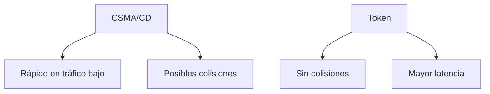

---

## Cuándo usar CSMA/CD

### Idea clave

Mejor para redes con tráfico irregular.

- WiFi
- Redes domésticas
- Oficinas
- Cafeterías

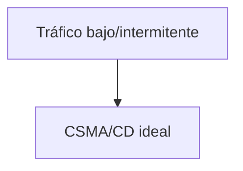

---

## Cuándo usar token

### Idea clave

Mejor para redes con alta carga constante.

- Satélites
- Fibra de larga distancia
- Enlaces costosos

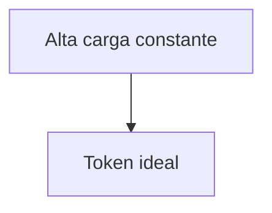

---

## Costo de colisiones

### Idea clave

En algunos medios, las colisiones son muy costosas.

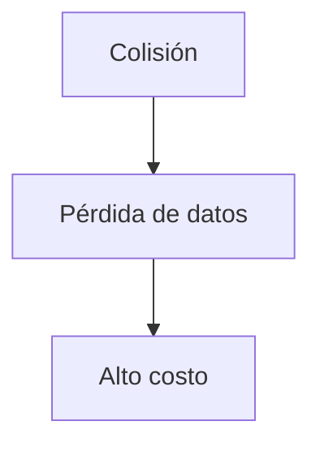

### Explicación

- Satélite → alto tiempo de ida y vuelta
- Fibra submarina → costosa
- Mejor evitarlas completamente

---

## Insight clave (muy importante)

No existe un único método perfecto: depende del contexto.

- CSMA/CD → flexible y rápido
- Token → ordenado y eficiente bajo carga

> Ingeniería = elegir el trade-off correcto

---

## Resumen

- Existen múltiples formas de coordinar redes compartidas
- CSMA/CD usa “escuchar e intentar”
- Token usa “turnos controlados”
- Token elimina colisiones
- Pero introduce latencia
- CSMA/CD es mejor para tráfico variable
- Token es mejor para tráfico constante
- La elección depende del tipo de red