## La capa de Aplicación

### Idea clave

Es la capa donde interactúan los usuarios.

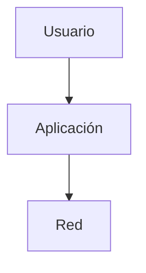

### Ejemplos

- Navegador web
- Correo electrónico
- Streaming de video

---

## Qué hace esta capa

### Idea clave

Las aplicaciones usan la red por nosotros.

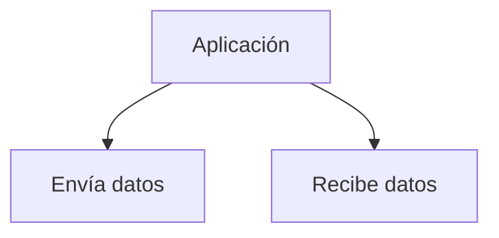

---

## Modelo cliente/servidor

### Idea clave

Toda aplicación en red tiene dos partes.

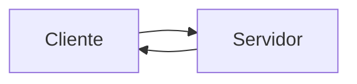

---

## Rol del cliente

### Idea clave

Inicia la conexión.

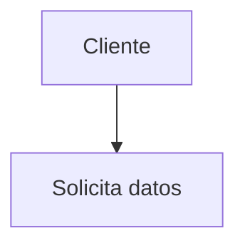

---

## Rol del servidor

### Idea clave

Responde y proporciona información.

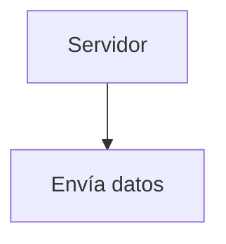

---

## Ejemplo: navegar en la web

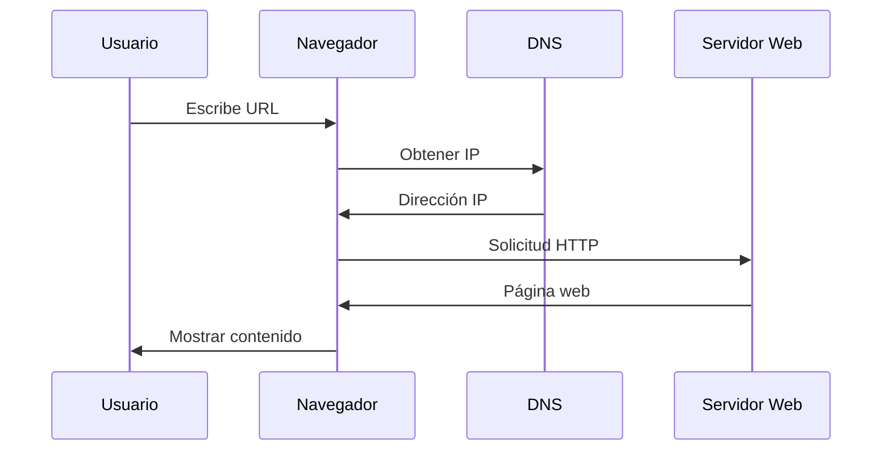

---

## Flujo completo simplificado

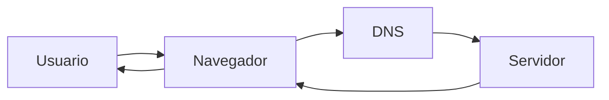

---

## Servidor siempre activo

### Idea clave

El servidor está esperando conexiones constantemente.

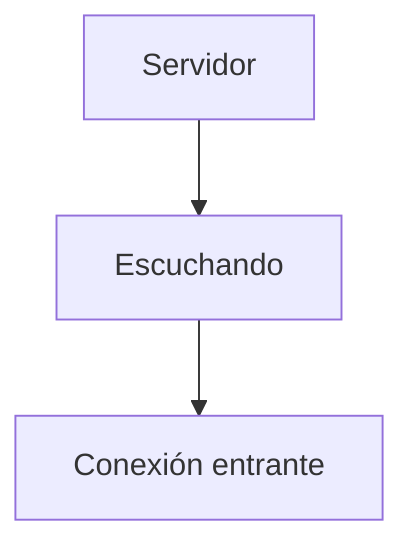

---

## Analogía: red telefónica

### Idea clave

Las capas inferiores funcionan como una red de comunicación.

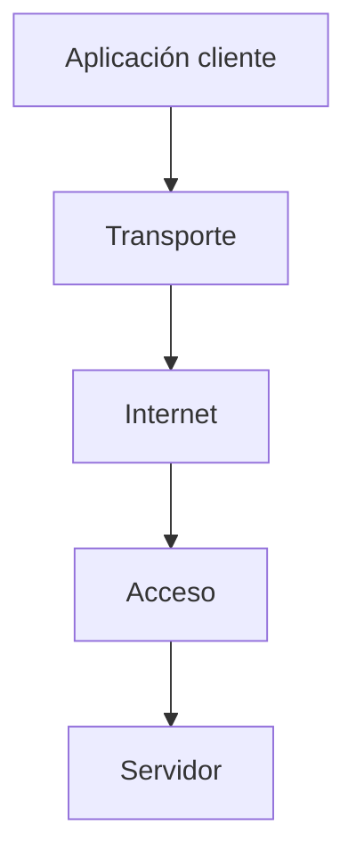

---

## Relación con otras capas

### Idea clave

La capa de Aplicación depende de todas las demás.

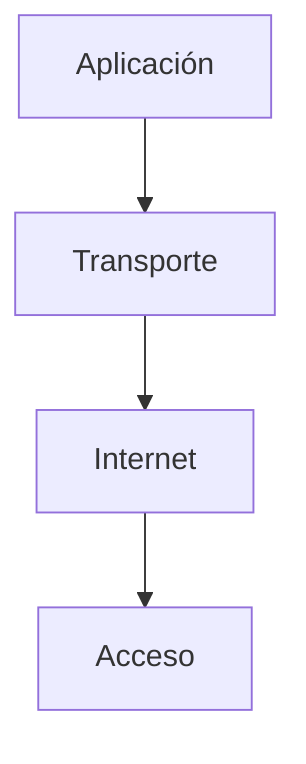

---

## Qué ve el usuario

### Idea clave

El usuario solo ve la aplicación, no la complejidad.

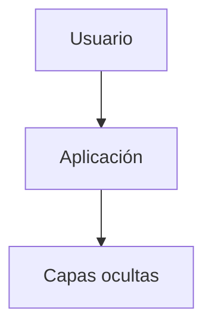

---

## Insight clave 

Las aplicaciones hacen que Internet sea útil.

- Sin aplicaciones → no hay valor para el usuario
- Todo lo demás es infraestructura
- Aquí ocurre la experiencia real

> Esta es la capa que convierte la red en algo útil

---

## Resumen

- La capa de Aplicación es la más cercana al usuario
- Aquí viven las apps (web, correo, video)
- Funciona con el modelo cliente/servidor
- El cliente inicia la comunicación
- El servidor responde
- Las apps usan las capas inferiores
- DNS ayuda a encontrar servidores
- El usuario no ve la complejidad técnica