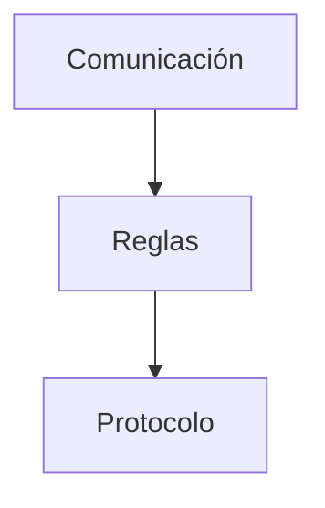
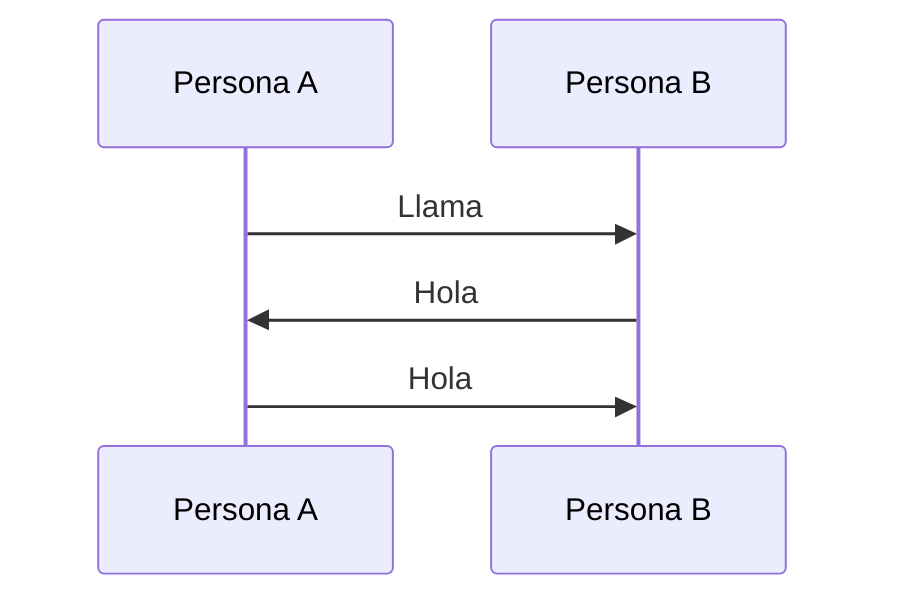
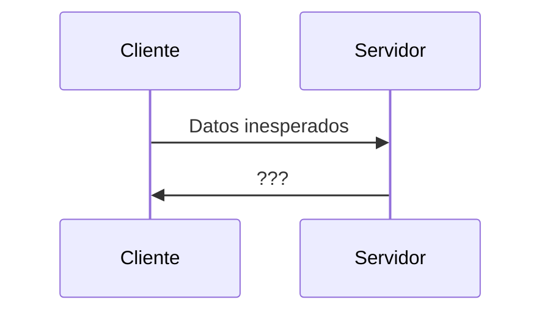
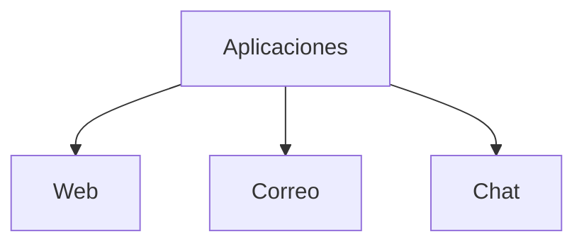
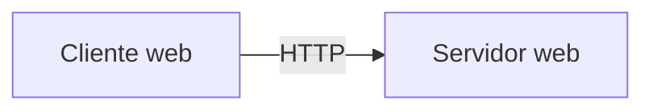
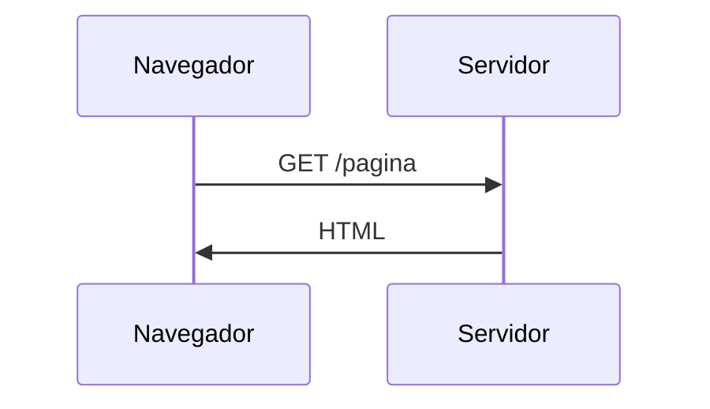
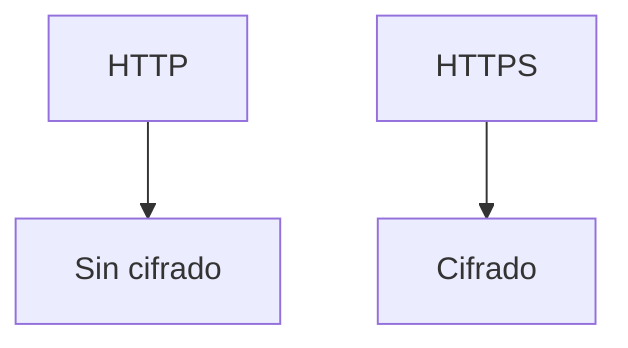
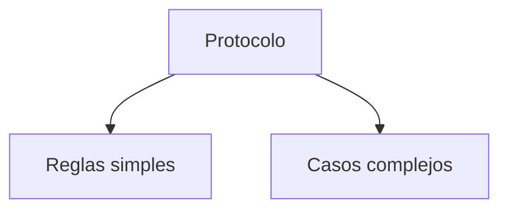
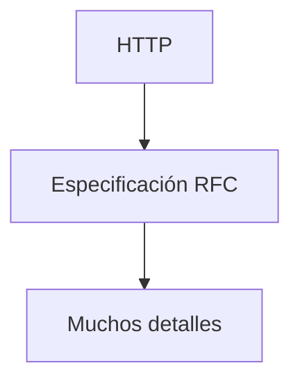
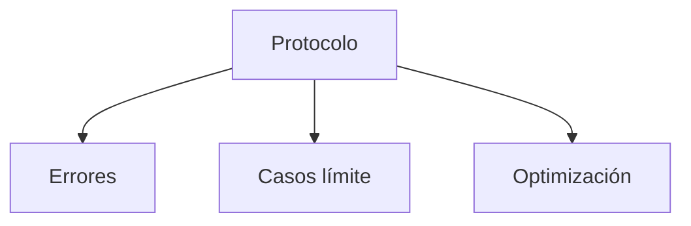

## ¿Qué es un protocolo?

### Idea clave

Un protocolo es un conjunto de reglas para comunicarse.



---

## Analogía: conversación humana

### Idea clave

Las conversaciones necesitan reglas implícitas.



### Explicación

- Hay orden
- Hay expectativas
- Sin reglas → confusión

---

## Problema sin protocolos

### Idea clave

Sin reglas, la comunicación falla.



---

## Protocolos en aplicaciones

### Idea clave

Cada aplicación necesita su propio protocolo.



---

## Ejemplo: HTTP

### Idea clave

HTTP es el protocolo de la web.



---

## Qué significa HTTP

### Idea clave

HyperText Transfer Protocol.

- Transferencia de páginas web
- Comunicación cliente-servidor
- Base de la web

---

## Ejemplo real de petición

```
GET http://www.example.org/pub/WWW/TheProject.html HTTP/1.1
```

### Idea clave

El cliente solicita un recurso al servidor.

---

## Flujo HTTP



---

## HTTP vs HTTPS

### Idea clave

HTTPS es HTTP seguro.



---

## Complejidad de los protocolos

### Idea clave

Los protocolos reales son muy detallados.



---

## Documentación de protocolos

### Idea clave

Los protocolos están definidos formalmente.



---

## Por qué tanta complejidad

### Idea clave

Se deben cubrir todos los escenarios posibles.



---

## Insight clave 

Los protocolos son el lenguaje de Internet.

- Definen cómo hablar
- Permiten interoperabilidad
- Hacen posible que sistemas diferentes se entiendan

> Sin protocolos, Internet no funcionaría

---

## Resumen

- Un protocolo es un conjunto de reglas
- Permite comunicación ordenada
- Cada aplicación tiene su propio protocolo
- HTTP es el protocolo de la web
- Define cómo pedir y recibir información
- HTTPS agrega seguridad
- Los protocolos están altamente documentados
- La precisión es clave en sistemas distribuidos