## Idea general

### Idea clave

HTTP puede usarse manualmente, sin navegador.

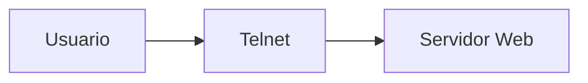

---

## Qué es telnet

### Idea clave

Telnet permite conectarse directamente a un servidor.

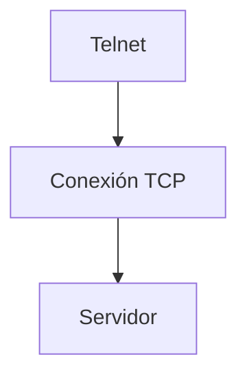

---

## Conexión básica

```
telnet www.dr-chuck.com 80
```

### Idea clave

- Dominio → servidor
- Puerto 80 → HTTP

---

## Qué ocurre al conectar

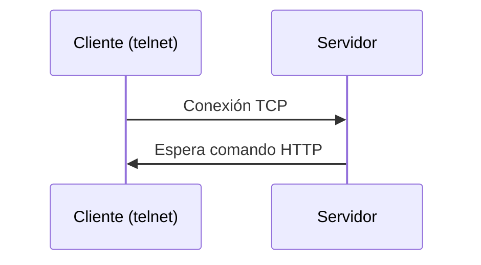

---

## Error por protocolo incorrecto

### Idea clave

Si no sigues el protocolo, el servidor no responde correctamente.

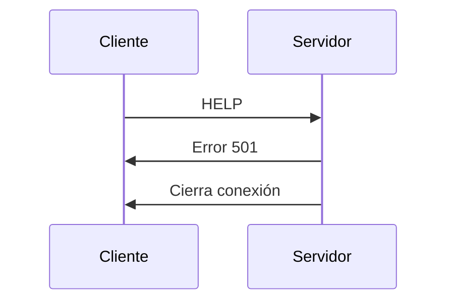

---

## Ejemplo de error

```
501 Method Not Implemented
```

### Explicación

- El servidor no entiende el comando
- La conexión termina

---

## Petición HTTP correcta

```
GET http://www.dr-chuck.com/page1.htm HTTP/1.0
```

### Idea clave

Una petición debe seguir reglas exactas.

---

## Flujo completo HTTP

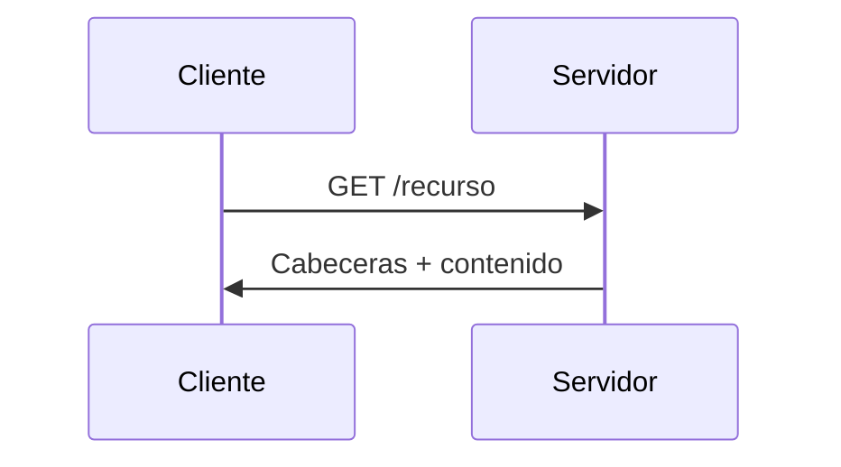

---

## Estructura de la respuesta

### Idea clave

El servidor responde en dos partes.

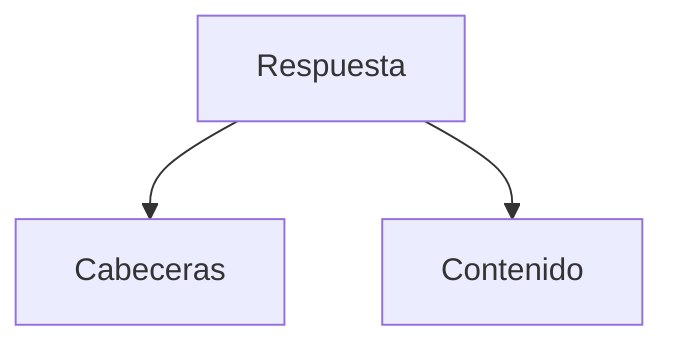

---

## Ejemplo de respuesta

```
HTTP/1.1 200 OK
Content-Type: text/html

<h1>Page</h1>
```

---

## Cabeceras HTTP

### Idea clave

Son metadatos sobre el contenido.

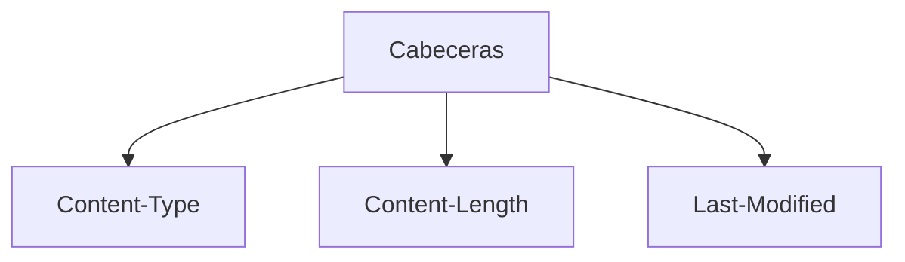

---

## Línea de estado

### Idea clave

Indica el resultado de la petición.

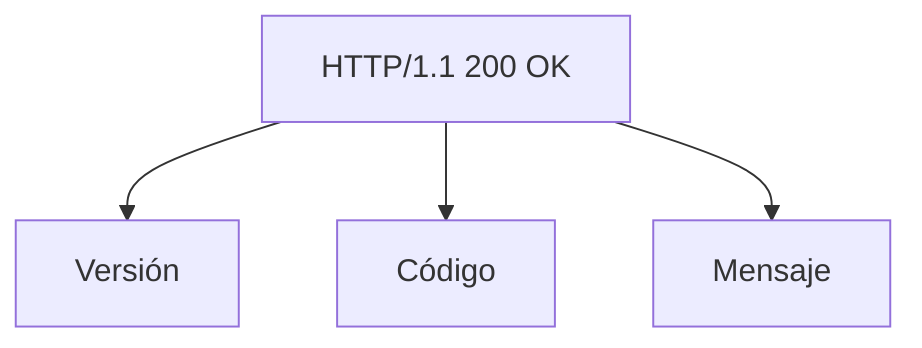

---

## Códigos de estado

### Idea clave

Los códigos indican qué ocurrió.

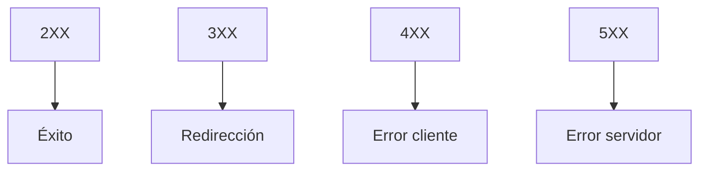

---

## Ejemplos comunes

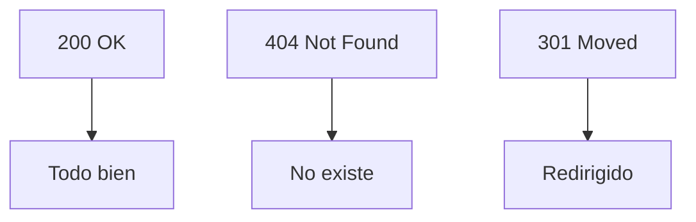

---

## HTML en la respuesta

### Idea clave

El servidor envía contenido en formato HTML.

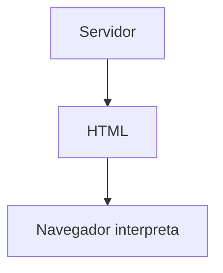

---

## Qué hace el navegador

### Idea clave

Convierte HTML en una página visual.

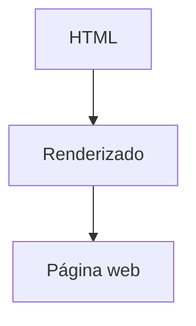

---

## Insight clave 

HTTP es texto simple pero extremadamente poderoso.

- Basado en texto
- Fácil de depurar
- Altamente extensible

> Toda la web funciona sobre estas reglas simples

---

## Resumen

- HTTP puede usarse manualmente con telnet
- Se conecta al puerto 80
- El servidor espera comandos válidos
- Una petición mal formada genera error
- Una petición correcta devuelve datos
- La respuesta incluye cabeceras y contenido
- Los códigos indican el resultado
- El contenido suele ser HTML
- El navegador interpreta ese HTML