## El problema del correo

### Idea clave

Tu computadora no siempre está encendida.

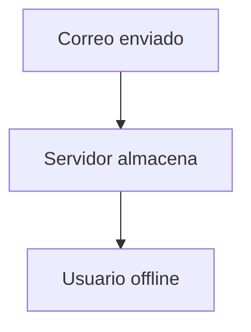

---

## Solución: servidor de correo

### Idea clave

El correo se guarda en un servidor central.

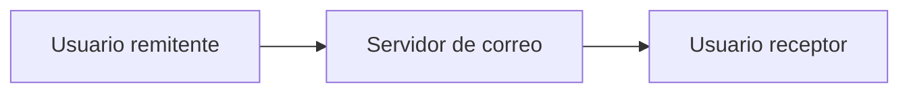

---

## Qué es IMAP

### Idea clave

IMAP permite acceder al correo almacenado en el servidor.


---

## Flujo básico de correo

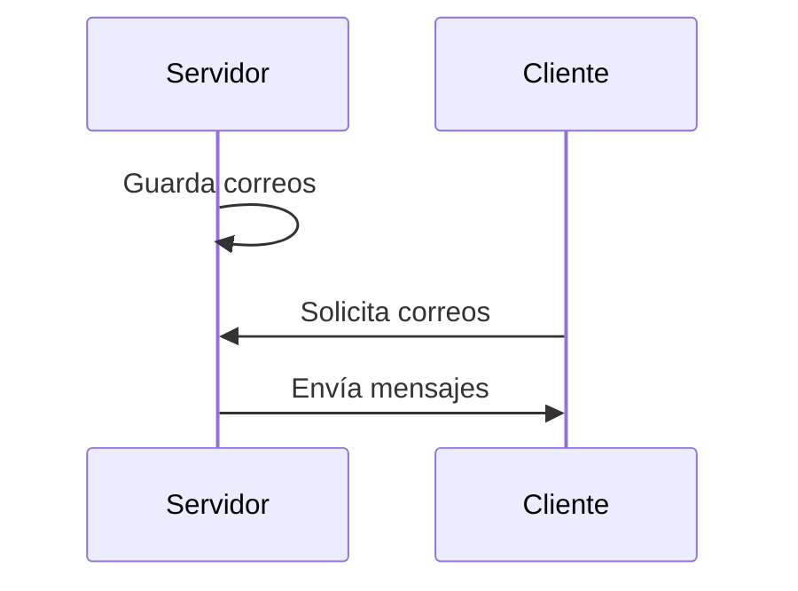

---

## Diferencia con HTTP

### Idea clave

IMAP es más complejo que HTTP.

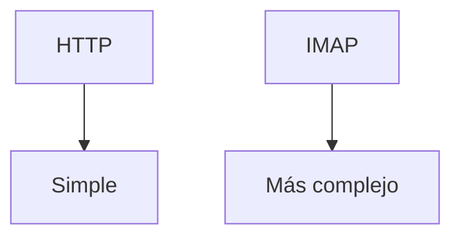

---

## Comunicación IMAP

### Idea clave

Cliente y servidor intercambian comandos estructurados.

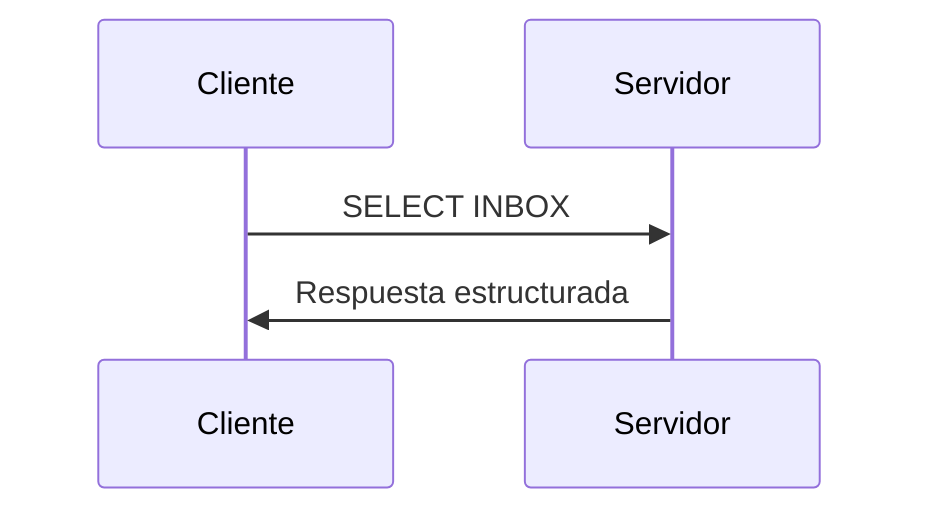

---

## Ejemplo real

```
C: A142 SELECT INBOX
S: * 172 EXISTS
S: * 1 RECENT
S: A142 OK
```

---

## Qué significa esto

### Idea clave

El cliente solicita información y el servidor responde con estado.

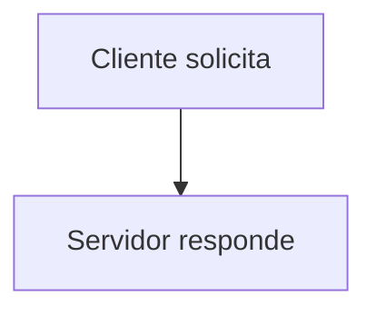

---

## Tipo de datos intercambiados

### Idea clave

IMAP trabaja con información estructurada.

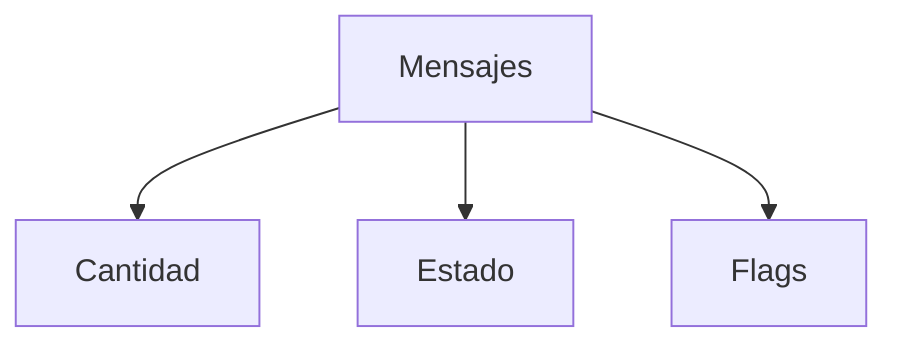

---

## Flags de correo

### Idea clave

Los correos tienen estados.

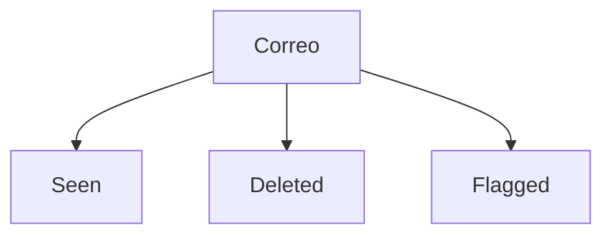

---

## Características de IMAP

### Idea clave

Permite trabajar directamente sobre el servidor.

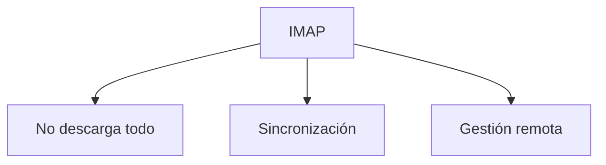

---

## Comparación conceptual

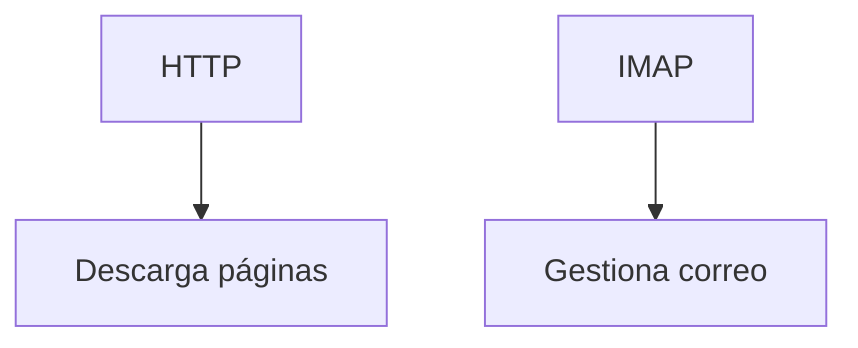

---

## Por qué no usar telnet fácilmente

### Idea clave

IMAP es más complejo y estructurado.

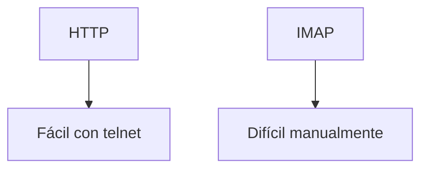

---

## Insight clave

Los protocolos varían en complejidad según el problema que resuelven.

- HTTP → simple (documentos)
- IMAP → complejo (estado, sincronización)

> Más funcionalidad = más complejidad

---

## Resumen

- El correo se almacena en servidores
- IMAP permite acceder a ese correo
- Funciona con modelo cliente/servidor
- Usa comandos estructurados
- Gestiona estados (leído, eliminado, etc.)
- Es más complejo que HTTP
- Permite sincronización remota
- No está pensado para interacción humana directa