## Idea general

### Idea clave

El control de flujo regula la velocidad de envío de datos.

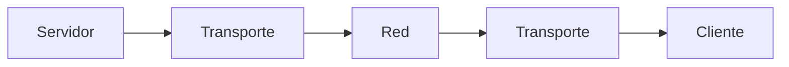

---

## Problema

### Idea clave

El servidor puede enviar datos más rápido que la red.

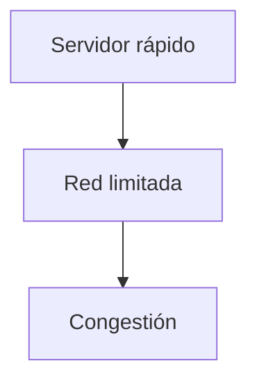

---

## Solución: tamaño de ventana

### Idea clave

El envío se limita a cierta cantidad de datos.

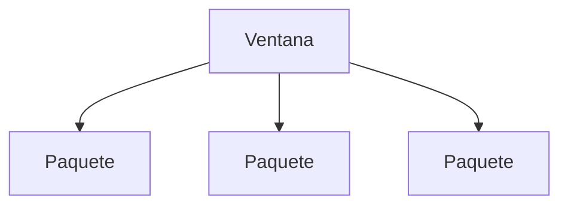

---

## Estado del sistema

### Idea clave

Hay paquetes en distintos estados simultáneamente.

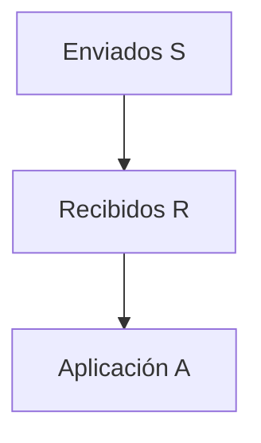

---

## Ejemplo con aplicación real

### Idea clave

Un navegador descargando una imagen.

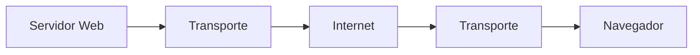

---

## Flujo de datos

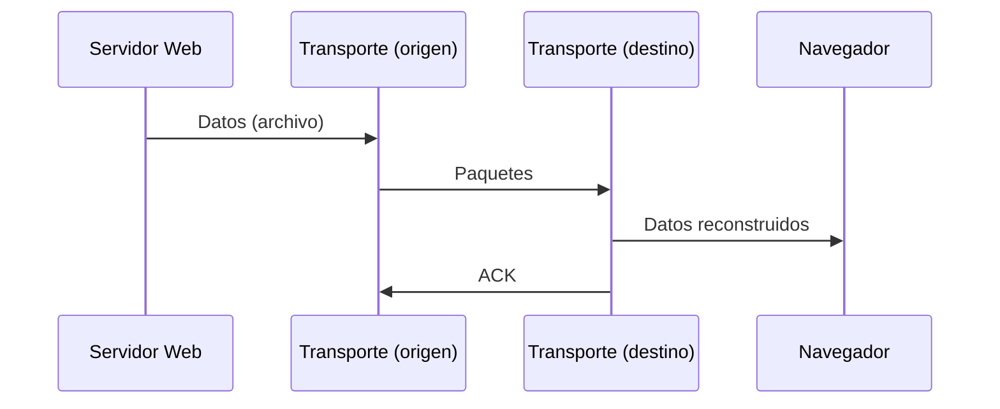

---

## Ventana llena

### Idea clave

El transporte detiene al servidor cuando se llena la ventana.

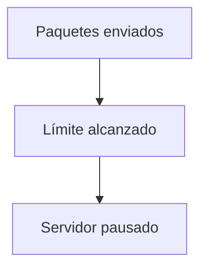

---

## Recepción parcial

### Idea clave

El receptor va reconstruyendo poco a poco.

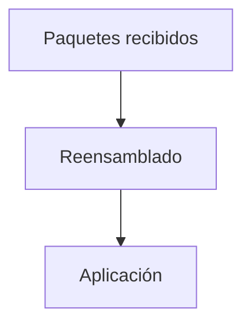

---

## Confirmaciones (ACK)

### Idea clave

El receptor confirma qué datos recibió.

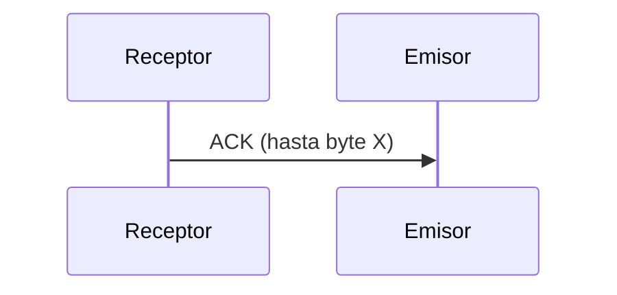

---

## Reanudación del envío

### Idea clave

Cuando llegan ACKs, el emisor continúa.

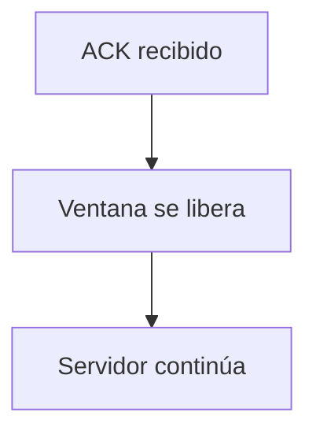

---

## Qué ocurre con los paquetes

### Idea clave

Solo se almacenan temporalmente.

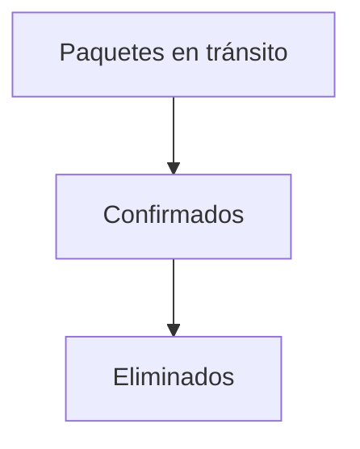

---

## Visualización completa

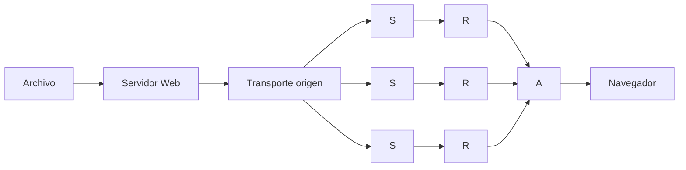

---

## Comportamiento dinámico

### Idea clave

El sistema se adapta a la velocidad de la red.

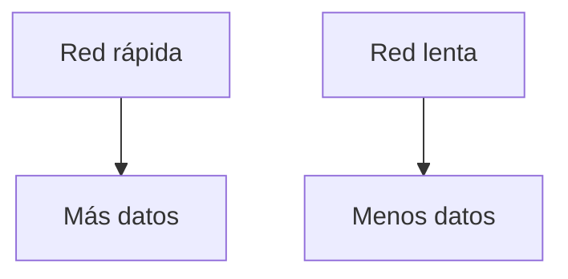

---

## Qué ve el usuario

### Idea clave

La experiencia depende de la velocidad.

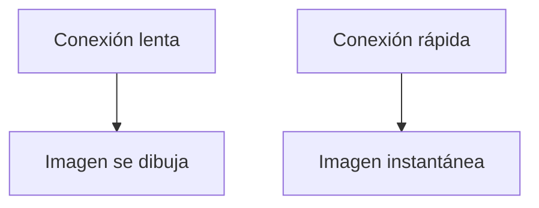

---

## Rol de las capas

### Idea clave

Las aplicaciones no controlan el flujo.

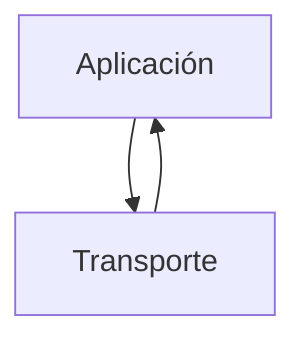

### Explicación

- La app solo envía/recibe
- Transporte regula velocidad

---

## Insight clave 

El control de flujo protege la red.

- Evita saturación
- Maximiza eficiencia
- Ajusta automáticamente

> Sin esto, Internet colapsaría bajo carga

---

## Resumen

- El control de flujo regula la velocidad de envío
- Se basa en el tamaño de ventana
- El emisor se detiene cuando la ventana se llena
- El receptor envía confirmaciones (ACK)
- El emisor reanuda al recibir ACK
- Solo se almacenan paquetes no confirmados
- La velocidad se adapta a la red
- Las aplicaciones no controlan este proceso
- La capa de Transporte gestiona todo