## Idea general

### Idea clave

Crear aplicaciones en red es más fácil de lo que parece.

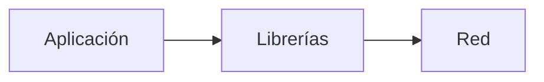

---

## Abstracción de complejidad

### Idea clave

Las capas inferiores ocultan la complejidad de la red.

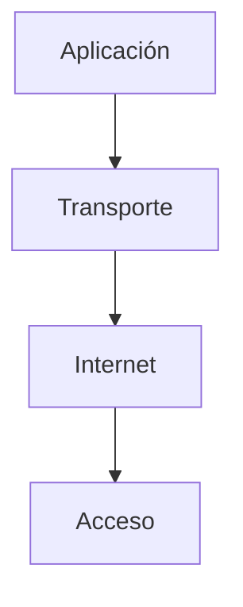

### Explicación

- La aplicación no maneja:
    - paquetes
    - rutas
    - retransmisiones
- Todo eso lo hacen las capas inferiores

---

## Uso de librerías

### Idea clave

Los lenguajes ya incluyen herramientas para conectarse a la red.

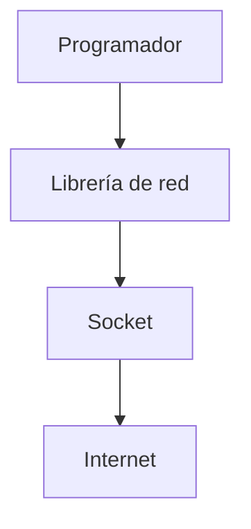

### Beneficio

- No necesitas construir la red desde cero
- Solo usas funciones ya existentes

---

## Modelo mental

### Idea clave

Conectarse a un servidor es similar a leer un archivo.

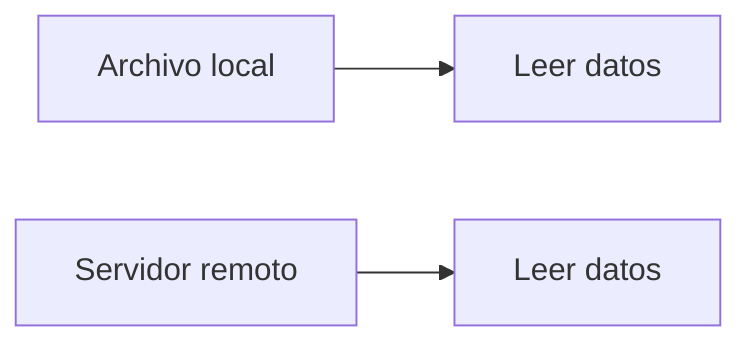

---

## Ejemplo real en Python

### Código

```py
importsocket

mysock=socket.socket(socket.AF_INET,socket.SOCK_STREAM)
mysock.connect(('www.py4inf.com',80))
mysock.send('GET http://www.py4inf.com/code/romeo.txt HTTP/1.0\n\n')

whileTrue:
data=mysock.recv(512)
if (len(data)<1):
break
print(data)

mysock.close()
```

---

## Flujo de la conexión

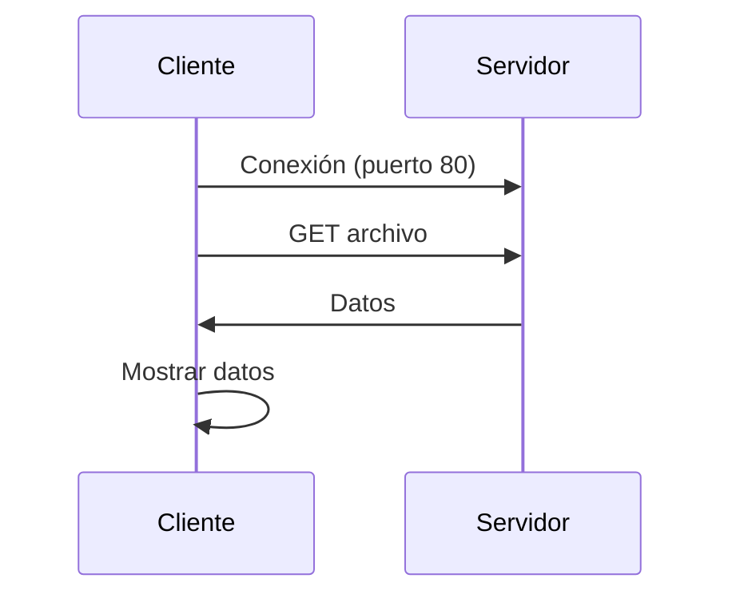

---

## Qué está pasando realmente

### Paso a paso

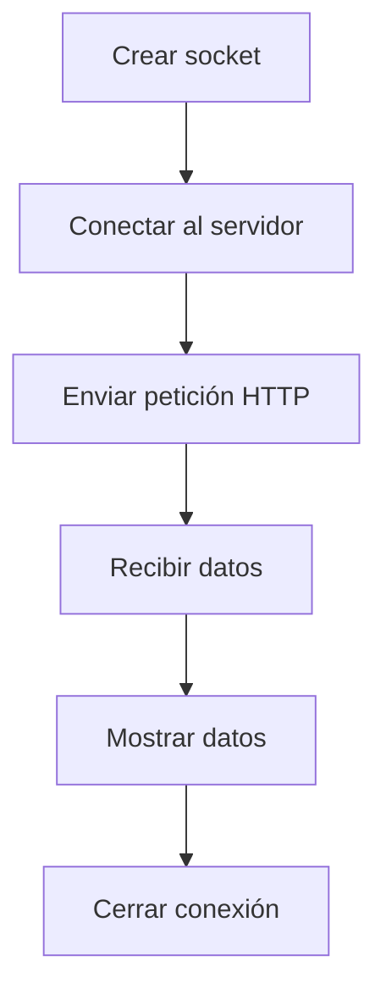

---

## Importancia del puerto

### Idea clave

El puerto define qué aplicación estás usando.

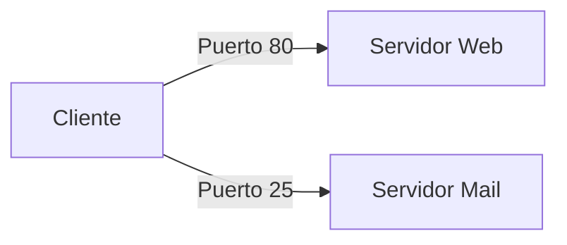

---

## Simplicidad engañosa

### Idea clave

El código es corto porque la complejidad está oculta.

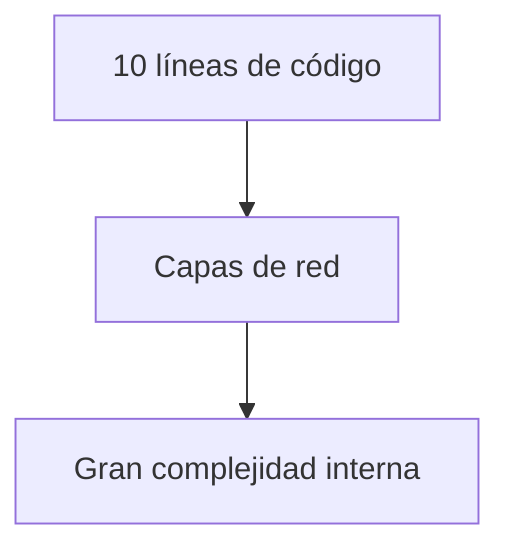

---

## Rol de las capas

### Idea clave

Cada capa resuelve un problema distinto.

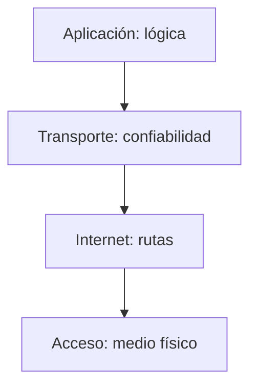

---

## Impacto en el desarrollo

### Idea clave

Esto permite crear aplicaciones rápidamente.

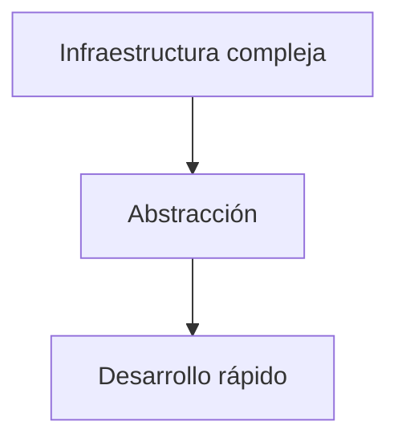

---

## Tipos de aplicaciones posibles

### Ejemplos

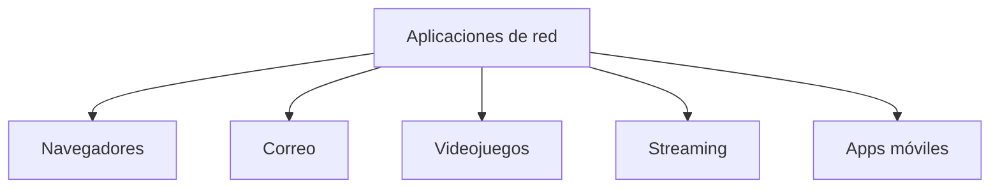

---

## Insight clave


Internet es una plataforma de innovación.

- Cualquiera puede crear aplicaciones
- No necesitas entender toda la red
- Solo necesitas usar sus interfaces

---

## Resumen

- Las aplicaciones de red usan librerías para comunicarse
- Conectarse a un servidor es sencillo (ej. sockets)
- El puerto define el tipo de servicio
- Las capas inferiores manejan toda la complejidad
- El código de red puede ser muy corto
- Esto permite crear aplicaciones rápidamente
- Internet funciona como una plataforma para innovación