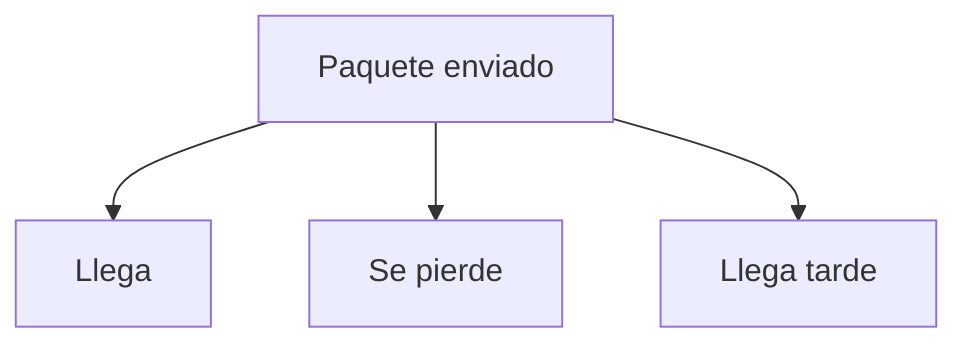
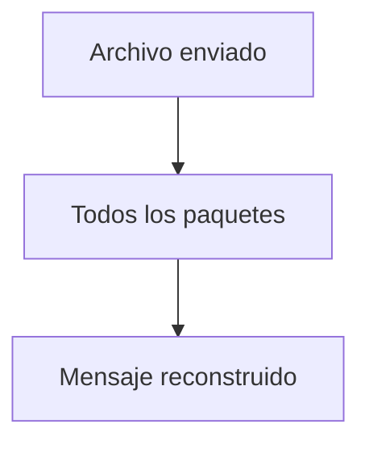
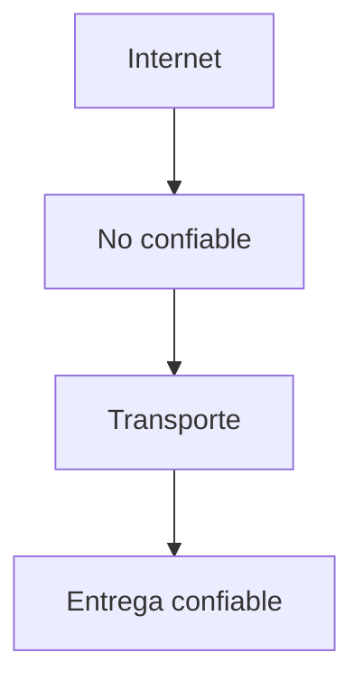
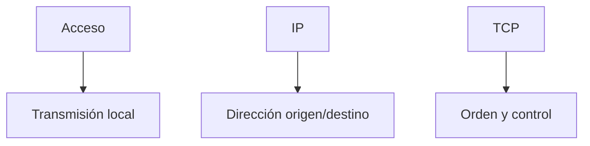
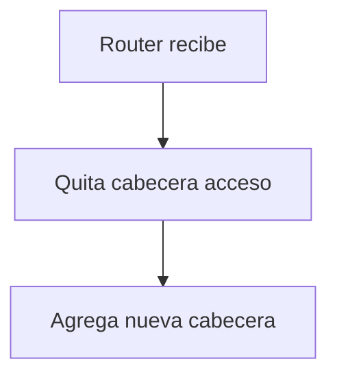
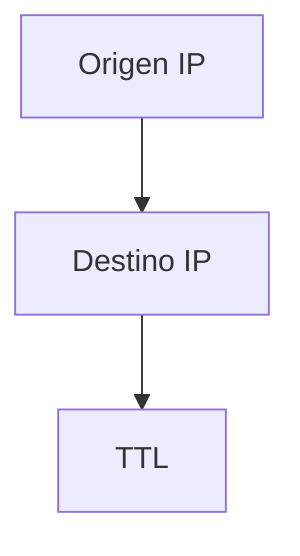
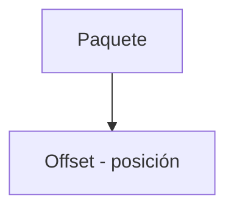
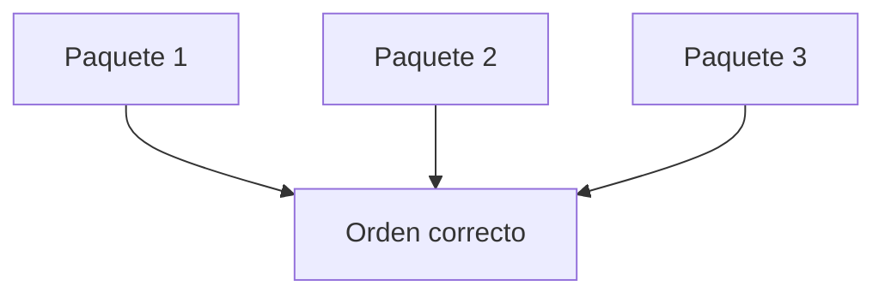

## El problema: Internet no es perfecto

### Idea clave

La capa de Internet no garantiza que los paquetes lleguen.

### Explicación

- Puede haber pérdidas
- Puede haber desorden
- Puede haber retrasos

---

## Necesidad de fiabilidad

### Idea clave

Los usuarios necesitan recibir mensajes completos y correctos.

---

## Rol de la capa de Transporte

### Idea clave

Se encarga de asegurar la entrega correcta.

### Funciones

- Reordenar paquetes
- Detectar pérdidas
- Solicitar reenvíos

---

## Estructura de un paquete

### Idea clave

Un paquete tiene múltiples capas de información.

---

## Qué contiene cada cabecera

### Idea clave

Cada capa agrega información específica.

---

## Cabecera de acceso

### Idea clave

Se usa solo para el siguiente salto.

### Explicación

- Cambia en cada salto
- Depende del medio (WiFi, cable, etc.)

---

## Cabecera IP

### Idea clave

Se mantiene durante todo el viaje.

### Explicación

- Dirección origen
- Dirección destino
- TTL (decrementa en cada salto)

---

## Cabecera TCP

### Idea clave

Indica cómo reconstruir el mensaje.

### Explicación

- Indica posición en el mensaje
- Permite ordenar paquetes
- Clave para reconstrucción

---

## Viaje del paquete

### Idea clave

- Cabecera acceso cambia
- IP y TCP permanecen

---

## Reensamblaje en destino

### Idea clave

El destino usa la información TCP para reconstruir.

### Explicación

- Los paquetes pueden llegar desordenados
- Se reorganizan usando offsets

---

## Insight clave 

Internet mueve paquetes, pero la capa de Transporte crea mensajes confiables.

- IP → entrega “lo mejor posible”
- TCP → garantiza orden y completitud

> Sin la capa de Transporte, Internet sería inutilizable para aplicaciones reales

---

## Resumen

- Internet no garantiza entrega
- Los paquetes pueden perderse o desordenarse
- La capa de Transporte asegura fiabilidad
- Los paquetes tienen múltiples cabeceras
- La cabecera de acceso cambia en cada salto
- La cabecera IP permanece
- La cabecera TCP permite reconstrucción
- El destino reorganiza los paquetes