## Reensamblado de paquetes

### Idea clave

Los paquetes pueden llegar desordenados, pero se reorganizan usando su posición.

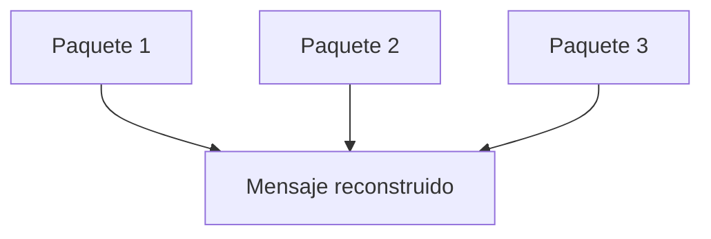

---

## Uso del offset

### Idea clave

Cada paquete sabe dónde va dentro del mensaje.

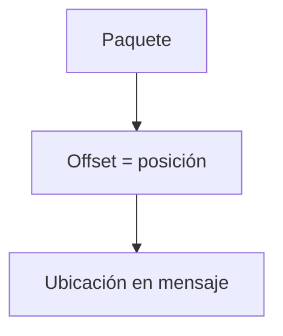

---

## Buffer de recepción

### Idea clave

Los paquetes adelantados se almacenan temporalmente.

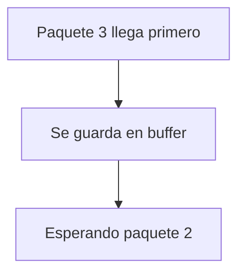

---

## Manejo de huecos

### Idea clave

El sistema detecta partes faltantes del mensaje.

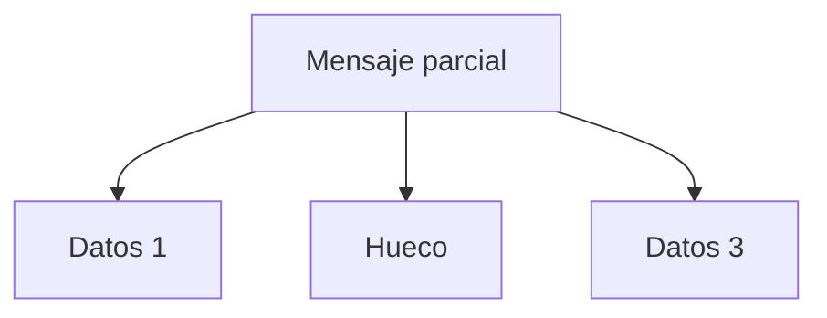

---

## Llegada tardía

### Idea clave

Cuando llega el paquete faltante, se completa el mensaje.

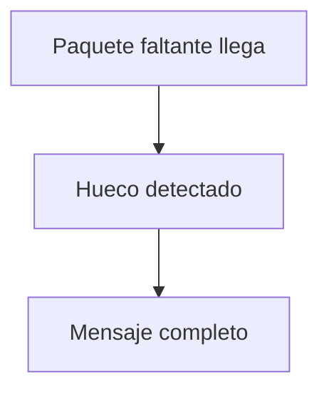

---

## Control de flujo: tamaño de ventana

### Idea clave

El emisor no envía todo de golpe.

---

## Qué es el tamaño de ventana

### Idea clave

Cantidad de datos enviados antes de esperar confirmación.

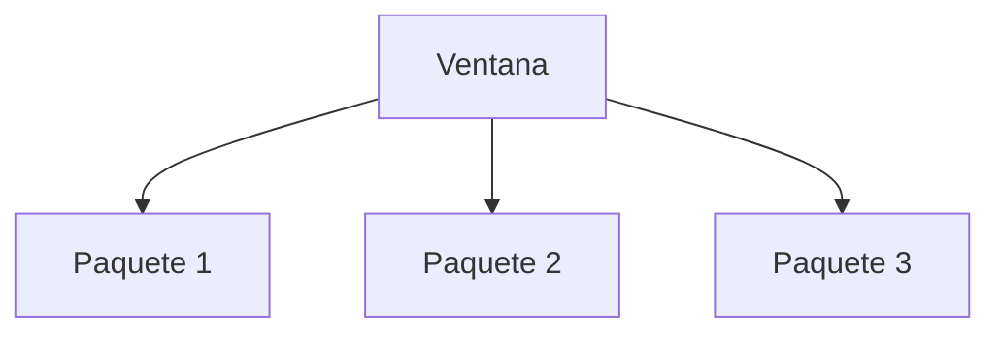

---

## Ajuste dinámico

### Idea clave

La ventana se adapta según la red.

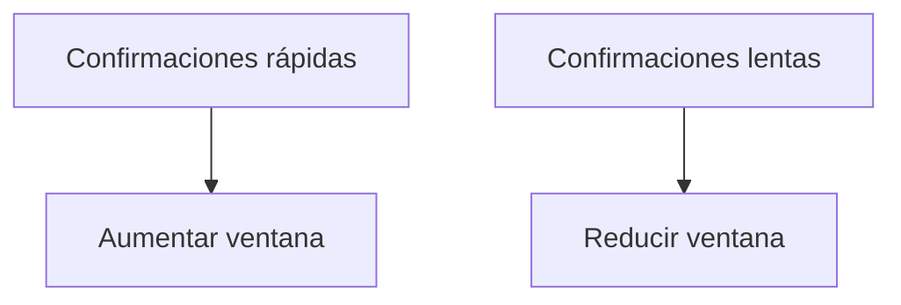

---

## Red rápida vs lenta

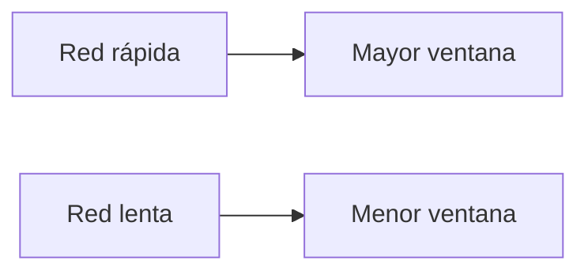

---

## Problema: paquete perdido

### Idea clave

Un paquete puede no llegar nunca.

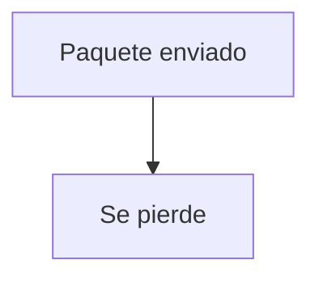

---

## Bloqueo temporal

### Idea clave

El sistema se detiene esperando confirmación.

---

## Solución: timeout

### Idea clave

El receptor detecta que pasó demasiado tiempo.

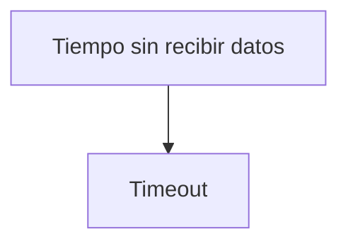

---

## Solicitud de reenvío

### Idea clave

El receptor pide reiniciar desde un punto.

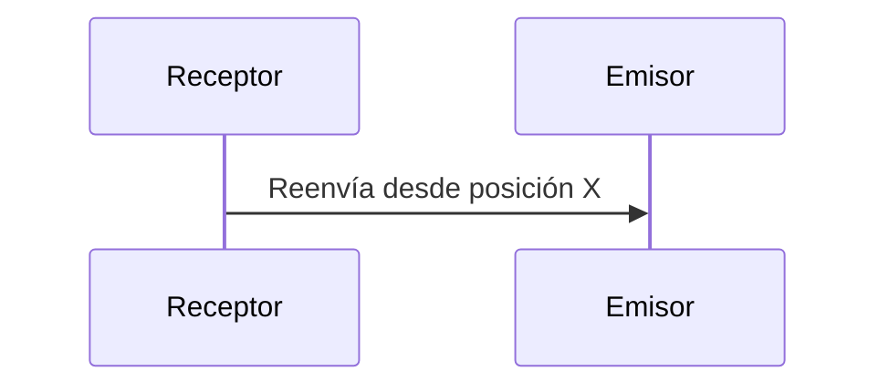

---

## Retransmisión

### Idea clave

El emisor “retrocede” y reenvía datos.

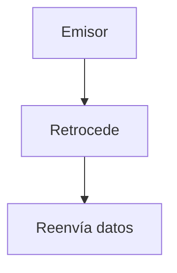

---

## Flujo completo simplificado

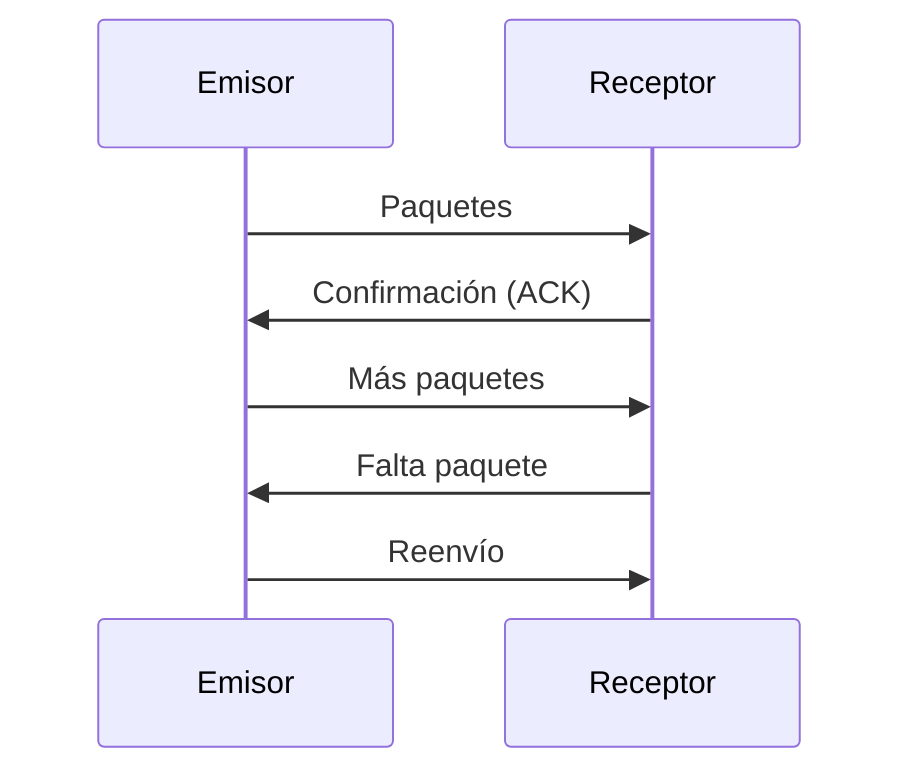

---

## Control continuo

### Idea clave

El sistema ajusta constantemente su comportamiento.

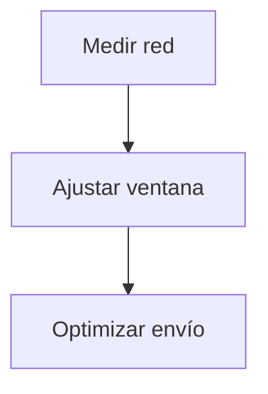

---

## Insight clave 

TCP logra fiabilidad combinando tres ideas simples:

- Reordenamiento con offsets
- Confirmaciones (ACKs)
- Retransmisión

> Esto convierte una red imperfecta en un sistema confiable

---

## Resumen

- Los paquetes pueden llegar desordenados
- Se reensamblan usando offsets
- Se usan buffers para paquetes adelantados
- Se detectan huecos en el mensaje
- El tamaño de ventana controla el flujo
- Se ajusta dinámicamente según la red
- Los paquetes perdidos detienen el envío
- El sistema usa timeouts para detectar fallos
- Se solicita retransmisión cuando falta información