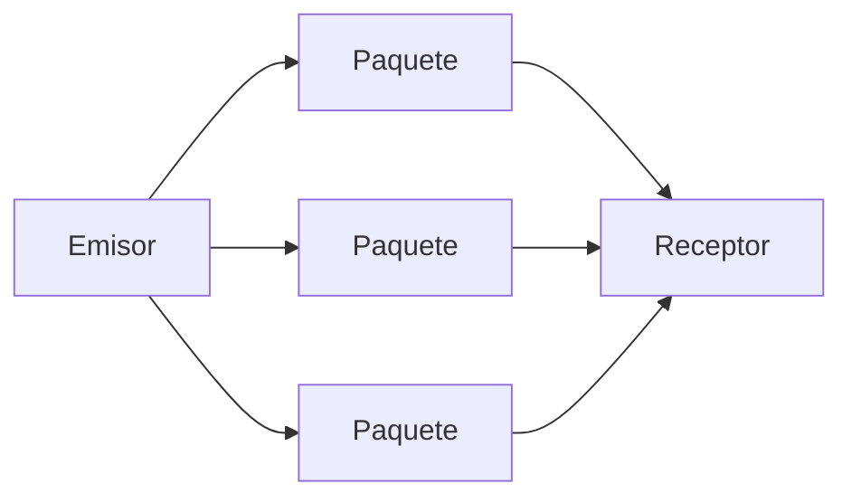
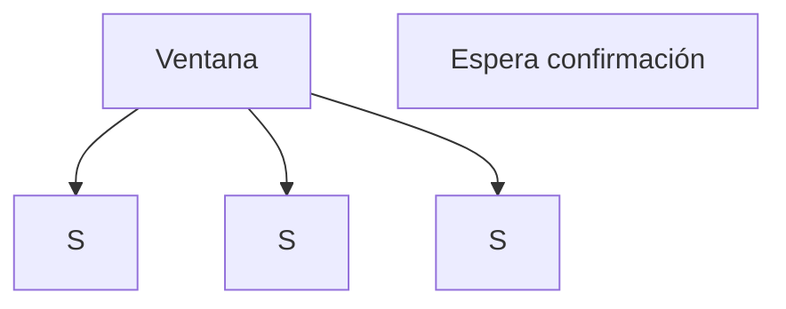
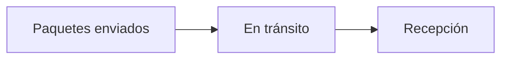
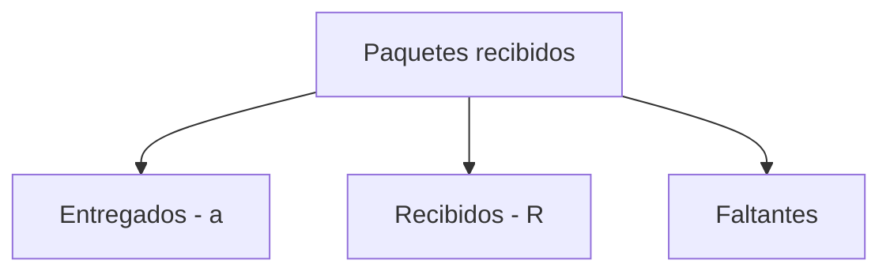
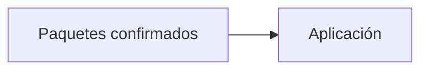
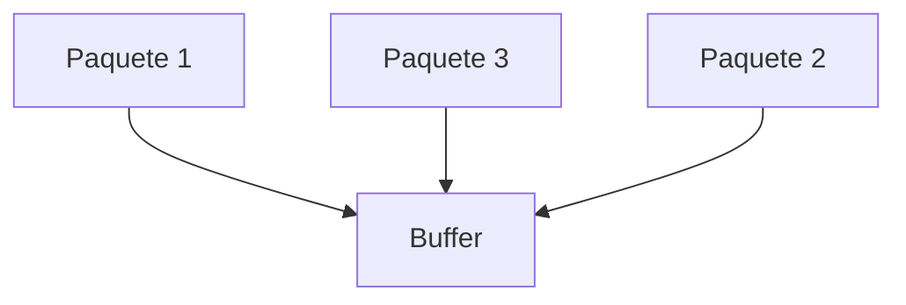
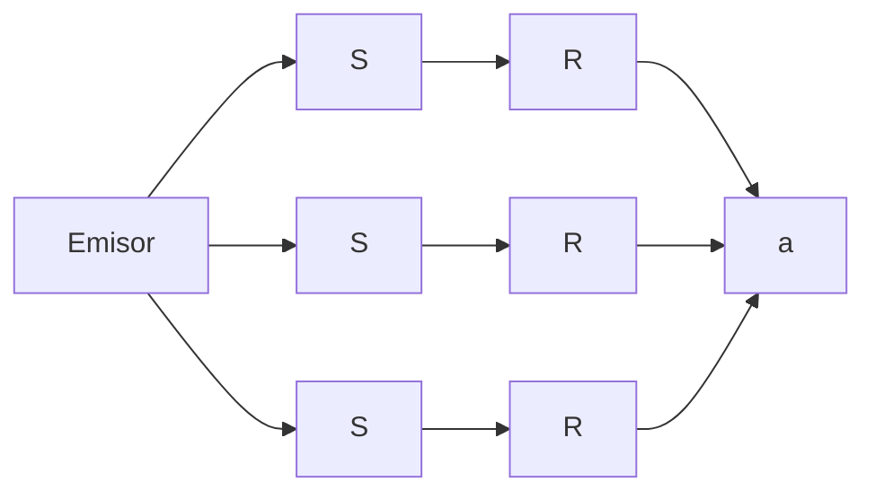
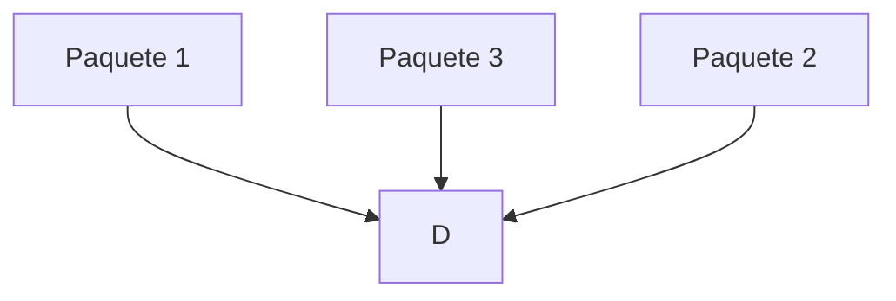
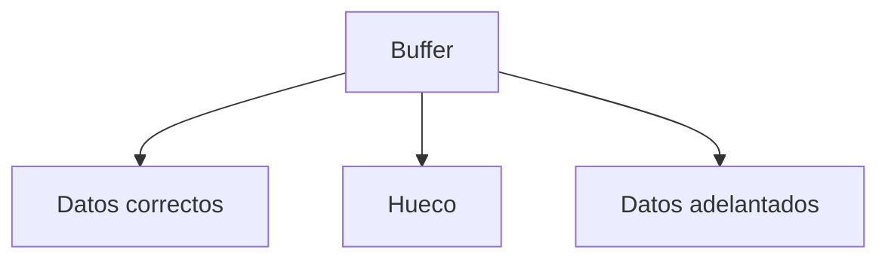
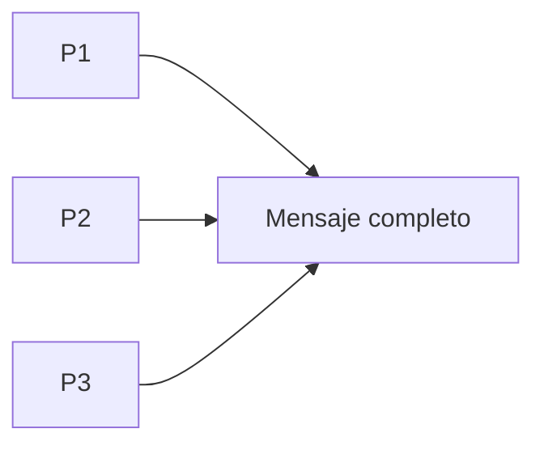

## Paquetes en tránsito

### Idea clave

Puede haber múltiples paquetes viajando al mismo tiempo.

---

## Ventana llena

### Idea clave

El emisor deja de enviar cuando alcanza el límite de la ventana.

### Explicación

- “S” = paquetes enviados pero no confirmados
- No se envían más hasta recibir ACK

---

## Flujo continuo

### Idea clave

Siempre hay paquetes “en el aire”.

---

## Estado en el receptor

### Idea clave

El receptor puede tener paquetes en diferentes estados.

---

## Paquetes entregados

### Idea clave

Los paquetes correctos ya pasan a la aplicación.

---

## Paquetes recibidos pero no ordenados

### Idea clave

El receptor puede recibir paquetes fuera de orden.

---

## Ejemplo completo

### Leyenda

- **S** → Enviado
- **R** → Recibido
- **a** → Entregado a la aplicación

---

## Problema: paquete desordenado

### Idea clave

Un paquete puede llegar antes que otro anterior.

---

## Solución: buffer temporal

### Idea clave

El receptor espera y almacena paquetes hasta completar el mensaje.

---

## Reconstrucción final

### Idea clave

El mensaje se arma como un rompecabezas.

---

## Insight clave 

La red puede entregar datos desordenados…

pero TCP garantiza orden final.

- No importa el orden de llegada
- Lo importante es el orden final
- El receptor se encarga

> Esto permite máxima eficiencia en la red

---

## Resumen

- Puede haber múltiples paquetes en tránsito
- El emisor se detiene cuando llena la ventana
- El receptor recibe paquetes en distintos estados
- Algunos paquetes ya están confirmados
- Otros están en buffer
- Algunos pueden llegar desordenados
- El sistema espera paquetes faltantes
- Finalmente, el mensaje se reconstruye correctamente