## Modelo cliente/servidor

### Idea clave

Las aplicaciones funcionan en pares: cliente y servidor.

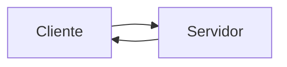

### Explicación

- Cliente → inicia la conexión
- Servidor → responde

---

## Ejemplo real

### Idea clave

Tu navegador es un cliente.

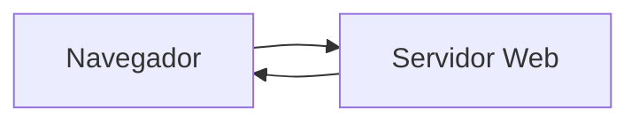

---

## Qué hace la capa de Transporte

### Idea clave

Hace que la comunicación entre aplicaciones sea confiable.

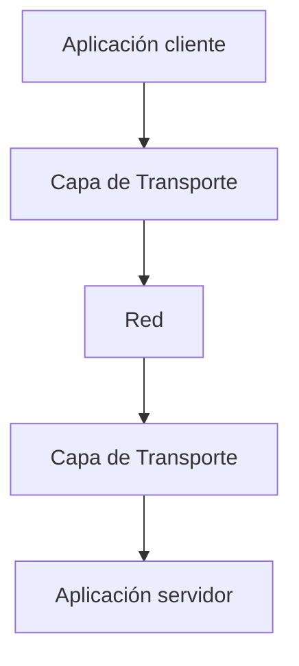

---

## Problema: múltiples aplicaciones en un mismo equipo

### Idea clave

Un servidor puede ejecutar muchas aplicaciones al mismo tiempo.

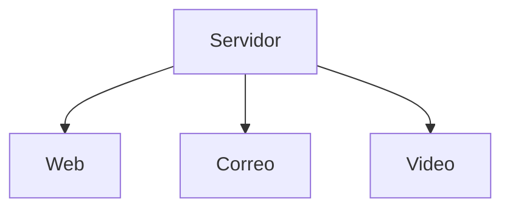

---

## Solución: puertos

### Idea clave

Los puertos identifican aplicaciones dentro de un equipo.

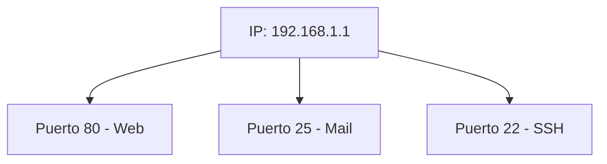

---

## Analogía: número telefónico

### Idea clave

IP = número principal, puerto = extensión.

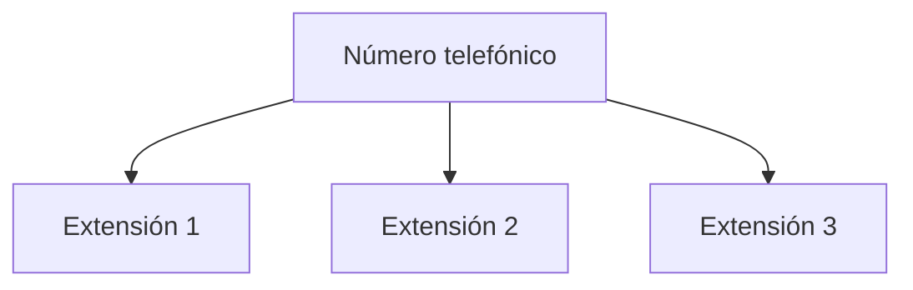

---

## Flujo de conexión

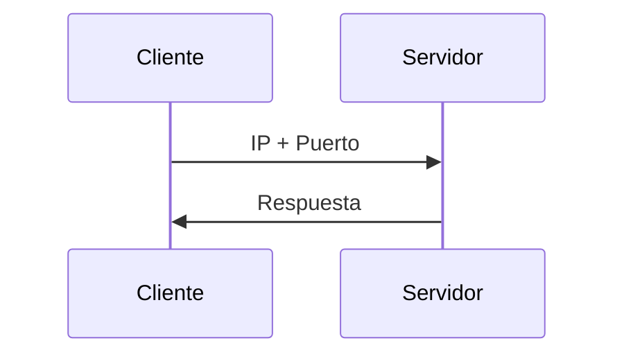

---

## Servidor en “escucha”

### Idea clave

El servidor espera conexiones en un puerto específico.

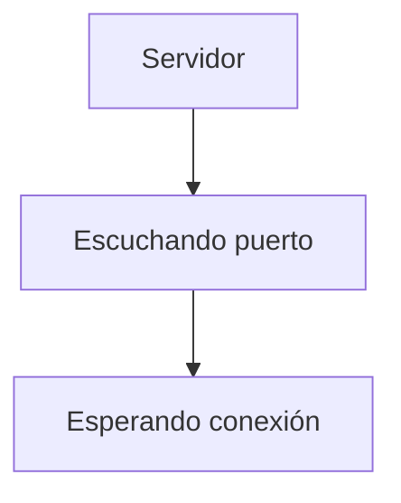

---

## Puertos más comunes

### Idea clave

Existen puertos estándar conocidos.

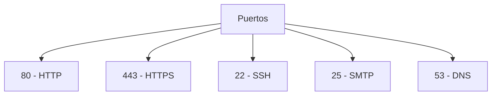

---

## Ejemplo con URL y puerto

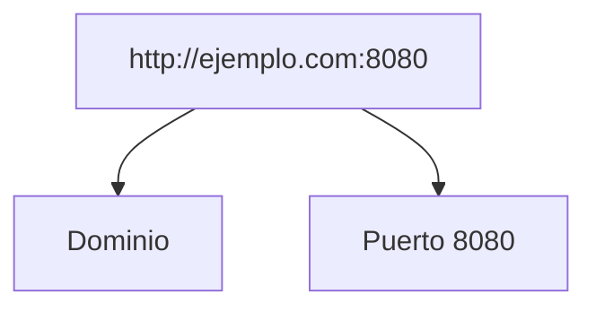

### Explicación

- Por defecto → puerto 80
- Aquí → puerto 8080

---

## Puertos no estándar

### Idea clave

Se pueden usar puertos personalizados.

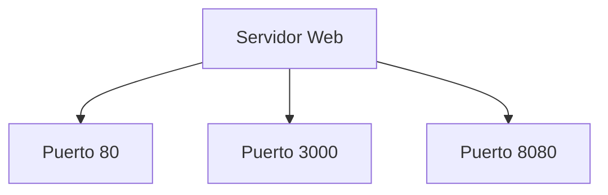

---

## Flujo completo

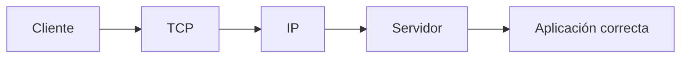

---

## Rol de la capa de Transporte en todo esto

### Idea clave

Permite que las aplicaciones no se preocupen por la red.

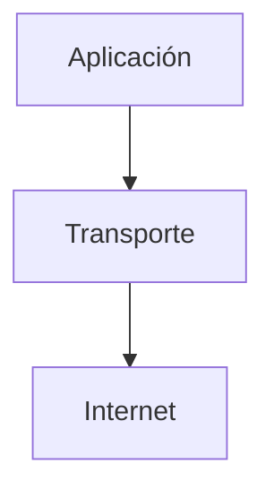

### Explicación

- Maneja errores
- Reenvía datos
- Controla flujo

---

## Arquitectura en capas

### Idea clave

Cada capa resuelve una parte del problema.

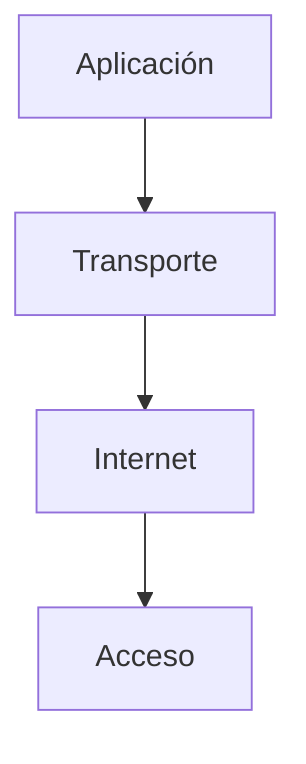

---

## Insight clave 
IP identifica máquinas, puertos identifican aplicaciones.

- IP → “dónde”
- Puerto → “qué aplicación”

> Ambos son necesarios para comunicar software en red

---

## Resumen

- Las aplicaciones usan el modelo cliente/servidor
- El cliente inicia la conexión
- El servidor responde
- Un mismo equipo puede tener múltiples servicios
- Los puertos identifican cada servicio
- Existen puertos estándar
- Se pueden usar puertos personalizados
- La capa de Transporte hace posible todo esto de forma confiable
- Las capas simplifican el diseño del sistema