## Dividir un problema complejo

### Idea clave

Internet se diseñó dividiendo el problema en capas independientes.

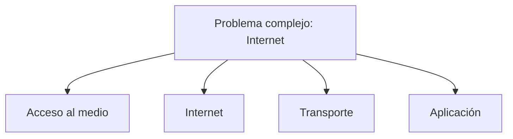

### Explicación

- En lugar de resolver todo de una vez
- Se divide en partes más pequeñas
- Cada capa resuelve un problema específico

---

## Modelo de capas (TCP/IP)

### Idea clave

Las capas se organizan como una pila.

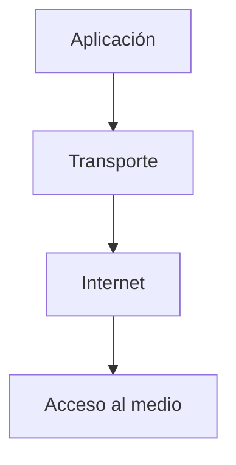

### Explicación

- **Acceso**: conexión física
- **Internet**: direccionamiento y rutas
- **Transporte**: control de comunicación
- **Aplicación**: interacción con el usuario

---

## ¿Qué hace la capa de acceso?

### Idea clave

Conecta un dispositivo a su red local y mueve datos en un solo salto.

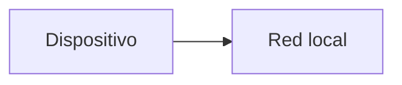

### Explicación

- Es el nivel más cercano al hardware
- Maneja conexiones físicas o inalámbricas
- Solo cubre distancias cortas

---

## Tipos de conexión en la capa de acceso

### Idea clave

Las conexiones tienen alcance limitado.

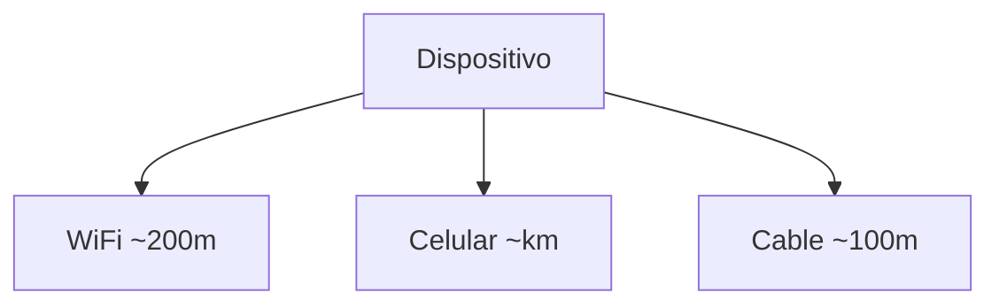

### Explicación

- WiFi → corto alcance
- Celular → mayor alcance, pero depende de torres
- Cable → conexión física directa

---

## Problema 1: cómo enviar datos

### Idea clave

Hay que definir cómo representar los bits en el medio físico.

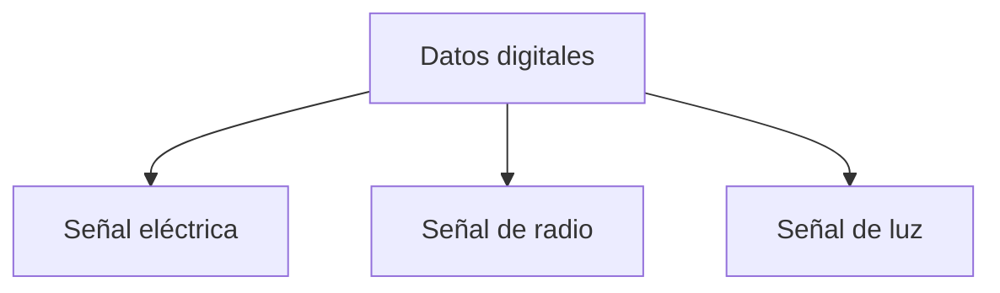

### Explicación

Dependiendo del medio:

- Cable → voltaje
- WiFi → ondas de radio
- Fibra → luz

---

## Problema 2: compartir el medio

### Idea clave

Múltiples dispositivos usan la misma red → riesgo de colisiones.

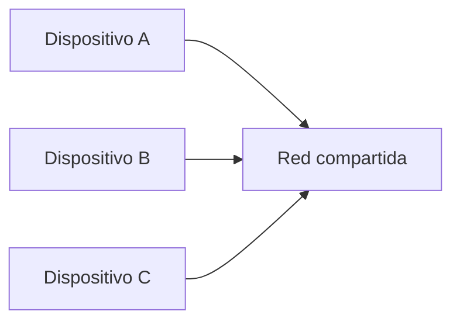

### Problema

- Si todos transmiten al mismo tiempo
- Los datos se mezclan
- Se genera ruido

---

## Solución: turnarse usando paquetes

### Idea clave

Dividir datos en paquetes permite compartir la red.

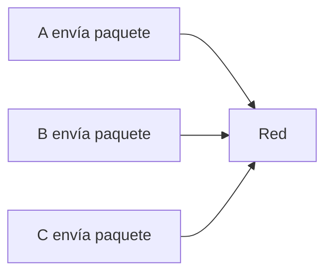

### Explicación

- Cada dispositivo envía un paquete
- Luego espera
- Se alternan de forma ordenada

---

## Cómo sabe un dispositivo si puede transmitir

### Idea clave

Se usa un mecanismo llamado CSMA/CD.

---

## CSMA/CD explicado

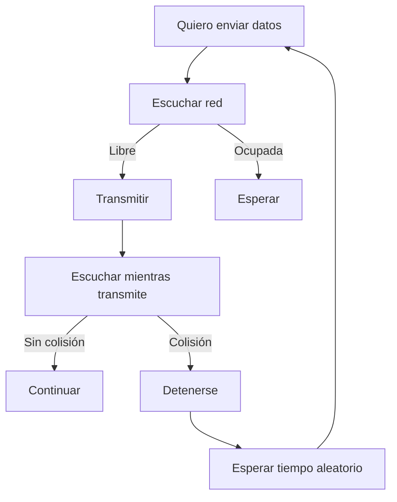

### Explicación

- Escucha si alguien está transmitiendo
- Si no, transmite
- Si detecta colisión:
    - Se detiene
    - Espera
    - Intenta de nuevo

---

## Qué es una colisión

### Idea clave

Ocurre cuando dos dispositivos transmiten al mismo tiempo.

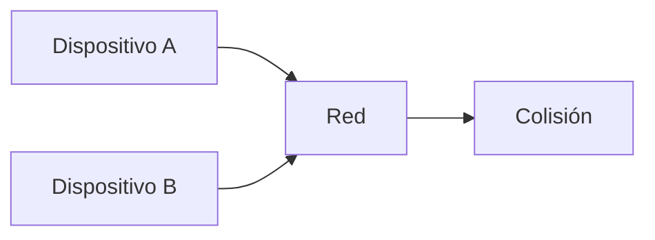

### Explicación

- Los datos se mezclan
- No se pueden interpretar correctamente
- Se requiere reintento

---

## Compartición justa de la red

### Idea clave

El sistema permite uso eficiente tanto con pocos como con muchos dispositivos.

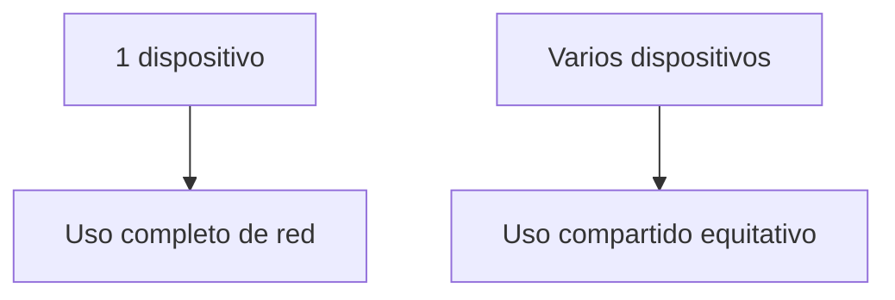

### Explicación

- Un dispositivo → usa toda la red
- Muchos → se turnan automáticamente

---

## Tipos de redes en la capa de acceso

### Redes compartidas

- WiFi
- Celular
- Cable modem

### Redes no compartidas

- Fibra óptica dedicada
- Líneas arrendadas

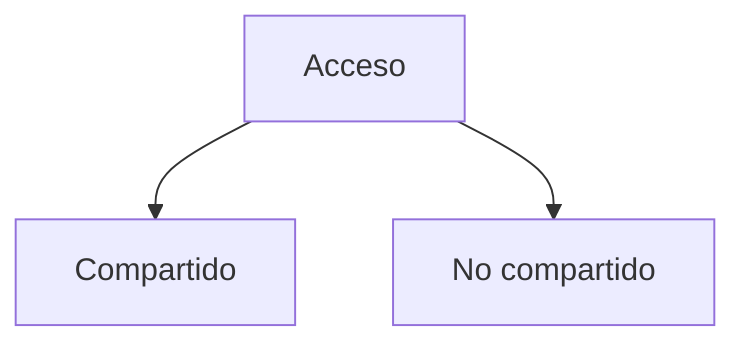

---

## Salto (hop)

### Idea clave

Cada vez que un paquete pasa de un dispositivo a otro, realiza un salto.

### Explicación

- Cada salto usa la capa de acceso
- Internet completo = muchos saltos

---

## Viaje global de un paquete

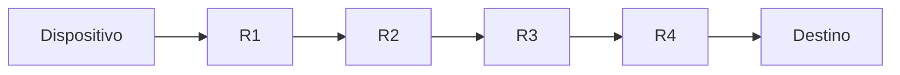

### Idea clave

Un mensaje puede atravesar ~20 routers para llegar al otro lado del mundo.

---

## Insight clave (muy importante)

La capa de acceso permite que los datos se muevan en distancias cortas, pero es la base de todo Internet.

- Define cómo viajan los bits
- Permite compartir el medio
- Hace posibles los saltos

> Sin esta capa, nada podría transmitirse físicamente

---

## Resumen

- Internet se divide en capas para simplificar su diseño
- La capa de acceso conecta dispositivos a la red local
- Define cómo se transmiten los datos físicamente
- Gestiona redes compartidas
- Usa mecanismos como CSMA/CD para evitar colisiones
- Permite que múltiples dispositivos compartan el medio
- Cada transmisión entre nodos es un “salto”
- Muchos saltos permiten comunicación global