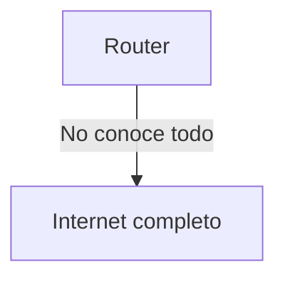
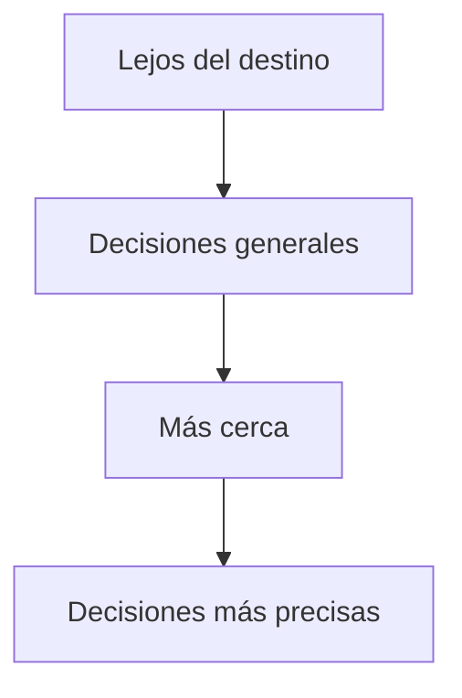
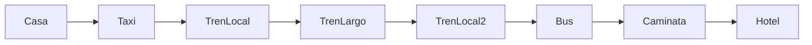
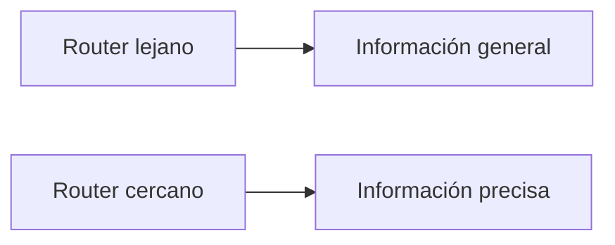
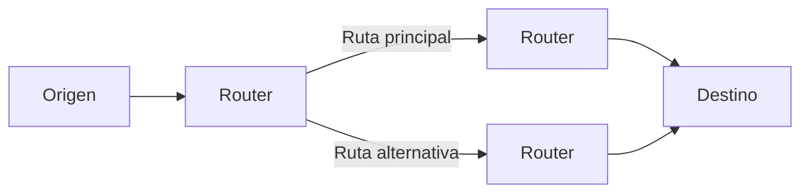
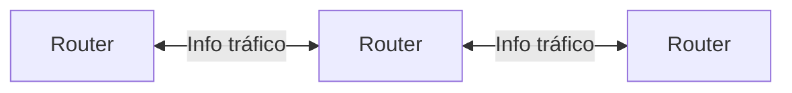
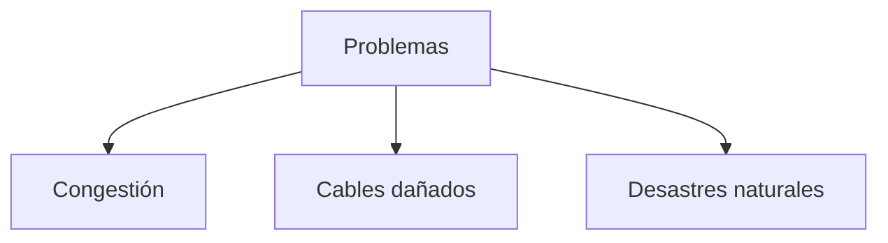
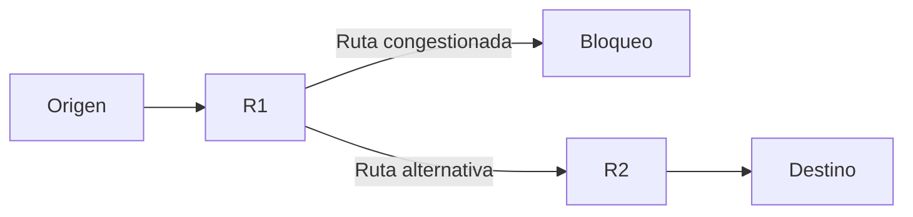
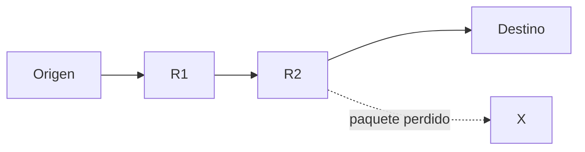

## El rol de la capa de Internet

### Idea clave

La capa de Internet se encarga de mover paquetes a través de múltiples redes usando routers.

### Explicación

- Después del primer salto, el paquete entra a Internet
- Cada router decide el siguiente paso
- El objetivo es acercar el paquete al destino

---

## Decisiones sin conocimiento total

### Idea clave

Ningún router conoce toda la red ni todas las rutas posibles.

### Explicación

- Internet tiene miles de millones de dispositivos
- Es imposible mantener información completa
- Cada router toma decisiones locales

---

## Estrategia: acercarse al destino

### Idea clave

Cada router intenta enviar el paquete “más cerca” del destino.

### Explicación

- No necesita saber toda la ruta
- Solo necesita elegir un buen siguiente paso
- Los routers cooperan indirectamente

---

## Precisión aumenta con la cercanía

### Idea clave

Mientras más cerca está el paquete, más precisa es la ruta.

### Explicación

- Lejos → decisiones aproximadas
- Cerca → decisiones exactas

---

## Analogía: viajar por el mundo

### Idea clave

Internet funciona como un viaje con múltiples transportes.

### Explicación

- Cada etapa te acerca más al destino
- No necesitas conocer todo el trayecto desde el inicio
- Cada “nodo” sabe solo su parte

---

## Diferente conocimiento en cada punto

### Idea clave

Los nodos cercanos al destino tienen más información detallada.

### Explicación

- Lejos → solo sabe “hacia dónde avanzar”
- Cerca → sabe exactamente a dónde entregar

---

## Adaptación a problemas

### Idea clave

Los routers pueden cambiar rutas dinámicamente.

### Explicación

- Si una ruta falla, se usa otra
- La red se adapta automáticamente

---

## Comunicación entre routers

### Idea clave

Los routers intercambian información sobre el estado de la red.

### Explicación

- Informan sobre congestión
- Informan sobre fallos
- Ajustan rutas en conjunto

---

## Problemas comunes en la red

### Idea clave

La red no siempre funciona perfectamente.

### Explicación

- Tráfico excesivo
- Fallos físicos
- Eventos externos

---

## Redirección del tráfico

### Idea clave

Los paquetes pueden desviarse cuando hay problemas.

### Explicación

- Los routers detectan fallos
- Buscan caminos alternativos
- Mantienen la comunicación activa

---

## Pérdida de paquetes

### Idea clave

Algunos paquetes pueden perderse en el camino.

### Explicación

- No todos los paquetes llegan
- La red no garantiza entrega perfecta
- Otra capa se encarga de esto

---

## Insight clave (muy importante)

La capa de Internet es un sistema distribuido que toma decisiones locales para lograr un objetivo global.

- No hay control central
- Cada router decide de forma independiente
- La cooperación emergente permite que funcione Internet

> Este diseño hace que Internet sea escalable y resiliente

---

## Resumen

- Los routers dirigen paquetes hacia su destino
- No tienen conocimiento completo de la red
- Cada router acerca el paquete progresivamente
- Las decisiones son más precisas cerca del destino
- Los routers intercambian información
- La red se adapta a congestión y fallos
- Algunos paquetes pueden perderse
- La capa de Internet no garantiza entrega perfecta