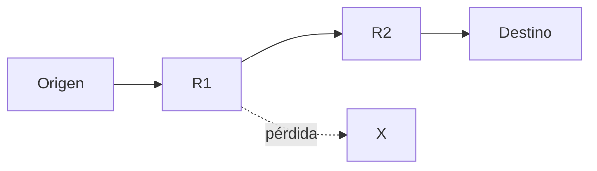
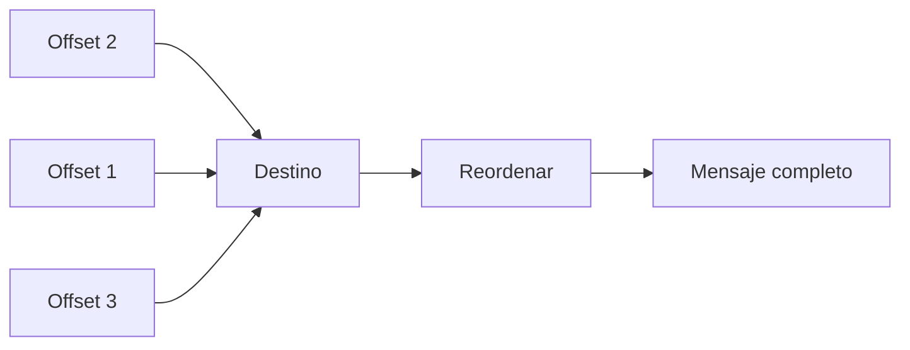
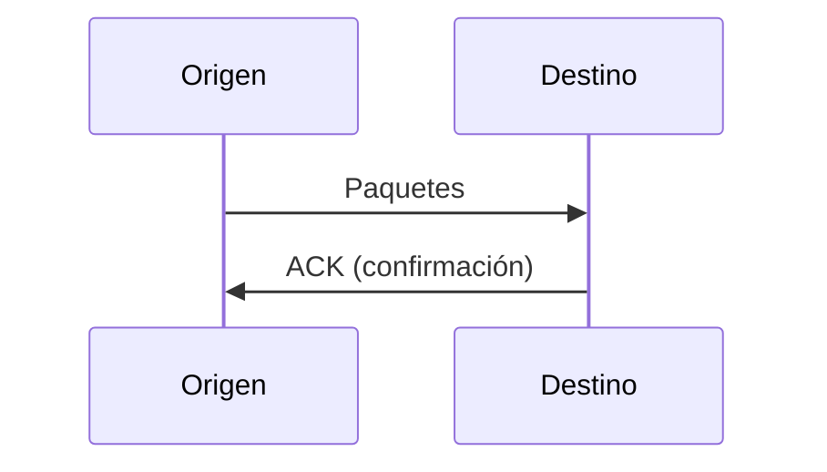
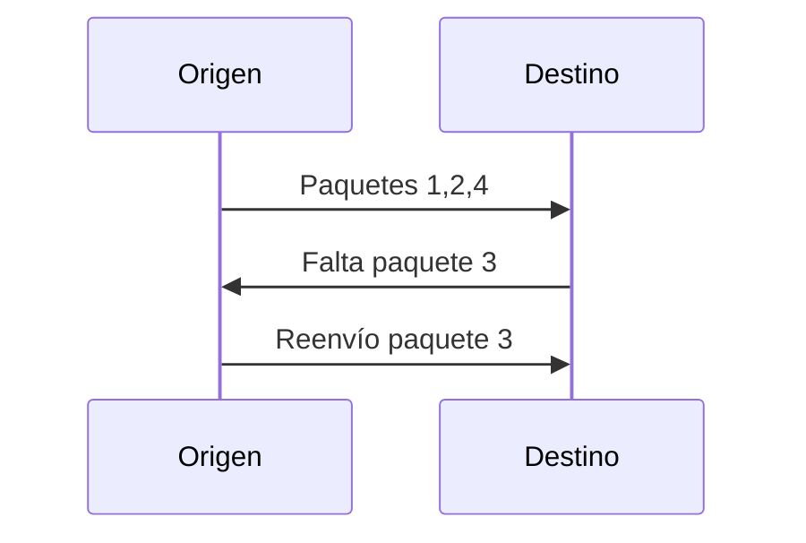
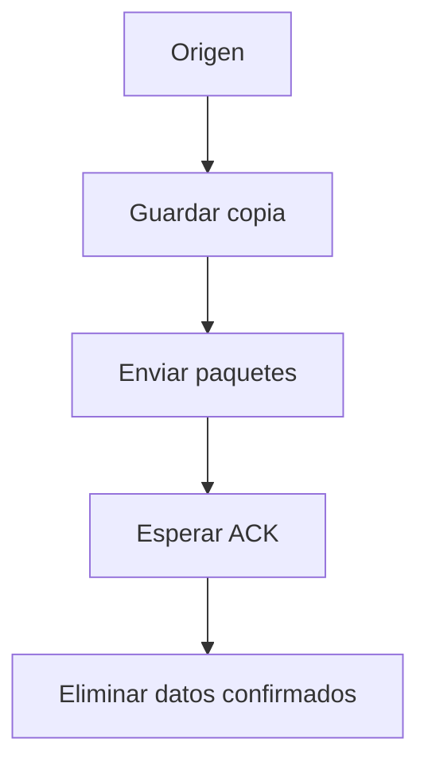
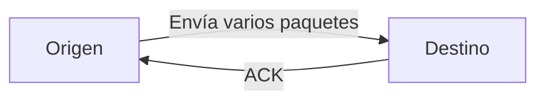
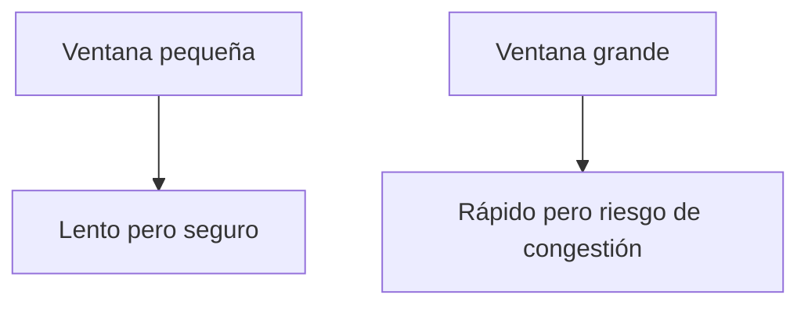
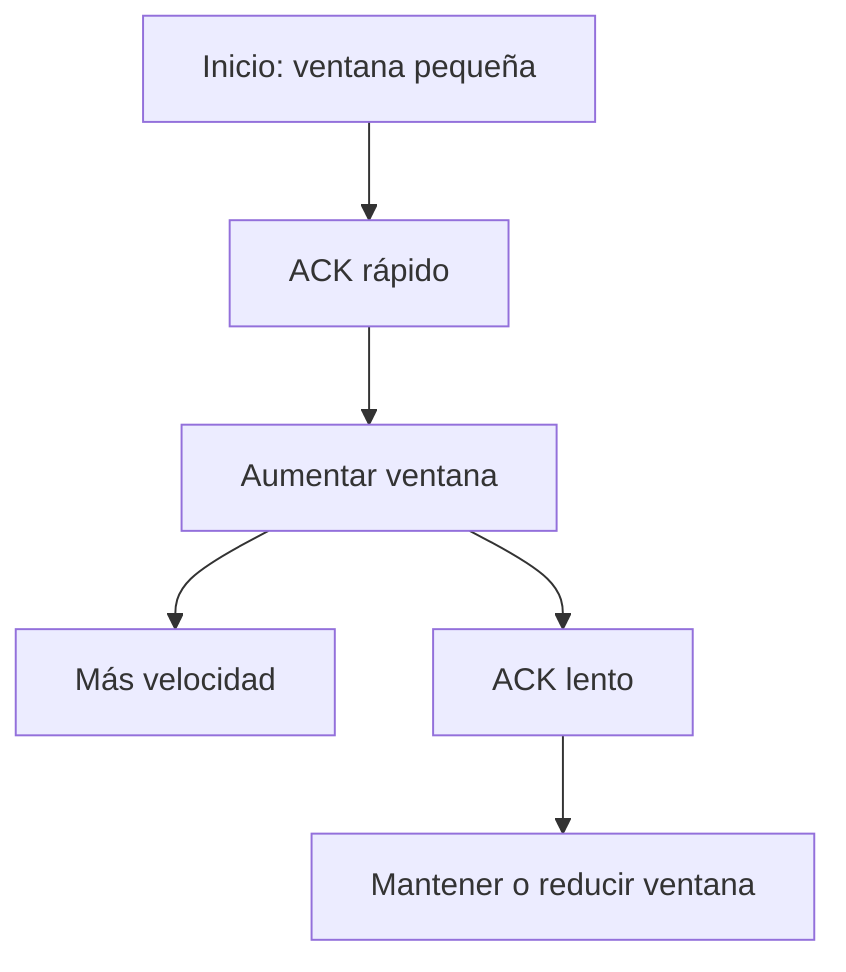
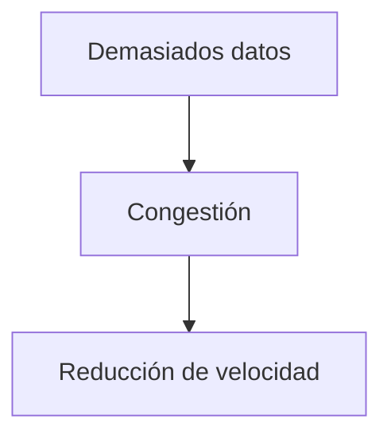
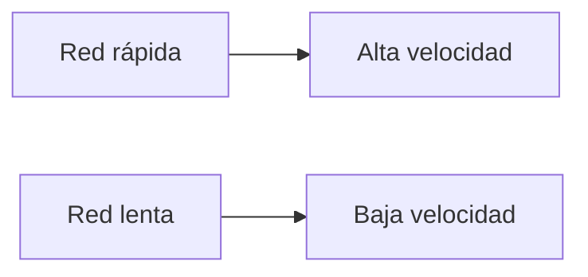

## Problemas de la capa de Internet

### Idea clave

La capa de Internet no garantiza que los paquetes lleguen correctamente.

### Problemas posibles

- Paquetes perdidos
- Paquetes retrasados
- Paquetes desordenados

---

## Reconstrucción del mensaje

### Idea clave

El destino puede reconstruir el mensaje usando el offset.

### Explicación

- Cada paquete indica su posición
- El destino reordena los datos
- Se reconstruye el mensaje original

---

## Acuse de recibo (ACK)

### Idea clave

El destino confirma qué datos ha recibido correctamente.

### Explicación

- El destino envía confirmaciones periódicas
- Indica cuánto del mensaje ha recibido
- Permite al origen saber qué datos ya llegaron

---

## Detección de pérdida

### Idea clave

Si faltan datos, el destino solicita retransmisión.

### Explicación

- El destino detecta huecos en la secuencia
- Espera un tiempo
- Solicita los paquetes faltantes

---

## Almacenamiento en el origen

### Idea clave

El origen guarda los datos hasta recibir confirmación.

### Explicación

- No se eliminan datos inmediatamente
- Se espera confirmación del destino
- Evita pérdida definitiva

---

## Tamaño de ventana

### Idea clave

Define cuántos datos se envían antes de esperar confirmación.

---

## Ventana pequeña vs grande

### Idea clave

El tamaño de ventana afecta la velocidad y estabilidad.

### Explicación

- Pequeña → espera frecuente → menor velocidad
- Grande → más datos → posible saturación

---

## Ajuste dinámico de la ventana

### Idea clave

TCP ajusta el tamaño de ventana según la red.

### Explicación

- Si la red responde rápido → aumenta velocidad
- Si la red está lenta → reduce ritmo
- Se adapta automáticamente

---

## Control de congestión

### Idea clave

TCP evita sobrecargar la red.

### Explicación

- Evita saturar routers
- Protege la red compartida
- Mantiene estabilidad global

---

## Comportamiento adaptativo

### Idea clave

TCP se adapta a las condiciones de la red.

### Explicación

- Redes rápidas → transmisión rápida
- Redes saturadas → transmisión lenta

---

## Analogía: conversación educada

### Idea clave

TCP funciona como reglas de cortesía.

- Esperar turno
- Confirmar recepción
- No interrumpir demasiado

> Igual que en comunicación humana eficiente

---

## Insight clave (muy importante)

TCP convierte una red no confiable en una comunicación confiable.

- Detecta pérdidas
- Reenvía datos
- Ordena paquetes
- Ajusta velocidad

> Sin TCP, Internet sería caótico

---

## Resumen

- La capa de Internet no garantiza entrega correcta
- TCP reconstruye mensajes completos
- Usa acuses de recibo (ACK)
- Detecta y corrige pérdidas
- El origen guarda datos hasta confirmación
- El tamaño de ventana controla el flujo
- TCP se adapta a la velocidad de la red
- Evita congestión y mantiene estabilidad