## El rol de la capa de aplicación

### Idea clave

La capa de aplicación es donde los usuarios interactúan con Internet.

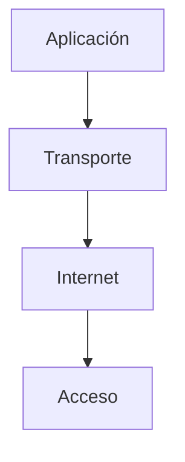

### Explicación

- Las capas inferiores mueven datos
- La capa de aplicación define **qué hacemos con esos datos**

---

## Qué permite esta capa

### Idea clave

Gracias a esta capa, podemos construir aplicaciones útiles sobre la red.

### Ejemplos

- Navegar en la web
- Enviar correos
- Transferir archivos
- Chatear

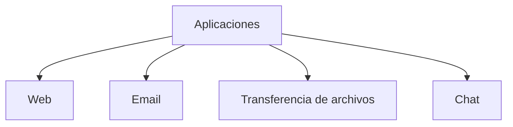

---

## Primeras aplicaciones de Internet

### Idea clave

Las primeras aplicaciones ya permitían comunicación remota.

### Funcionalidades

- Login remoto
- Transferencia de archivos
- Correo electrónico
- Chat

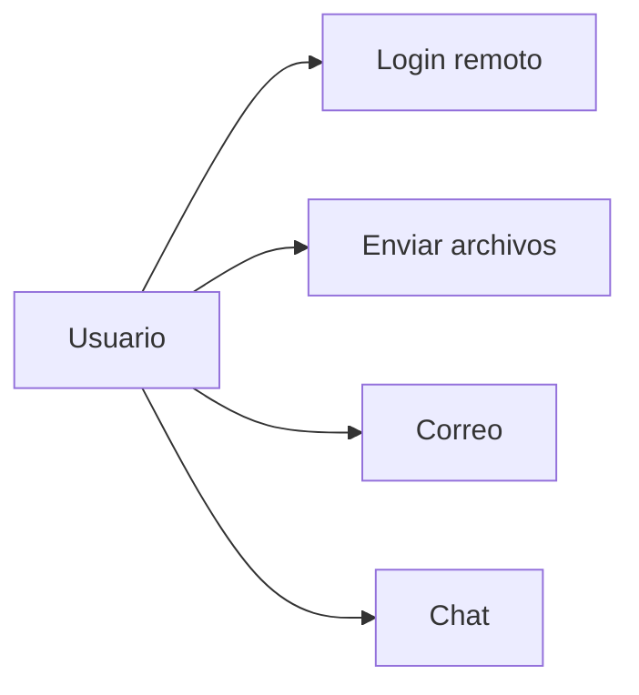

---

## La llegada de la Web

### Idea clave

La World Wide Web revolucionó el uso de Internet.

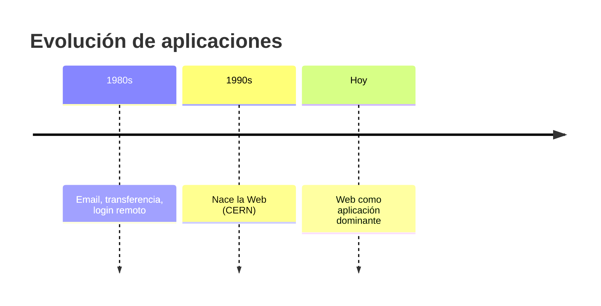

### Explicación

- Introdujo documentos con texto + imágenes
- Basada en hipertexto
- Hoy es la aplicación más usada

---

## Modelo cliente-servidor

### Idea clave

Las aplicaciones se dividen en cliente y servidor.

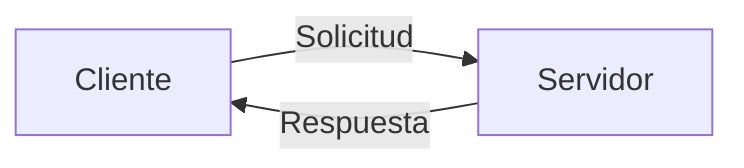

### Explicación

- Cliente → inicia comunicación
- Servidor → responde

---

## Qué es el cliente

### Idea clave

El cliente es el programa que usa el usuario.

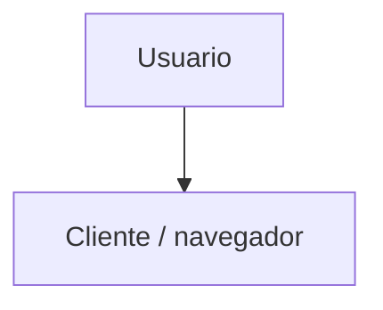

### Ejemplos

- Navegador web (Chrome, Firefox)
- App de correo
- App móvil

---

## Qué es el servidor

### Idea clave

El servidor es el sistema que responde a solicitudes.

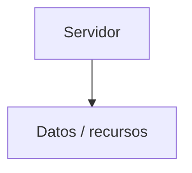

### Explicación

- Espera conexiones
- Procesa solicitudes
- Envía respuestas

---

## Ejemplo: navegar en la web

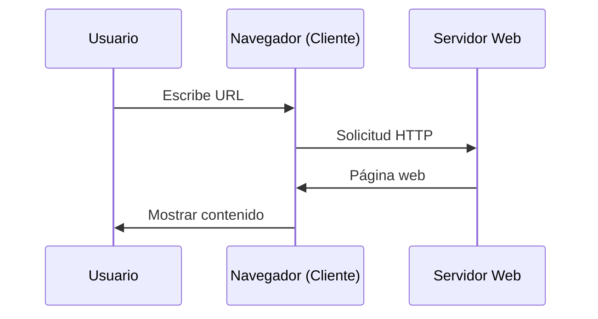

### Idea clave

El cliente solicita y el servidor responde con contenido.

---

## Qué es una URL

### Idea clave

Una URL identifica el servidor y el recurso.

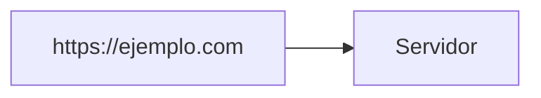

### Explicación

- Indica dónde está el recurso
- El cliente la usa para conectarse

---

## Protocolos de aplicación

### Idea clave

Cliente y servidor necesitan reglas para comunicarse.

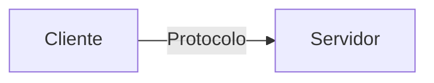

### Explicación

- Define formato de mensajes
- Define cómo interactúan
- Es específico para cada aplicación

---

## Ejemplos de protocolos

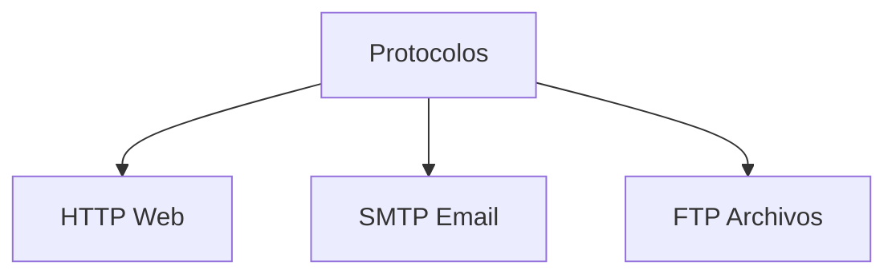

### Idea clave

Cada aplicación tiene su propio protocolo.

---

## Especialización de protocolos

### Idea clave

Cada protocolo está diseñado para una necesidad específica.

- Web → documentos
- Email → mensajes
- Archivos → transferencia

> No existe un único protocolo universal para todo

---

## Insight clave (muy importante)

La capa de aplicación es donde Internet se vuelve útil para los humanos.

- Las capas inferiores mueven datos
- Esta capa define **experiencias**
- Aquí viven las apps que usamos diario

> Sin esta capa, Internet sería solo cables y paquetes

---

## Resumen

- La capa de aplicación es la interfaz con el usuario
- Permite construir aplicaciones sobre la red
- Usa modelo cliente-servidor
- El cliente solicita, el servidor responde
- Las URLs identifican recursos
- Cada aplicación usa su propio protocolo
- La web es la aplicación más utilizada