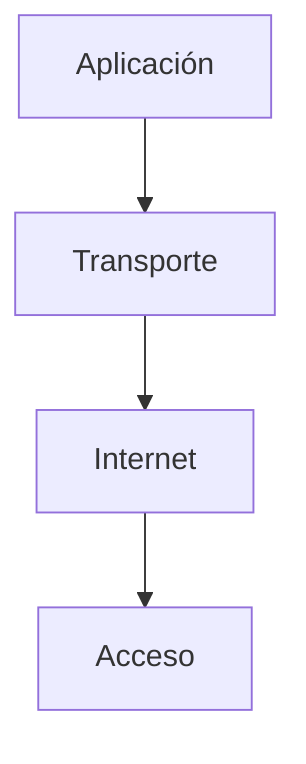
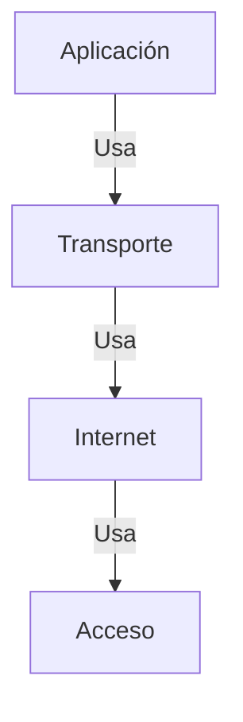
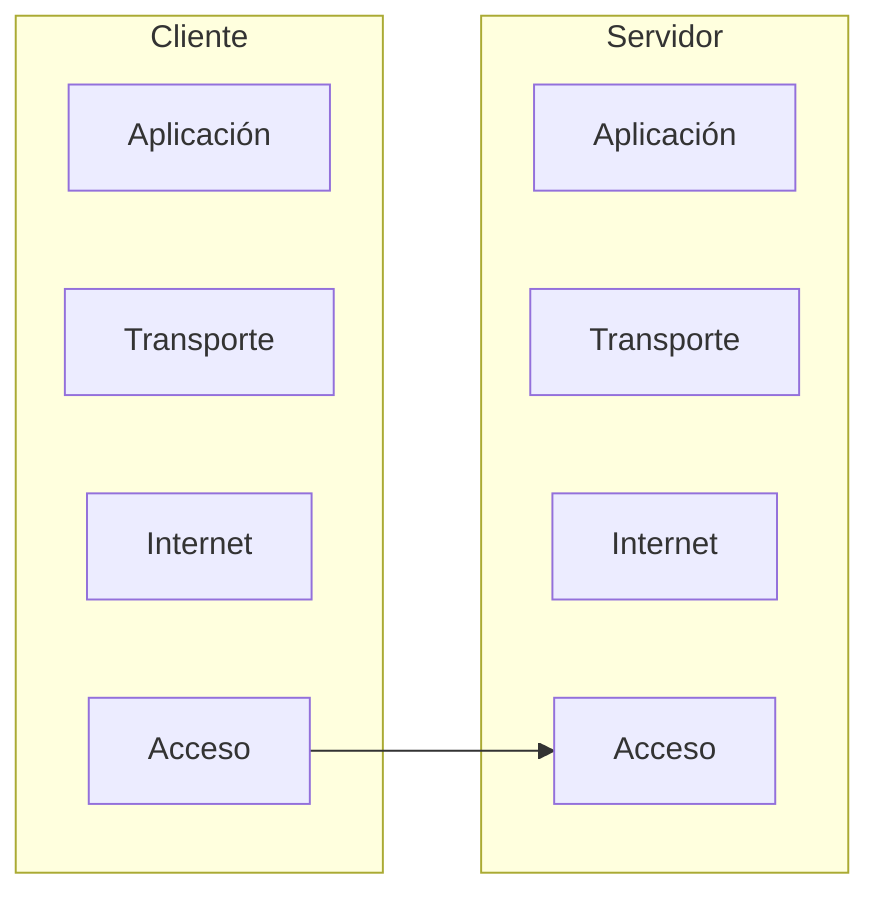
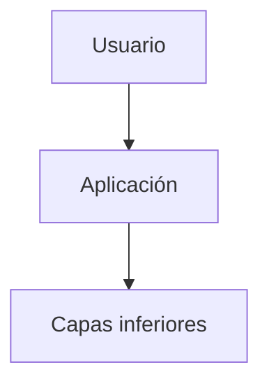
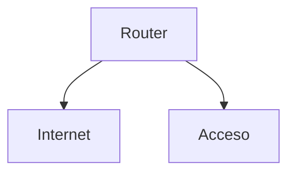
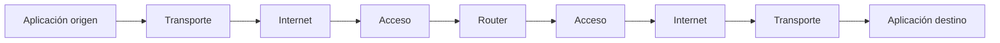
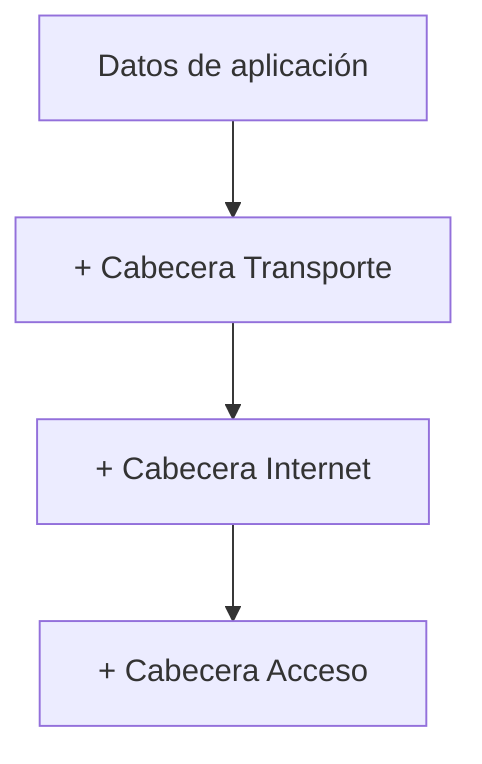
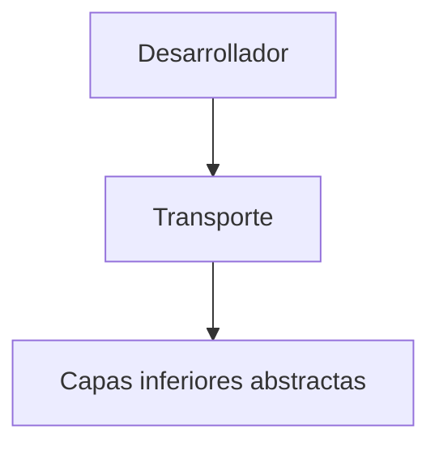
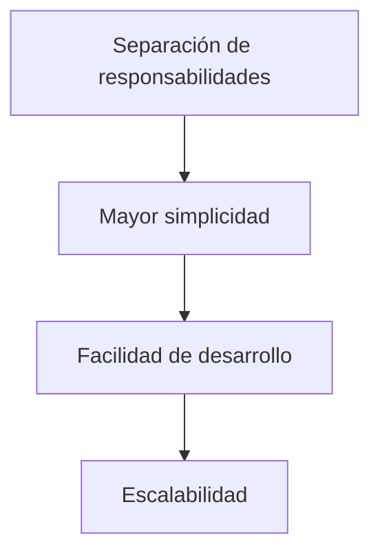

## Representación en capas

### Idea clave

Las capas se representan como una pila donde cada una depende de las demás.

### Explicación

- Aplicación → lo que usa el usuario
- Transporte → controla la comunicación
- Internet → enruta paquetes
- Acceso → mueve bits físicamente

---

## Interacción entre capas

### Idea clave

Cada capa usa los servicios de la capa inferior.

### Explicación

- No trabajan de forma aislada
- Cada capa delega responsabilidades
- Se construyen una sobre otra

---

## Capas en el cliente y el servidor

### Idea clave

Todas las capas existen tanto en el origen como en el destino.

### Explicación

- Cliente y servidor tienen la misma estructura
- La comunicación ocurre entre capas equivalentes

---

## Qué ve el usuario

### Idea clave

El usuario solo interactúa con la capa de aplicación.

### Explicación

- Navegador, app, etc.
- Todo lo demás ocurre “debajo”
- Es invisible para el usuario

---

## Qué hacen los routers

### Idea clave

Los routers solo operan en capas inferiores.

### Explicación

- No entienden aplicaciones
- No gestionan transporte
- Solo leen direcciones y reenvían paquetes

---

## Flujo de datos completo

### Idea clave

Los datos bajan por las capas en el origen y suben en el destino.

---

## Encapsulamiento (concepto clave)

### Idea clave

Cada capa agrega información al paquete.

### Explicación

- Cada capa añade información
- Esto permite que cada capa cumpla su función
- El proceso se invierte en el destino

---

## Simplificación para desarrolladores

### Idea clave

Los desarrolladores no necesitan entender todas las capas.

### Explicación

- Se programa sobre TCP/UDP
- No es necesario manejar routers o cables
- El modelo abstrae la complejidad

---

## Ventaja del modelo por capas

### Idea clave

Permite construir sistemas complejos de forma modular.

### Explicación

- Cada capa resuelve un problema
- Se pueden mejorar de forma independiente
- Facilita evolución del sistema

---

## Insight clave (muy importante)

El modelo en capas permite que Internet sea entendible, escalable y programable.

- Abstrae la complejidad
- Divide responsabilidades
- Permite innovación en cada nivel

> Es una de las ideas más importantes en toda la ingeniería de redes

---

## Resumen

- Las capas se organizan como una pila
- Cada capa depende de la inferior
- Cliente y servidor tienen todas las capas
- El usuario solo interactúa con la capa de aplicación
- Los routers operan en Internet y Acceso
- Los datos bajan y suben por las capas
- El modelo simplifica el desarrollo
- Permite construir sistemas complejos de forma modular