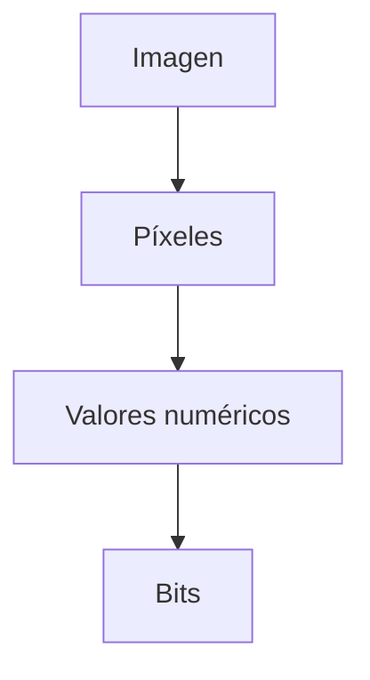

# De bits a información (texto, imágenes, video)

En la lección anterior vimos que todo en una red se reduce a bits:

> secuencias de 0 y 1
> 

Pero eso abre una pregunta clave:

> ¿Cómo pasamos de 0 y 1 a algo que podamos entender, como texto, imágenes o video?
> 

---

## La idea clave

Los bits por sí solos no tienen significado.

Para que representen información, necesitamos:

> **reglas que indiquen cómo interpretar esos bits**
> 

A estas reglas se les llama **codificación**.

---

## Texto: de bits a letras

Para representar texto, usamos tablas que asignan números a caracteres.

Por ejemplo, en una codificación común:

- 01000001 → A
- 01000010 → B
- 01000011 → C

Esto significa que:

> cada letra es en realidad un conjunto de bits
> 

---

### Ejemplo

La palabra:

```
HOLA
```

se convierte en bits como:

```
01001000 01001111 01001100 01000001
```

El dispositivo receptor usa la misma codificación para reconstruir el texto.

---

## Imágenes: de bits a píxeles

Una imagen está formada por una cuadrícula de puntos llamados **píxeles**.

Cada píxel tiene información como:

- color
- intensidad

---



---

Por ejemplo:

- un píxel puede representarse con números como (255, 0, 0) → rojo
- esos números se convierten en bits

Una imagen completa es simplemente una gran colección de píxeles codificados en bits.

---

## Video: imágenes en secuencia

Un video no es más que:

> muchas imágenes mostradas rápidamente una tras otra
> 

Por ejemplo:

- 24 imágenes por segundo
- 30 imágenes por segundo

Cada imagen ya está representada en bits, por lo que:

> un video es una secuencia de bits que representan muchas imágenes en el tiempo
> 

---

## Sonido (intuición rápida)

El sonido también se convierte en datos:

- se capturan ondas de audio
- se transforman en números
- esos números se convierten en bits

---

## Analogía importante

Piensa en los bits como números sin significado.

La codificación es como un idioma que dice:

- este número significa una letra
- este número significa un color
- este número significa un sonido

Sin ese “idioma”, los bits no tienen sentido.

---

## Ejemplo real

Cuando ves un video en una plataforma como YouTube:

- el video está almacenado como bits
- esos bits viajan por la red
- tu dispositivo los interpreta como imágenes y sonido

---

## Intuición clave

Los bits no representan información por sí solos.

> lo importante es cómo los interpretamos
> 

Gracias a las codificaciones, los bits pueden convertirse en:

- texto
- imágenes
- audio
- video

---

## Idea clave de esta lección

La información digital existe porque usamos reglas de codificación para interpretar combinaciones de bits como datos comprensibles.

---

## Repaso

- Los bits necesitan reglas para tener significado
- Esas reglas se llaman codificación
- El texto se representa asignando bits a caracteres
- Las imágenes se representan como píxeles codificados
- El video es una secuencia de imágenes en bits
- Todo lo digital es interpretación de bits

---