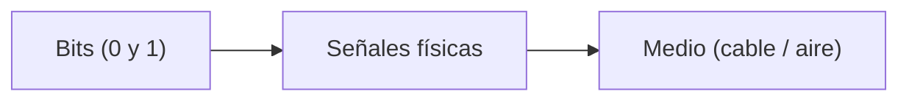
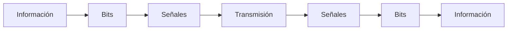

# ¿Qué significa “enviar datos”?

Hasta ahora sabemos que toda la información se convierte en bits.

Pero ahora viene una pregunta clave:

> ¿Qué significa realmente “enviar” esos bits?
> 

---

## La idea principal

Enviar datos no es más que:

> **transmitir una secuencia de bits desde un dispositivo a otro a través de un medio físico**
> 

---

## Paso 1: Crear los datos

Todo comienza con información:

- un mensaje
- una imagen
- un video

El dispositivo convierte esa información en bits.

---

## Paso 2: Convertir bits en señales

Los bits no viajan como “0” y “1” flotando en el aire.

Se convierten en señales físicas:

- electricidad (en cables)
- ondas de radio (WiFi)
- luz (fibra óptica)

---

---

## Paso 3: Transmisión

Las señales viajan a través del medio:

- un cable Ethernet
- el aire (WiFi)
- fibra óptica

Durante este proceso, los bits están representados como cambios en la señal.

---

## Paso 4: Recepción

El dispositivo receptor capta esas señales y hace el proceso inverso:

- interpreta las señales
- reconstruye los bits

---

---

## Paso 5: Interpretación

Finalmente, los bits se interpretan según una codificación:

- texto
- imagen
- video

Y se muestran al usuario.

---

## El proceso completo

---

## Algo importante: no es un solo envío

En la práctica, los datos no se envían de una sola vez.

Se envían en pequeñas partes (esto lo veremos después como “paquetes”).

---

## Ejemplo real

Cuando envías un mensaje en una aplicación como WhatsApp:

1. Escribes el mensaje
2. Se convierte en bits
3. Esos bits se transforman en señales
4. Viajan por la red
5. El otro dispositivo reconstruye el mensaje

---

## Intuición clave

Enviar datos no es “mover información” de forma abstracta.

Es un proceso físico real:

> transformar bits en señales, transmitirlas y reconstruirlas en destino
> 

---

## Idea clave de esta lección

Enviar datos significa convertir información en bits, transformar esos bits en señales físicas, transmitirlas y reconstruir la información en el destino.

---

## Repaso

- Los datos se convierten en bits
- Los bits se convierten en señales físicas
- Las señales viajan por un medio
- El receptor reconstruye los bits
- Los bits se interpretan como información