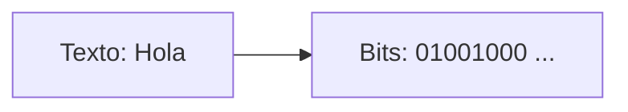
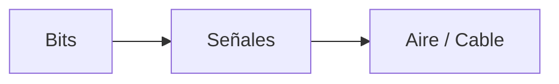
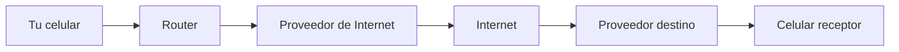
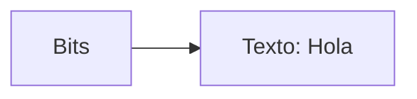
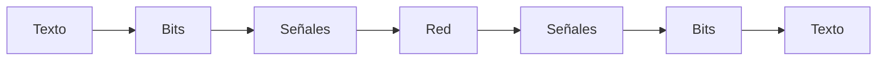

# Ejemplo completo: enviar un mensaje

Hasta ahora hemos visto piezas individuales:

- bits
- codificación
- señales
- transmisión

Ahora vamos a unir todo en un solo flujo.

> ¿Qué ocurre exactamente cuando envías un mensaje?
> 

---

## Escenario

Vas a enviar el mensaje:

```
Hola
```

desde tu celular a otra persona usando una aplicación como WhatsApp.

---

## Paso 1: Crear la información

Todo comienza cuando escribes el mensaje:

```
Hola
```

En este punto, solo existe como texto en tu dispositivo.

---

## Paso 2: Convertir a bits

El sistema convierte cada letra en bits usando una codificación.

Por ejemplo:

- H → bits
- o → bits
- l → bits
- a → bits

El resultado es una secuencia de 0 y 1.

---



---

## Paso 3: Preparar el envío

El dispositivo organiza esos bits para enviarlos.

(En la práctica se dividen en partes más pequeñas, pero lo veremos más adelante.)

---

## Paso 4: Convertir bits en señales

Los bits se transforman en señales físicas:

- ondas de radio si usas WiFi
- señales eléctricas si usas cable

---



---

## Paso 5: Viajar por la red

Las señales no van directamente al otro celular.

El camino real es más complejo:



Durante este recorrido:

- los datos atraviesan múltiples redes
- pueden tomar diferentes rutas
- pasan por varios dispositivos intermedios

---

## Paso 6: Recepción

El celular receptor:

- recibe las señales
- las convierte de nuevo en bits

---

## Paso 7: Reconstrucción

Los bits se interpretan usando la misma codificación.



---

## Paso 8: Mostrar el mensaje

Finalmente, la aplicación muestra el mensaje en pantalla.

---

## El flujo completo



---

## Algo importante

Todo este proceso ocurre en milisegundos.

Aunque parece complejo, está completamente automatizado.

---

## Intuición clave

Enviar un mensaje no es un solo evento.

Es una cadena de transformaciones:

> texto → bits → señales → red → señales → bits → texto
> 

---

## Idea clave de esta lección

Un mensaje viaja a través de múltiples transformaciones físicas y lógicas antes de llegar a su destino, pero siempre comienza y termina como información comprensible.

---

## Repaso

- El mensaje se convierte en bits
- Los bits se convierten en señales
- Las señales viajan por múltiples redes
- El receptor reconstruye los bits
- Los bits se interpretan como información
- El mensaje aparece en pantalla