## El problema: recordar direcciones IP

### Idea clave

Las direcciones IP no son fáciles de recordar.

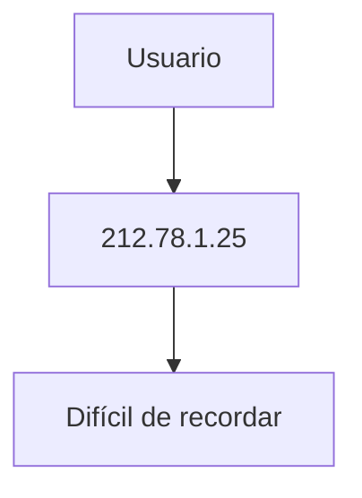

---

## Solución: nombres de dominio

### Idea clave

Usamos nombres fáciles en lugar de números.

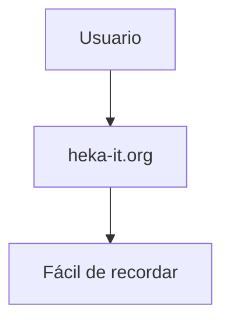

---

## Qué es DNS

### Idea clave

DNS traduce nombres de dominio a direcciones IP.

---

## Ejemplo de resolución

---

## Flujo de conexión

### Idea clave

Primero se resuelve el nombre, luego se conecta.

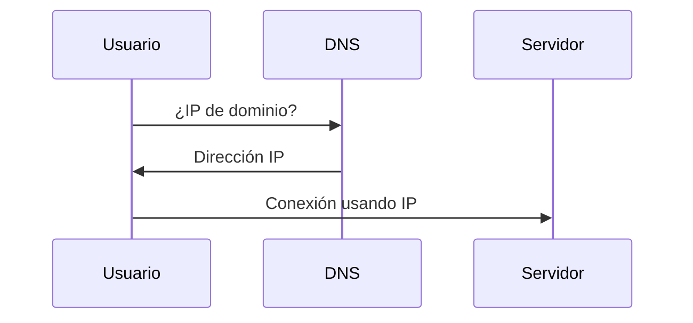

---

## Ventaja clave del DNS

### Idea clave

Permite cambiar la IP sin afectar al usuario.

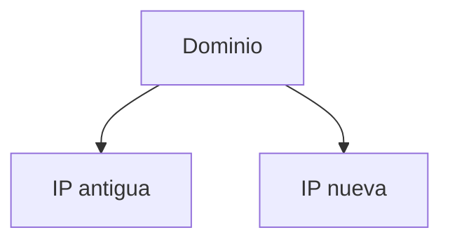

### Explicación

- El servidor puede moverse
- Solo se actualiza el DNS
- El usuario no nota el cambio

---

## IP vs dominio

### Idea clave

IP = ubicación, dominio = nombre.

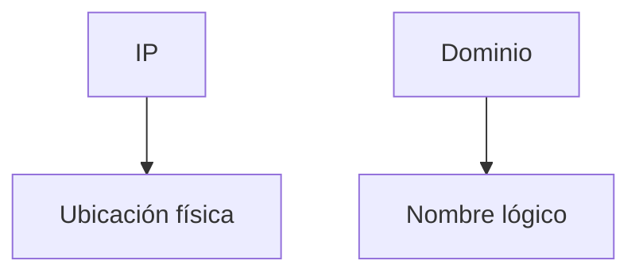

---

## Jerarquía del DNS

### Idea clave

Los dominios están organizados en niveles.

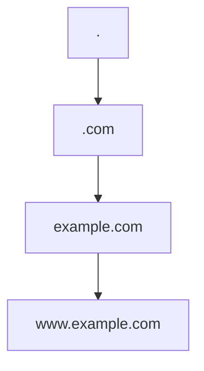

---

## Dominios de nivel superior (TLD)

### Idea clave

Son la base de la estructura de nombres.

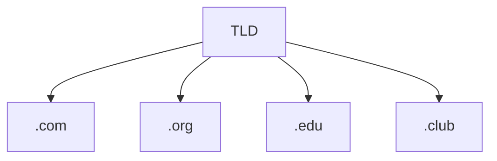

---

## Dominios por país (ccTLD)

### Idea clave

Representan países.

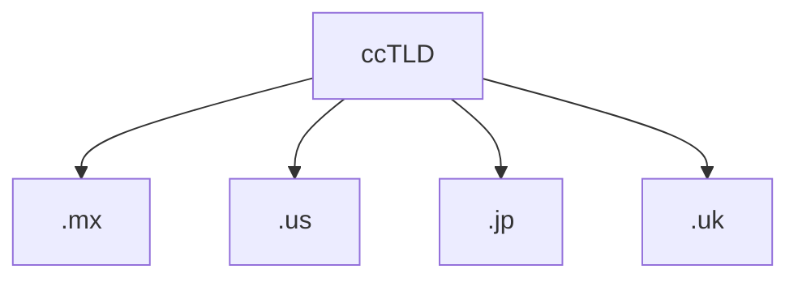

---

## Subdominios

### Idea clave

Las organizaciones crean sus propios subniveles.

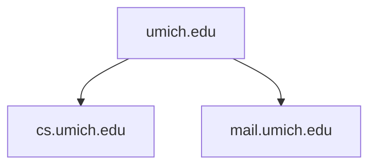

---

## Organización global: ICANN

### Idea clave

ICANN gestiona el sistema global de dominios.

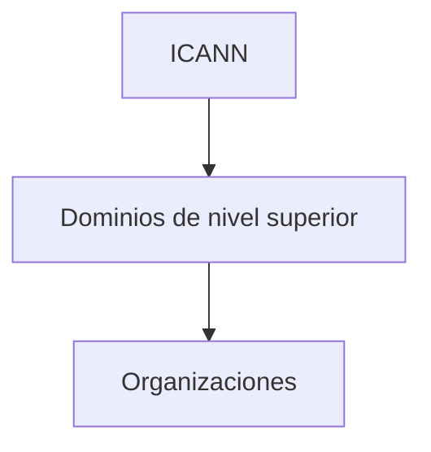

---

## Flujo de asignación de dominios

---

## Propiedad de dominios

### Idea clave

Los dominios pueden ser gestionados por organizaciones o personas.

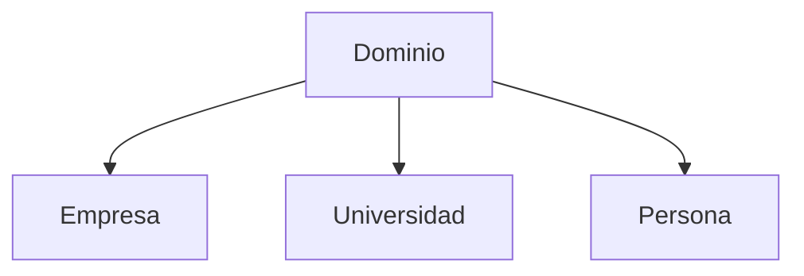

---

## Insight clave 

DNS desacopla el nombre de la ubicación.

- Los usuarios usan nombres
- Los sistemas usan IPs
- Permite flexibilidad total

> Es una de las piezas más importantes de Internet

---

## Resumen

- DNS traduce nombres a direcciones IP
- Los usuarios usan dominios, no IPs
- Primero se resuelve el nombre, luego se conecta
- Permite mover servidores sin afectar usuarios
- Existe una jerarquía de dominios
- ICANN gestiona los dominios globales
- Los dominios se pueden subdividir
- DNS hace Internet más usable y flexible