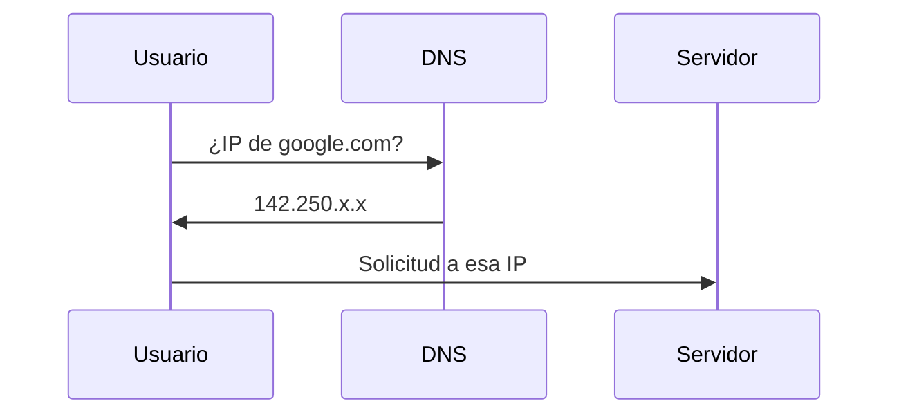

# ¿Qué es el DNS?

En la lección anterior vimos que:

- los humanos usamos nombres como google.com
- las computadoras usan direcciones IP

Esto plantea una pregunta clave:

> ¿Quién traduce esos nombres a direcciones IP?
> 

---

## La idea clave

El sistema encargado de esta traducción es:

> **DNS (Domain Name System)**
> 

---

## ¿Qué es el DNS?

El DNS es:

> un sistema que traduce nombres de dominio en direcciones IP
> 

Por ejemplo:

```
google.com → 142.250.190.78
```

---

## ¿Por qué es necesario?

Sin DNS:

- tendrías que memorizar IPs
- navegar sería impráctico

El DNS permite usar nombres fáciles mientras la red usa direcciones.

---

## Cómo funciona (intuición)

Cuando escribes un dominio en tu navegador:

1. tu dispositivo pregunta:
“¿Cuál es la IP de este nombre?”
2. un servidor DNS responde con la IP
3. tu dispositivo usa esa IP para comunicarse

---



---

## ¿Dónde está el DNS?

El DNS no es un solo servidor.

Es un sistema distribuido:

- hay muchos servidores DNS
- trabajan juntos
- están distribuidos por todo el mundo

---

## Analogía importante

El DNS es como una agenda telefónica.

- tú buscas un nombre
- obtienes un número

Luego usas ese número para comunicarte.

---

## Ejemplo real

Cuando entras a YouTube:

- escribes un nombre
- DNS lo traduce a una IP
- tu dispositivo se conecta al servidor

---

## Algo importante

El DNS ocurre antes de cualquier comunicación.

Sin él:

- no sabrías a dónde enviar los datos

---

## Intuición clave

El DNS es el puente entre:

- el mundo humano (nombres)
- el mundo de la red (IPs)

---

## Idea clave de esta lección

El DNS es el sistema que traduce nombres de dominio en direcciones IP, permitiendo que Internet sea usable para las personas.

---

## Repaso

- DNS significa Domain Name System
- Traduce nombres a direcciones IP
- Es un sistema distribuido
- Funciona como una agenda telefónica
- Es esencial para navegar en Internet