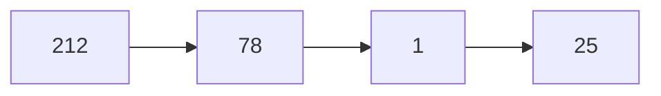
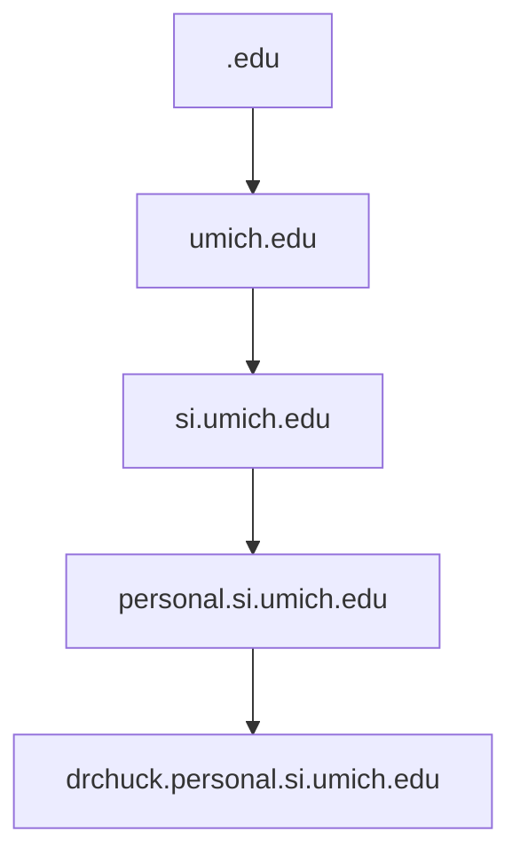
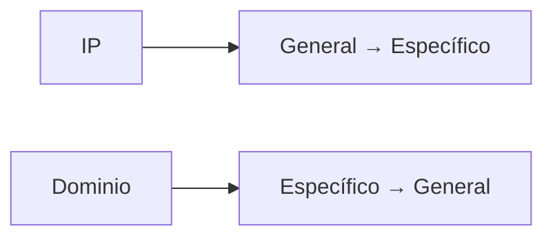
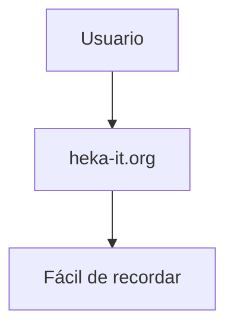
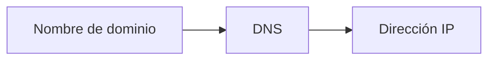
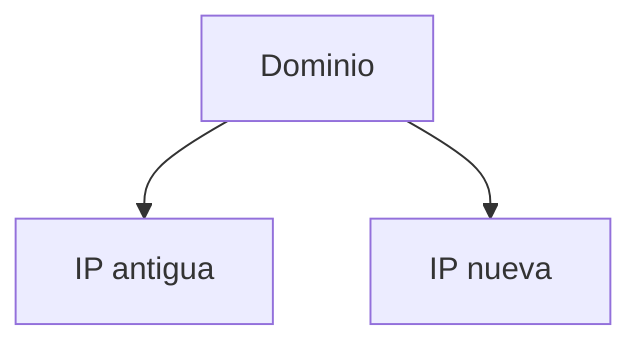
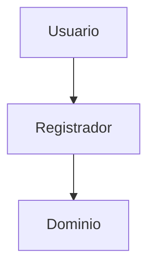

## Cómo se leen las direcciones IP

### Idea clave

Las direcciones IP se leen de izquierda a derecha.



### Interpretación

- Izquierda → más general (red)
- Derecha → más específico (dispositivo)

```
212.78.1.25
General ----> Específico
```

---

## Cómo se leen los dominios

### Idea clave

Los nombres de dominio se leen de derecha a izquierda.


### Interpretación

```
drchuck.personal.si.umich.edu
Específico <--- General
```

---

## Jerarquía de un dominio

### Idea clave

Cada parte del dominio representa un nivel.



### Explicación

- `.edu` → tipo de organización
- `umich` → institución
- `si` → suborganización
- `personal` → área específica
- `drchuck` → recurso específico

---

## Comparación IP vs dominio

### Idea clave

IP y dominio organizan la información en sentidos opuestos.



---

## Ejemplo práctico



### Idea clave

Los humanos usan nombres, no números.

---

## DNS como traductor

### Idea clave

DNS conecta el mundo humano con el mundo técnico.



---

## Ventaja clave del sistema

### Idea clave

Permite cambiar la infraestructura sin afectar al usuario.



### Explicación

- El usuario sigue usando el mismo nombre
- El sistema redirige automáticamente

---

## Registro de dominios

### Idea clave

Los dominios pueden comprarse y gestionarse.



### Explicación

- Empresas registradoras venden dominios
- Tú controlas tus subdominios

---

## Insight clave 

Los dominios están diseñados para humanos, las IPs para máquinas.

- Dominios → legibles
- IPs → eficientes
- DNS → conecta ambos mundos

> Esta abstracción hace Internet usable

---

## Resumen

- Las IP se leen de izquierda a derecha
- Los dominios se leen de derecha a izquierda
- Los dominios tienen estructura jerárquica
- Cada nivel agrega especificidad
- DNS traduce nombres a IPs
- Permite cambiar servidores sin afectar usuarios
- Los dominios pueden registrarse y gestionarse