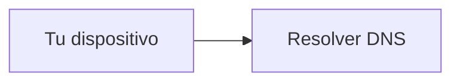
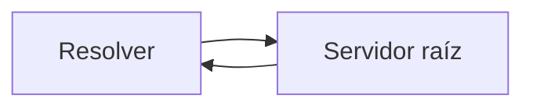
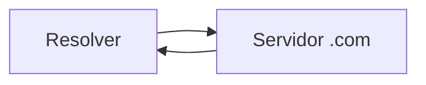
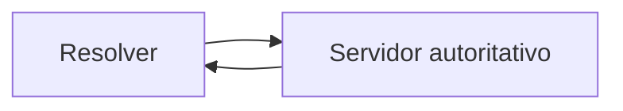
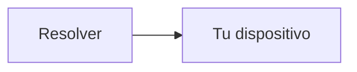
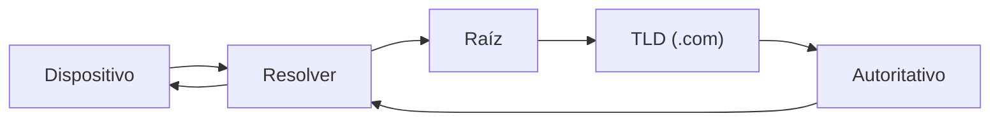

# Cómo se resuelve un dominio paso a paso

En la lección anterior vimos qué es el DNS.

Ahora vamos a responder:

> ¿Qué ocurre exactamente cuando escribes un dominio como google.com?
> 

---

## La idea clave

Resolver un dominio significa:

> convertir un nombre en una dirección IP mediante una serie de consultas entre servidores DNS
> 

---

## Paso 0: Verificar caché local

Antes de preguntar a Internet, tu dispositivo revisa:

- su caché local
- registros recientes

Si ya conoce la IP, no necesita preguntar.

---

## Paso 1: Pregunta al resolver DNS

Si no está en caché, tu dispositivo pregunta a un servidor DNS.

Este suele ser:

- tu router
- o el servidor de tu proveedor

---

---

## Paso 2: Servidores raíz

Si el resolver no sabe la respuesta, inicia una búsqueda jerárquica.

Primero pregunta a los servidores raíz.

Estos responden:

> “No sé la IP, pero sé quién maneja .com”
> 

---

---

## Paso 3: Servidores de dominio (TLD)

Luego pregunta a los servidores del dominio de nivel superior (TLD), por ejemplo:

- .com
- .org

Estos responden:

> “No tengo la IP, pero sé quién maneja google.com”
> 

---

---

## Paso 4: Servidor autoritativo

Finalmente, el resolver pregunta al servidor autoritativo del dominio.

Este sí tiene la respuesta:

> “La IP de google.com es esta”
> 

---

---

## Paso 5: Respuesta al dispositivo

El resolver devuelve la IP a tu dispositivo.

---

---

## Paso 6: Conexión al servidor

Ahora sí:

- tu dispositivo ya conoce la IP
- puede enviar datos directamente

---

## Flujo completo simplificado

---

## Algo importante: caché

Después de resolver:

- el resultado se guarda en caché
- futuras consultas son más rápidas

---

## Analogía importante

Imagina que buscas una dirección:

1. preguntas a alguien cercano
2. te manda a una oficina central
3. esa oficina te manda a otra más específica
4. finalmente alguien te da la dirección exacta

---

## Intuición clave

Resolver un dominio no es una sola consulta.

> es una cadena de preguntas que van de lo general a lo específico
> 

---

## Idea clave de esta lección

La resolución DNS ocurre en múltiples pasos jerárquicos hasta encontrar la dirección IP correcta de un dominio.

---

## Repaso

- Primero se revisa caché
- Luego se consulta un resolver
- El resolver pregunta a:
    - servidores raíz
    - servidores TLD
    - servidores autoritativos
- Se obtiene la IP
- Se establece la conexión