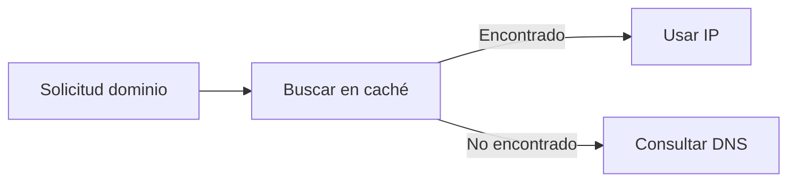

# Caché DNS

En la lección anterior vimos que resolver un dominio implica varios pasos.

Pero si cada vez tuviéramos que repetir todo ese proceso, sería lento.

Aquí entra un concepto clave:

> la **caché DNS**
> 

---

## La idea clave

La caché DNS es:

> un almacenamiento temporal de direcciones IP ya resueltas
> 

---

## ¿Para qué sirve?

Evita tener que repetir todo el proceso de resolución cada vez.

En lugar de preguntar:

- servidores raíz
- servidores TLD
- servidores autoritativos

el sistema puede usar una respuesta ya conocida.

---

## Cómo funciona

Cuando resuelves un dominio:

1. se obtiene la dirección IP
2. se guarda temporalmente
3. la próxima vez se reutiliza

---

---

## ¿Dónde existe la caché?

La caché DNS puede existir en varios niveles:

- en tu dispositivo
- en tu navegador
- en tu router
- en servidores DNS del proveedor

---

Esto significa que muchas veces:

> la respuesta ya está disponible muy cerca de ti
> 

---

## Tiempo de vida (TTL)

La caché no es permanente.

Cada registro tiene un tiempo llamado:

> TTL (Time To Live)
> 

Después de ese tiempo:

- se elimina
- se vuelve a consultar

---

## ¿Por qué no es permanente?

Porque las direcciones IP pueden cambiar.

La caché debe actualizarse para evitar errores.

---

## Analogía importante

Imagina que buscas una dirección:

- la primera vez preguntas a varias personas
- la segunda vez ya la recuerdas

La caché es esa memoria temporal.

---

## Ejemplo real

Cuando entras varias veces a YouTube:

- la primera vez puede tardar un poco más
- después es más rápido

Porque la IP ya está en caché.

---

## Intuición clave

La caché reduce trabajo innecesario.

> evita repetir procesos costosos cuando ya conocemos la respuesta
> 

---

## Idea clave de esta lección

La caché DNS almacena temporalmente direcciones IP para acelerar la resolución de dominios.

---

## Repaso

- La caché guarda resultados de DNS
- Reduce el número de consultas
- Existe en múltiples niveles
- Tiene un tiempo de vida (TTL)
- Mejora la velocidad de navegación