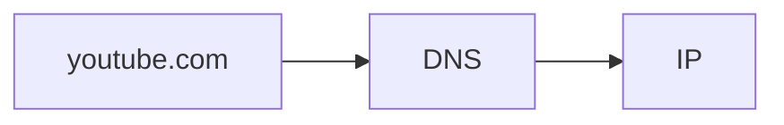
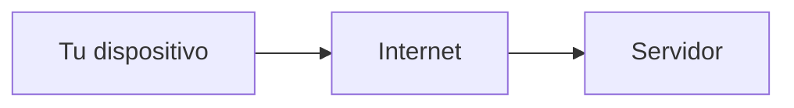
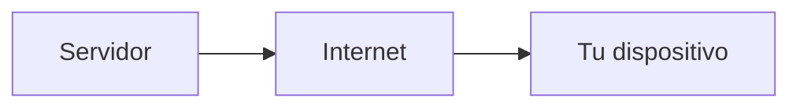
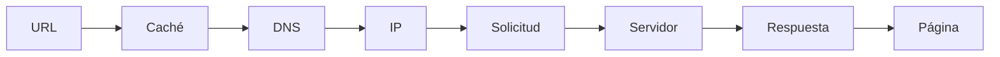

# Ejemplo completo: escribir una URL

Hasta ahora hemos visto:

- direcciones IP
- DNS
- caché

Ahora vamos a integrar todo en un solo flujo.

> ¿Qué ocurre cuando escribes una URL en tu navegador?
> 

---

## Escenario

Escribes:

```
youtube.com
```

y presionas enter.

---

## Paso 1: Verificar caché

El sistema revisa:

- caché del navegador
- caché del sistema operativo

Si ya conoce la IP, la usa directamente.

---

## Paso 2: Resolución DNS

Si no está en caché:

- se consulta al resolver DNS
- se obtiene la dirección IP

---



---

## Paso 3: Preparar la conexión

Ahora el dispositivo ya sabe a dónde enviar los datos.

- tiene la IP del servidor
- prepara la solicitud

---

## Paso 4: Enviar la solicitud

El navegador envía una solicitud al servidor.

Esto viaja en forma de:

- paquetes
- bits
- señales

---



---

## Paso 5: Procesamiento en el servidor

El servidor:

- recibe la solicitud
- procesa la petición
- prepara una respuesta

---

## Paso 6: Envío de la respuesta

El servidor envía de vuelta:

- datos de la página
- recursos (imágenes, scripts, etc.)

---



---

## Paso 7: Renderizado

Tu navegador:

- recibe los datos
- los interpreta
- construye la página

---

## Flujo completo



---

## Algo importante

Todo este proceso ocurre en milisegundos.

Y no sucede una sola vez:

- cada imagen
- cada recurso
- cada archivo

puede requerir solicitudes adicionales.

---

## Intuición clave

Abrir una página web no es una sola acción.

> es una cadena de procesos coordinados entre múltiples sistemas
> 

---

## Idea clave de esta lección

Escribir una URL desencadena una serie de pasos: resolución DNS, conexión a un servidor, intercambio de datos y renderizado en el navegador.

---

## Repaso

- Se verifica caché
- Se resuelve el dominio con DNS
- Se obtiene una IP
- Se envía una solicitud
- El servidor responde
- El navegador construye la página