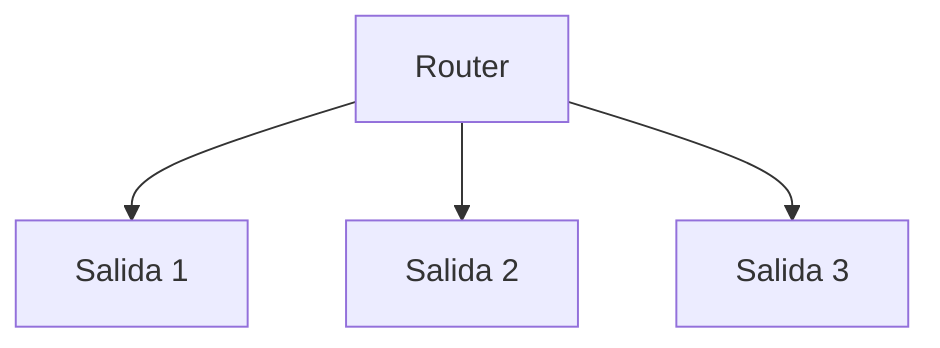
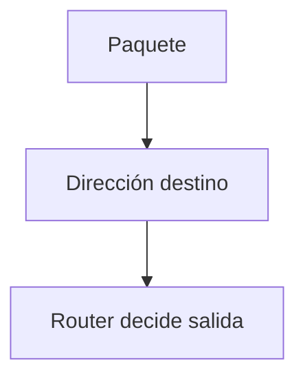
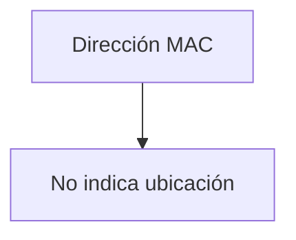
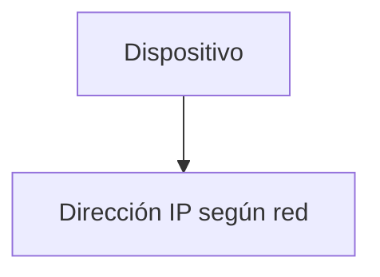
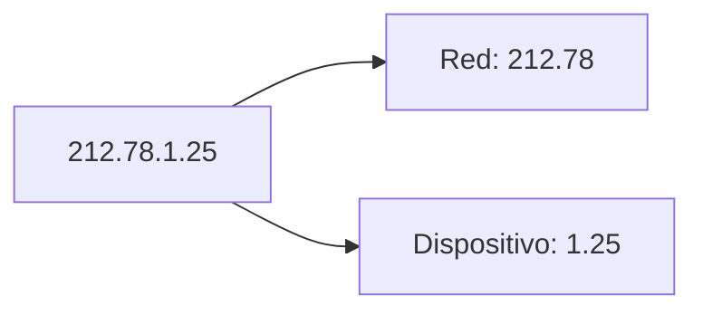
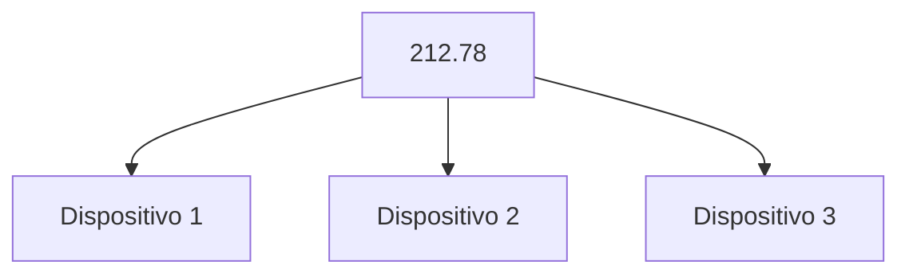
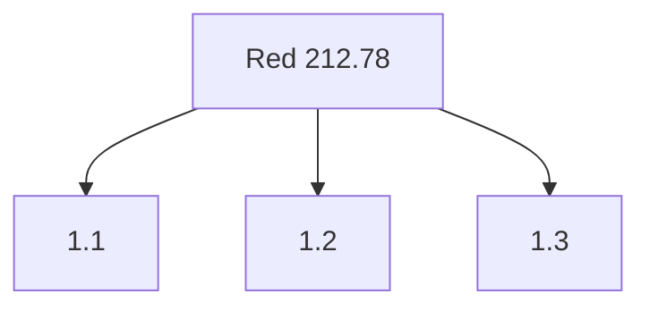
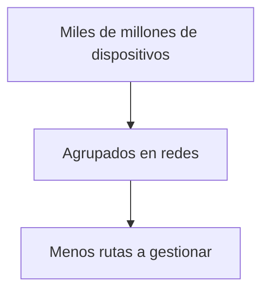

## El reto: llegar a cualquier destino

### Idea clave

Para enviar datos a larga distancia, los paquetes deben atravesar múltiples redes y saltos.


### Explicación

- No existe una conexión directa
- Los paquetes viajan por múltiples medios
- Cada salto acerca el paquete a su destino

---

## Analogía: viajar por el mundo

### Idea clave

Un paquete viaja como una persona en un viaje largo.


### Explicación

- Diferentes medios de transporte
- Diferentes decisiones en cada punto
- El camino completo se construye paso a paso

---

## Routers como estaciones

### Idea clave

Los routers funcionan como estaciones de tránsito.



### Explicación

- Reciben paquetes
- Deciden a dónde enviarlos
- Tienen múltiples rutas posibles

---

## Cómo decide un router

### Idea clave

El router usa la dirección de destino para decidir el siguiente salto.



### Explicación

- No pregunta a nadie
- No conoce toda la ruta
- Solo toma la mejor decisión local

---

## Introducción a la dirección IP

### Idea clave

Cada paquete lleva una dirección IP que indica su destino final.


---

## Ejemplo de dirección IPv4

### Idea clave

Las direcciones IPv4 tienen 4 números.

```
212.78.1.25
```

### Características

- 4 números separados por puntos
- Cada número entre 0 y 255
- Representa un dispositivo en la red

---

## Ejemplo de dirección IPv6

### Idea clave

IPv6 permite muchas más direcciones.

```
2001:0db8:85a3:0042:1000:8a2e:0370:7334
```

### Explicación

- Direcciones más largas
- Solución a la escasez de IPv4

---

## Problema con direcciones MAC

### Idea clave

Las direcciones MAC no sirven para enrutar en Internet.



### Explicación

- Son fijas (hardware)
- No dependen de la ubicación
- No escalan para Internet

---

## Solución: direcciones basadas en ubicación

### Idea clave

Las direcciones IP dependen de dónde está conectado el dispositivo.



### Explicación

- Cambian según la red
- Reflejan ubicación lógica
- Facilitan el enrutamiento

---

## Estructura de una dirección IP

### Idea clave

Una dirección IP se divide en dos partes.



---

## Dirección de red

### Idea clave

Identifica la red a la que pertenece el dispositivo.



### Explicación

- Agrupa dispositivos
- Permite enrutar en bloque

---

## Identificador de dispositivo

### Idea clave

Identifica el equipo dentro de la red.



---

## Enrutamiento eficiente

### Idea clave

Los routers solo necesitan conocer redes, no dispositivos individuales.


### Explicación

- Reduce complejidad
- Escala a nivel global
- Hace posible Internet

---

## Ventaja clave del diseño

### Idea clave

Agrupar dispositivos en redes simplifica el enrutamiento.



---

## Insight clave


Las direcciones IP permiten enrutar de forma eficiente a escala global.

- Representan ubicación lógica
- Agrupan dispositivos
- Reducen complejidad
- Permiten decisiones rápidas en routers

> Sin este diseño, Internet no podría escalar

---

## Resumen

- Los paquetes viajan a través de múltiples routers
- Cada router usa la dirección IP para decidir
- Las direcciones MAC no sirven para enrutar globalmente
- Las direcciones IP dependen de la red
- IPv4 usa 4 números, IPv6 usa direcciones más largas
- Una IP tiene parte de red y parte de dispositivo
- Los routers enrutan usando la parte de red
- Esto hace posible escalar Internet