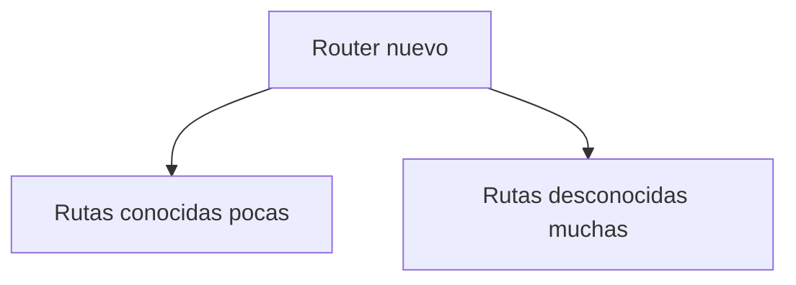
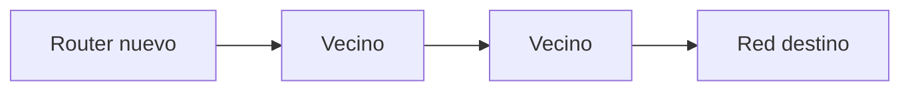
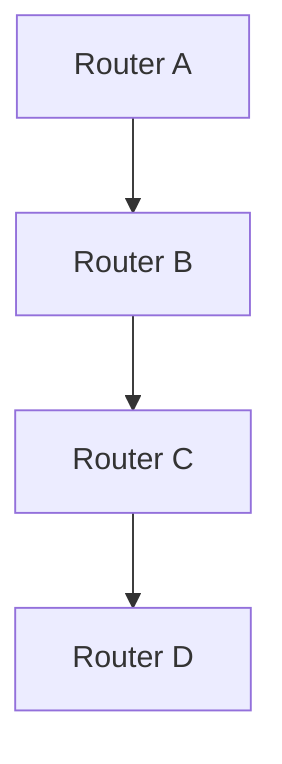
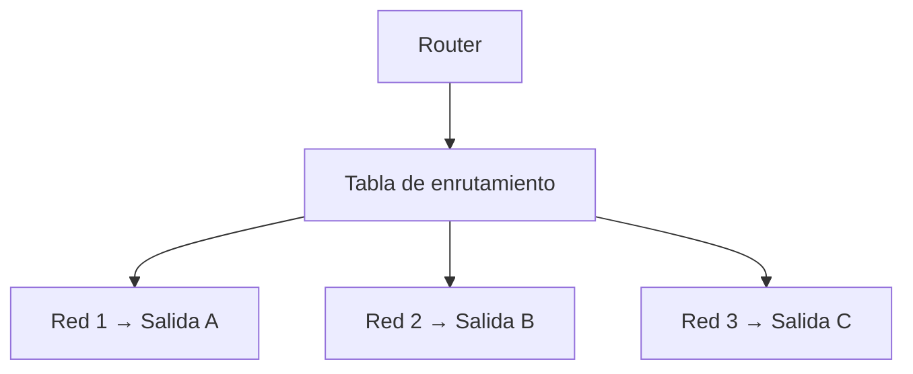
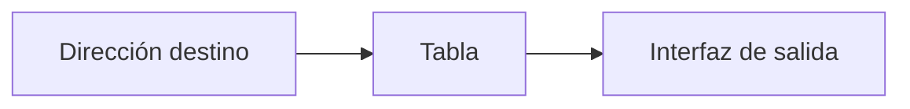
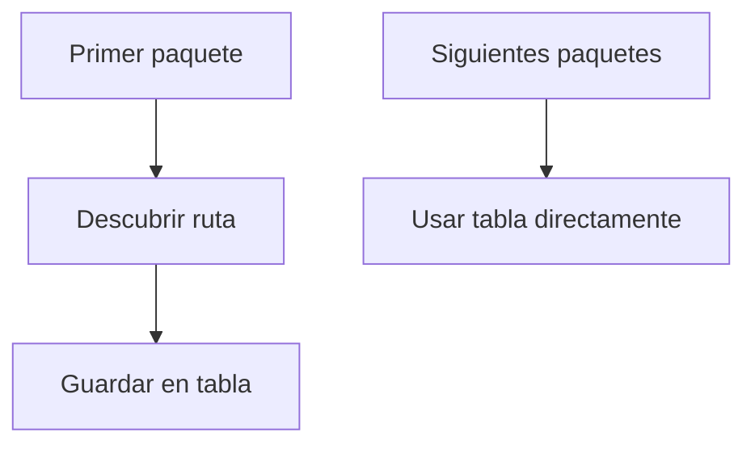
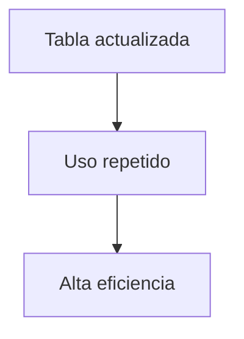
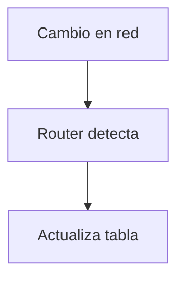
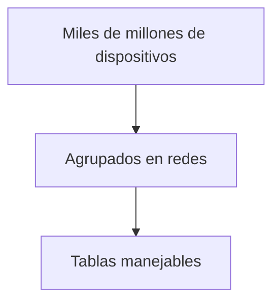

## El problema del enrutamiento

### Idea clave

Un router necesita saber por dónde enviar cada paquete.

### Explicación

- Existen muchas posibles rutas
- El router debe elegir una salida
- Necesita información para decidir

---

## Un router nuevo

### Idea clave

Un router recién conectado no conoce todas las rutas.

### Explicación

- Solo tiene información inicial
- Debe aprender el resto dinámicamente

---

## Descubrimiento de rutas

### Idea clave

Los routers preguntan a sus vecinos.

### Explicación

- Si no conoce la ruta → pregunta
- Los vecinos pueden responder
- O preguntar a otros routers

---

## Propagación de información

### Idea clave

La información sobre rutas se propaga entre routers.

### Explicación

- Los routers colaboran
- Comparten conocimiento
- La red se “auto-organiza”

---

## Construcción de la tabla de enrutamiento

### Idea clave

El router construye un mapa de rutas.

---

## Qué es una tabla de enrutamiento

### Idea clave

Es una lista que indica a dónde enviar paquetes según su destino.

### Explicación

- Relaciona redes con salidas
- Permite decisiones rápidas
- Es clave para el funcionamiento del router

---

## Primer paquete vs siguientes

### Idea clave

El router aprende una vez y reutiliza la información.

### Explicación

- Primera vez → más trabajo
- Después → muy rápido
- Mejora eficiencia

---

## Optimización del enrutamiento

### Idea clave

Los routers evitan recalcular rutas constantemente.

### Explicación

- No se recalcula cada vez
- Se reutiliza conocimiento
- Reduce carga en la red

---

## Actualización de rutas

### Idea clave

Las rutas pueden cambiar si la red cambia.

### Explicación

- Fallos o congestión
- Nuevas rutas disponibles
- Ajuste dinámico

---

## Escalabilidad del sistema

### Idea clave

El sistema funciona a escala global gracias a este mecanismo.

### Explicación

- No se rastrean dispositivos individuales
- Solo redes
- Hace viable Internet

---

## Insight clave 

Los routers aprenden y colaboran para construir una visión distribuida de la red.

- No hay mapa central
- Cada router tiene su propia tabla
- La red funciona por cooperación

> Internet es un sistema distribuido e inteligente

---

## Resumen

- Los routers necesitan conocer rutas
- Un router nuevo no conoce todas las rutas
- Descubre rutas preguntando a vecinos
- La información se propaga entre routers
- Construyen tablas de enrutamiento
- Usan esas tablas para decisiones rápidas
- Aprenden una vez y reutilizan
- Se adaptan a cambios en la red