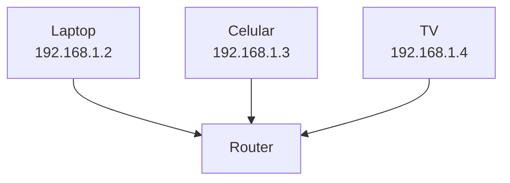
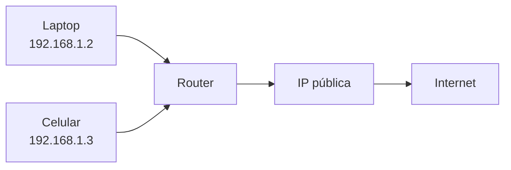

# IP pública vs privada

En la lección anterior vimos que cada dispositivo tiene una dirección IP.

Pero en la práctica, no todas las IPs son iguales.

> Existen dos tipos principales: **IP pública** y **IP privada**
> 

---

## La idea clave

- **IP pública** → identifica tu red en Internet
- **IP privada** → identifica dispositivos dentro de tu red local

---

## IP privada

Una IP privada se usa dentro de una red local (LAN).

Por ejemplo, en tu casa:

- tu celular
- tu laptop
- tu smart TV

Cada uno tiene su propia IP privada.

---

---

### Características

- solo funciona dentro de la red local
- no es visible desde Internet
- puede repetirse en otras redes

---

## IP pública

La IP pública es la dirección que representa a tu red en Internet.

Es asignada por tu proveedor de Internet.

---

---

### Características

- es única en Internet
- permite que otras redes te encuentren
- es asignada por el proveedor

---

## ¿Cómo trabajan juntas?

En una red doméstica ocurre lo siguiente:

1. tus dispositivos usan IP privadas
2. el router tiene una IP pública
3. el router conecta tu red con Internet

---

---

## Analogía importante

Imagina un edificio:

- IP pública → dirección del edificio
- IP privada → número de departamento

Desde fuera, solo ven el edificio.

Dentro, cada departamento tiene su número.

---

## Ejemplo real

Cuando usas una app como YouTube:

- tu celular usa una IP privada
- tu router usa una IP pública
- Internet solo ve la IP pública

---

## Algo importante

Muchos dispositivos pueden compartir una sola IP pública.

Esto es posible gracias a un mecanismo que veremos después (NAT).

---

## Intuición clave

Internet no se comunica directamente con cada dispositivo de tu casa.

> se comunica con tu red, a través de tu IP pública
> 

---

## Idea clave de esta lección

Las IP privadas identifican dispositivos dentro de una red local, mientras que la IP pública identifica a toda la red frente a Internet.

---

## Repaso

- IP privada → dentro de la red local
- IP pública → visible en Internet
- El router conecta ambas
- Muchos dispositivos comparten una IP pública
- Permite organizar redes de forma eficiente