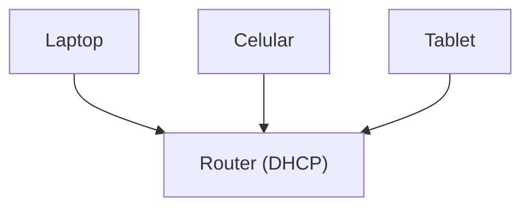
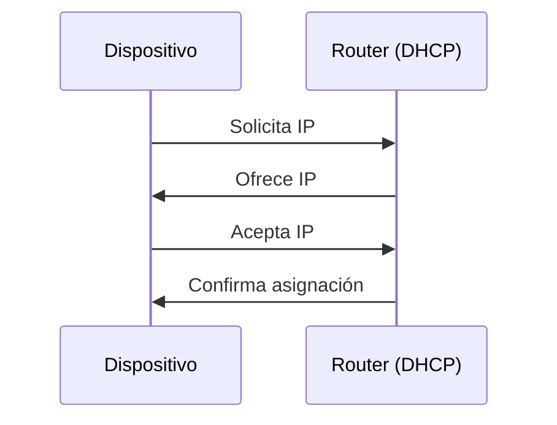

# ¿Cómo obtiene tu dispositivo su IP? (DHCP)

En la lección anterior vimos que cada dispositivo necesita una dirección IP.

Pero surge una pregunta importante:

> ¿Quién asigna esa dirección IP?
> 

---

## La idea clave

En la mayoría de los casos, tu dispositivo no elige su IP.

> la recibe automáticamente mediante un protocolo llamado **DHCP**
> 

---

## ¿Qué es DHCP?

DHCP significa:

> Dynamic Host Configuration Protocol
> 

Es un sistema que:

- asigna direcciones IP automáticamente
- configura parámetros de red
- evita conflictos entre dispositivos

---

## ¿Dónde está DHCP?

En una red doméstica, el DHCP suele estar en:

- el router

---

---

## ¿Por qué es necesario?

Sin DHCP tendrías que:

- asignar IP manualmente a cada dispositivo
- evitar duplicados
- configurar todo a mano

Esto sería complejo y propenso a errores.

---

## El proceso paso a paso

Cuando un dispositivo se conecta a la red, ocurre algo como esto:

---

### 1. Solicitud

El dispositivo dice:

> “Necesito una dirección IP”
> 

---

### 2. Oferta

El servidor DHCP (router) responde:

> “Te ofrezco esta IP”
> 

---

### 3. Solicitud de confirmación

El dispositivo responde:

> “Acepto esa IP”
> 

---

### 4. Confirmación

El router confirma:

> “Esa IP es tuya por ahora”
> 

---

---

## Algo importante: la IP no es permanente

La IP que recibes:

- es temporal
- puede cambiar con el tiempo

Esto se llama “arrendamiento” (lease).

---

## ¿Qué más configura DHCP?

Además de la IP, DHCP puede proporcionar:

- puerta de enlace (gateway)
- servidores DNS
- otros parámetros de red

---

## Analogía importante

Imagina que llegas a un hotel:

- pides una habitación
- te asignan un número
- puedes usarla por cierto tiempo

DHCP funciona de forma similar con las direcciones IP.

---

## Ejemplo real

Cuando conectas tu celular al WiFi de casa:

- automáticamente obtiene una IP
- no tienes que configurar nada
- puedes empezar a usar Internet

---

## Intuición clave

Las redes modernas están diseñadas para funcionar automáticamente.

> DHCP permite que los dispositivos se conecten sin configuración manual
> 

---

## Idea clave de esta lección

DHCP es el mecanismo que asigna automáticamente direcciones IP a los dispositivos cuando se conectan a una red.

---

## Repaso

- DHCP asigna IPs automáticamente
- Normalmente lo gestiona el router
- Evita conflictos de direcciones
- Funciona mediante un intercambio de mensajes
- Las IPs son temporales