## Problemas en la red

### Idea clave

Las conexiones pueden fallar y afectar el enrutamiento.

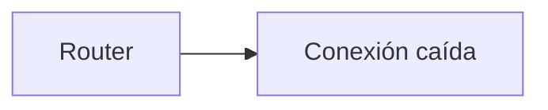

### Explicación

- Fallos físicos (cables)
- Congestión
- Interrupciones externas

---

## Reacción ante fallos

### Idea clave

El router elimina rutas inválidas de su tabla.

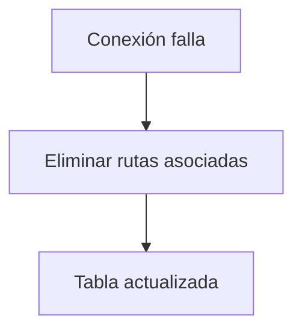

### Explicación

- Detecta la falla
- Borra rutas que ya no funcionan
- Evita enviar paquetes por caminos inválidos

---

## Redescubrimiento de rutas

### Idea clave

El router vuelve a buscar rutas alternativas.

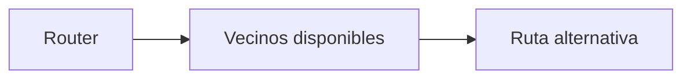

### Explicación

- Pregunta a otros routers
- Ignora la conexión caída
- Encuentra nuevos caminos

---

## Impacto temporal

### Idea clave

El rendimiento disminuye mientras se reconstruyen rutas.

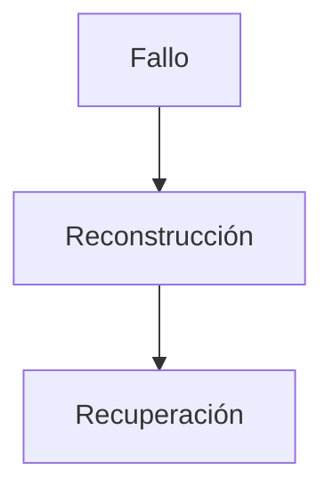

### Explicación

- Más lento temporalmente
- Luego vuelve a la normalidad

---

## Red bi-conectada

### Idea clave

Una red es resiliente si tiene múltiples rutas.

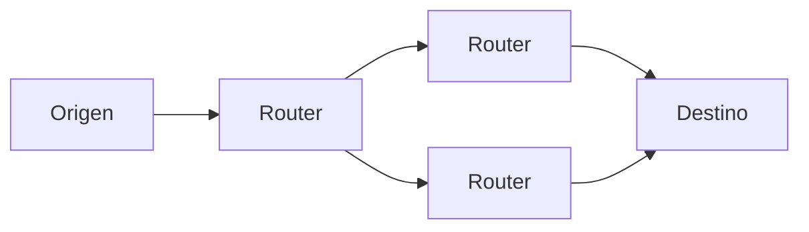

### Explicación

- Al menos dos caminos
- Permite recuperación ante fallos
- Mejora disponibilidad

---

## Falta de redundancia

### Idea clave

Una sola conexión implica riesgo total.

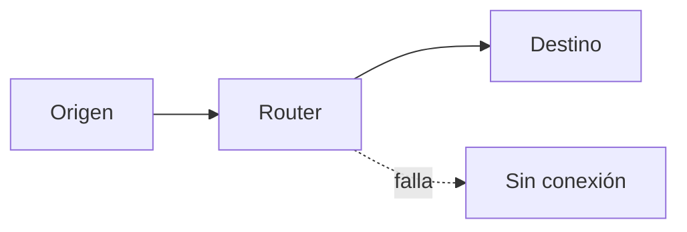

### Explicación

- Un fallo = desconexión total
- Común en hogares o escuelas

---

## Recuperación de conexiones

### Idea clave

Cuando vuelve una conexión, el router intenta usarla.

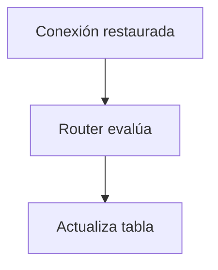

### Explicación

- Detecta nuevas oportunidades
- Mejora rutas existentes

---

## Optimización continua

### Idea clave

Los routers buscan constantemente mejores rutas.

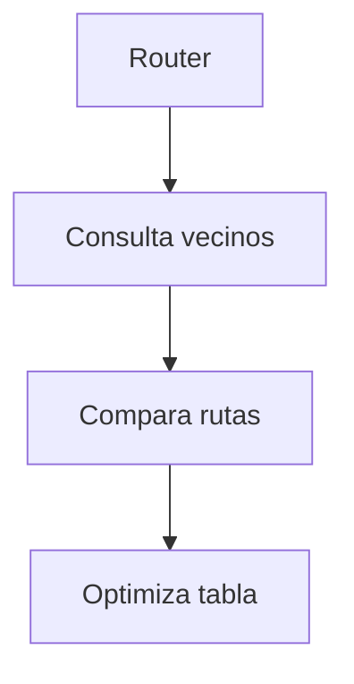

### Explicación

- No solo reaccionan a fallos
- También mejoran rendimiento

---

## Intercambio de tablas

### Idea clave

Los routers comparten información entre sí.

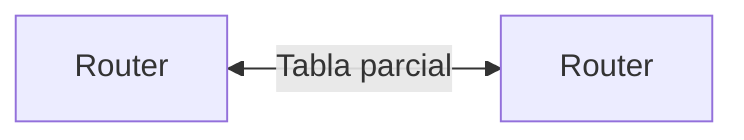

### Explicación

- Comparan rutas
- Detectan mejores caminos
- Actualizan información

---

## Cambio de rutas dinámico

### Idea clave

Los paquetes pueden seguir rutas diferentes en distintos momentos.

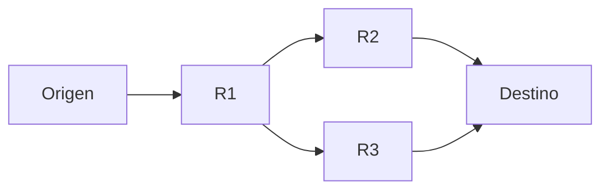

### Explicación

- La ruta no es fija
- Cambia según condiciones
- Optimiza velocidad y disponibilidad

---

## Desorden en paquetes

### Idea clave

Los paquetes pueden llegar en diferente orden.

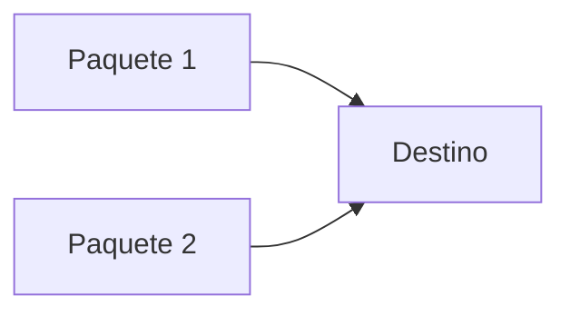

### Explicación

- Rutas diferentes → tiempos distintos
- No es responsabilidad de IP
- Otra capa lo resuelve

---

## Analogía: correo postal

### Idea clave

Los paquetes viajan como cartas.

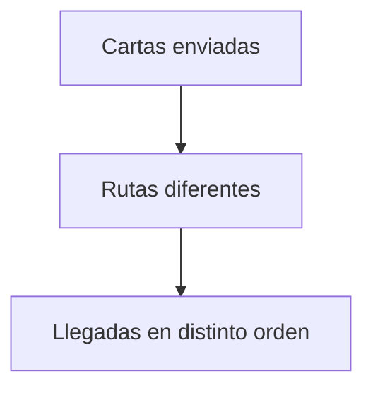

### Explicación

- Cada paquete toma su camino
- No hay control exacto del recorrido
- Todos llegan eventualmente

---

## Insight clave

Internet es resiliente porque se adapta dinámicamente a fallos y cambios.

- No depende de rutas fijas
- Se auto-reconfigura
- Mejora continuamente

> Esta flexibilidad es clave para su funcionamiento global

---

## Resumen

- Las conexiones pueden fallar
- Los routers eliminan rutas inválidas
- Redescubren rutas alternativas
- La red se ralentiza temporalmente
- Las redes con múltiples rutas son más resilientes
- Los routers optimizan continuamente
- Las rutas pueden cambiar dinámicamente
- Los paquetes pueden llegar desordenados