## ¿Se puede conocer la ruta de un paquete?

### Idea clave

Ningún dispositivo conoce la ruta completa de un paquete.

### Explicación

- Cada router solo decide el siguiente salto
- No existe un mapa global completo
- La ruta se construye dinámicamente

---

## Herramienta: traceroute

### Idea clave

Traceroute permite estimar la ruta de un paquete.

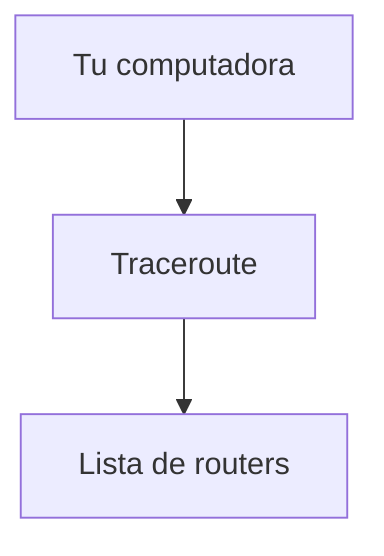

### Explicación

- No muestra la ruta exacta
- Muestra una aproximación
- Puede variar entre ejecuciones

---

## Problema crítico: bucles de red

### Idea clave

Un paquete puede quedar atrapado en un ciclo infinito.

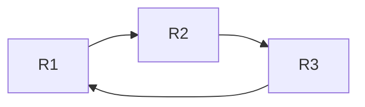

### Explicación

- Los routers pueden estar mal configurados
- El paquete nunca llega a destino
- Se consume toda la red

---

## Consecuencia de un bucle

### Idea clave

Los paquetes saturan la red.

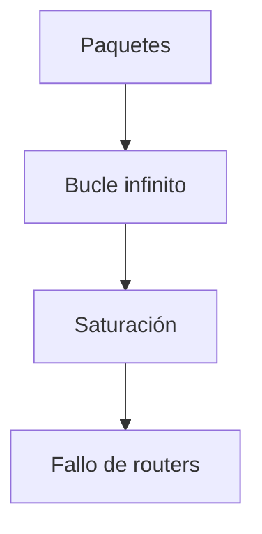

---

## Solución: TTL (Time To Live)

### Idea clave

Cada paquete tiene un contador de vida.

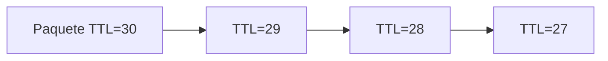

### Explicación

- Se reduce en cada salto
- Evita loops infinitos

---

## Cuando TTL llega a cero

### Idea clave

El paquete es descartado.

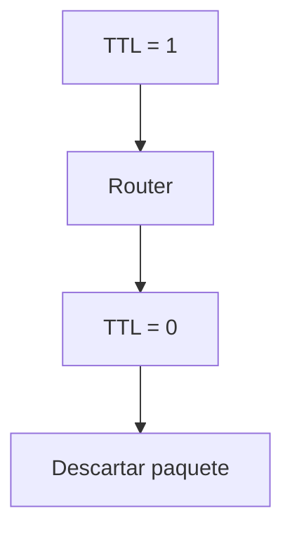

### Explicación

- El router elimina el paquete
- Evita congestión infinita

---

## Mensaje de error

### Idea clave

El router notifica al origen.

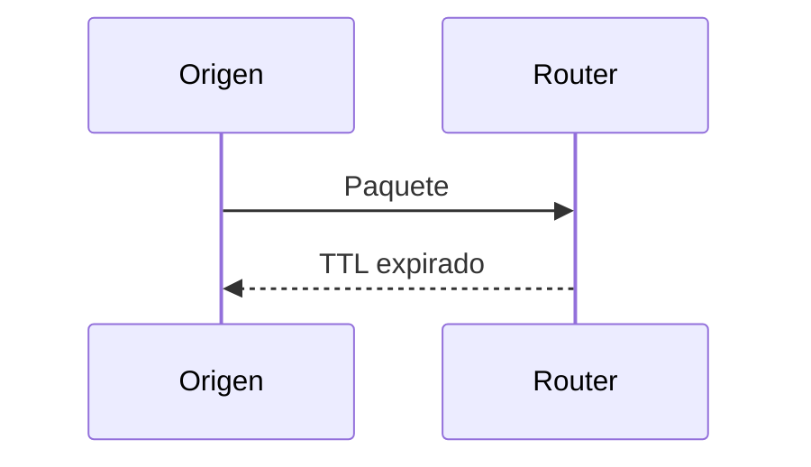

### Explicación

- Mensaje de cortesía
- Incluye IP del router
- Clave para traceroute

---

## Cómo funciona traceroute

### Idea clave

Usa TTL para descubrir routers paso a paso.

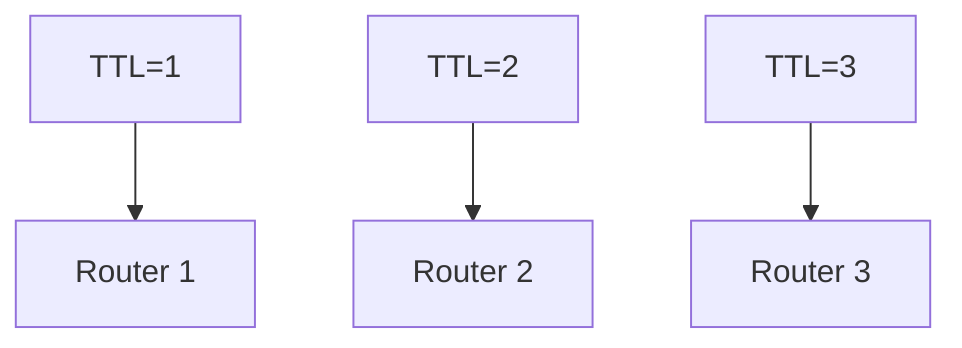

---

## Proceso completo

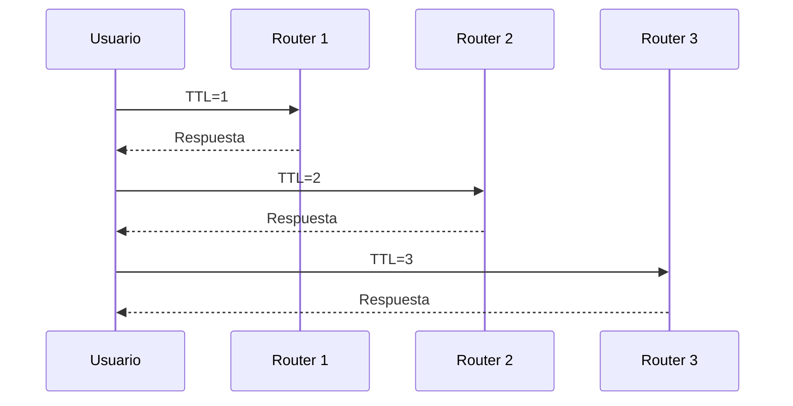

### Explicación

- Incrementa TTL gradualmente
- Cada router responde
- Se construye la ruta

---

## Resultado de traceroute

### Idea clave

Obtienes una lista de saltos.

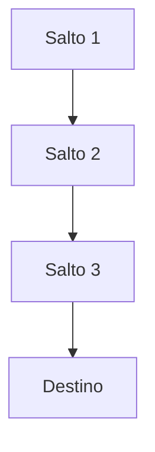

---

## Medición de latencia

### Idea clave

También mide el tiempo entre saltos.

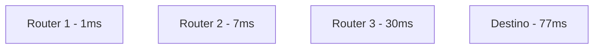

### Explicación

- Milisegundos (ms)
- Indica distancia y congestión

---

## Saltos largos (ej. submarinos)

### Idea clave

Los enlaces largos aumentan la latencia.

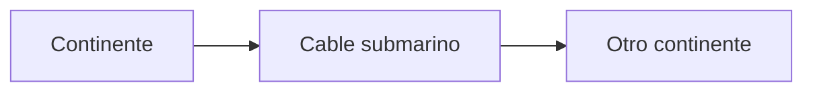

### Explicación

- Saltos internacionales → más tiempo
- Aún así, muy rápido globalmente

---

## Routers que no responden

### Idea clave

Algunos routers no envían respuesta.

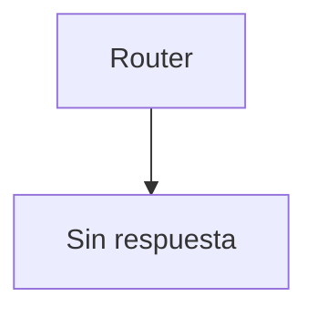

### Explicación

- Seguridad
- Configuración
- traceroute continúa

---

## Insight clave 

Traceroute no muestra la ruta exacta, sino una aproximación basada en el comportamiento de la red.

- La ruta puede cambiar
- Cada paquete puede tomar caminos distintos
- Aún así, es una herramienta poderosa

> Es una “radiografía” del Internet en ese momento

---

## Resumen

- No existe conocimiento global de rutas
- Los routers solo conocen el siguiente salto
- Pueden existir bucles peligrosos
- TTL evita loops infinitos
- Los routers descartan paquetes con TTL=0
- traceroute usa TTL para mapear rutas
- Permite ver saltos y latencia
- La ruta puede variar dinámicamente