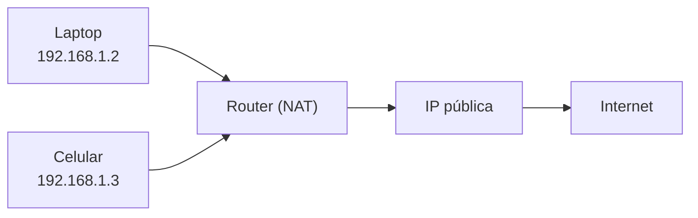
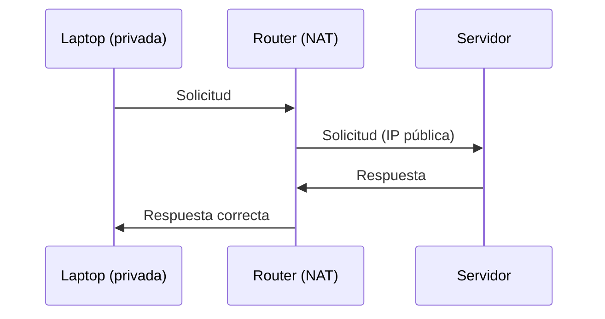

# NAT: cómo muchos dispositivos usan una sola IP

En la lección anterior vimos que:

- cada dispositivo tiene una IP privada
- el router tiene una IP pública

Pero esto plantea una pregunta importante:

> ¿Cómo pueden muchos dispositivos usar una sola IP pública al mismo tiempo?
> 

---

## La idea clave

Esto es posible gracias a:

> **NAT (Network Address Translation)**
> 

---

## ¿Qué es NAT?

NAT es un mecanismo que:

> traduce direcciones IP privadas en una dirección IP pública (y viceversa)
> 

Lo realiza el router.

---

## El problema que resuelve

En tu casa puedes tener:

- laptop
- celular
- tablet
- smart TV

Todos necesitan acceder a Internet.

Pero:

- solo tienes una IP pública

---

## ¿Cómo funciona NAT?

El router actúa como intermediario.

---

---

## Paso a paso

### 1. Dispositivo envía solicitud

Por ejemplo:

- tu laptop (IP privada) quiere acceder a un servidor

---

### 2. NAT modifica la solicitud

El router:

- reemplaza la IP privada por la IP pública
- registra quién hizo la solicitud

---

### 3. Envío a Internet

El servidor ve:

- solo la IP pública

---

### 4. Respuesta

El servidor responde a la IP pública.

---

### 5. NAT redirige la respuesta

El router:

- revisa su registro
- envía la respuesta al dispositivo correcto

---

---

## ¿Cómo distingue entre dispositivos?

El router usa información adicional como:

- puertos
- tablas internas

Esto le permite saber:

- qué respuesta corresponde a qué dispositivo

---

## Analogía importante

Imagina una oficina:

- todos los empleados usan la misma dirección del edificio
- el recepcionista (router) recibe todo
- luego entrega cada mensaje a la persona correcta

---

## Ejemplo real

Cuando usas una app como YouTube:

- tu celular envía una solicitud
- NAT la traduce
- el servidor responde
- el router devuelve la respuesta al dispositivo correcto

---

## Ventajas de NAT

- permite compartir una IP pública
- reduce el uso de direcciones IPv4
- añade una capa básica de aislamiento

---

## Intuición clave

Internet no ve todos tus dispositivos.

> solo ve tu router
> 

---

## Idea clave de esta lección

NAT permite que múltiples dispositivos con IP privadas compartan una sola IP pública mediante traducción de direcciones.

---

## Repaso

- NAT traduce IP privadas a una IP pública
- El router realiza esta función
- Mantiene una tabla para enrutar respuestas
- Permite que múltiples dispositivos usen Internet
- Internet solo ve la IP pública