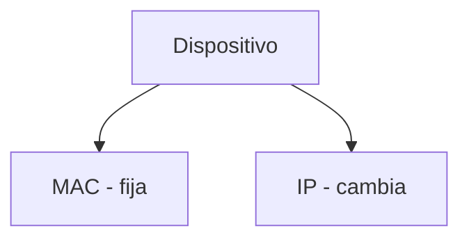
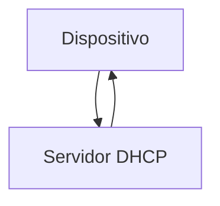
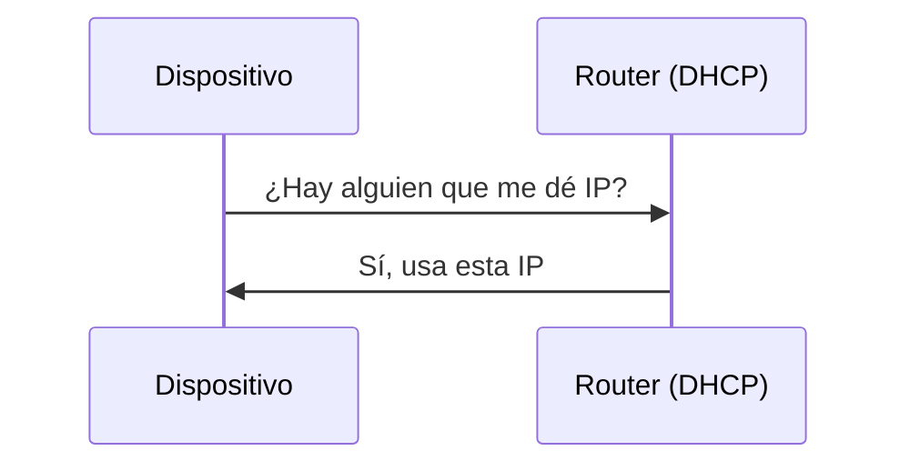
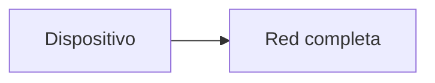
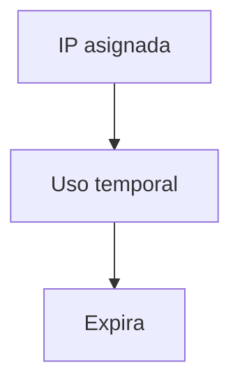
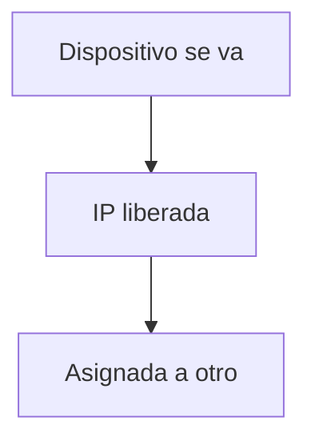
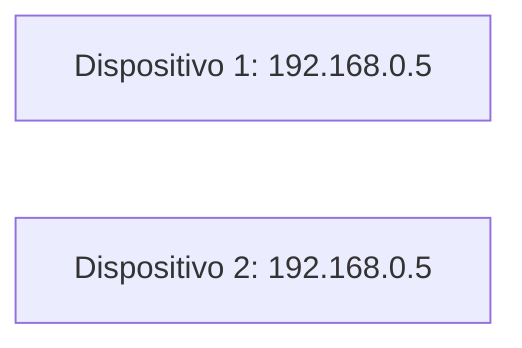
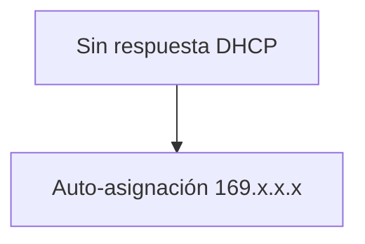
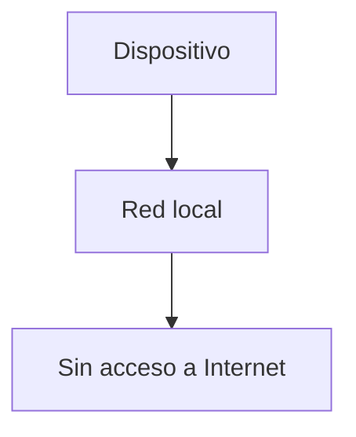

## El problema de la movilidad

### Idea clave

Los dispositivos cambian de red constantemente.


### Explicación

- Laptop, smartphone, tablet
- Se conectan a diferentes redes
- Necesitan nuevas direcciones IP

---

## IP vs MAC

### Idea clave

La MAC es fija, la IP cambia.



### Explicación

- MAC → hardware
- IP → ubicación en red

---

## ¿Cómo obtiene una IP?

### Idea clave

Se usa el protocolo DHCP.



---

## Qué es DHCP

### Idea clave

DHCP asigna automáticamente una dirección IP.

- Dynamic Host Configuration Protocol
- Configuración dinámica
- Automatiza la conexión

---

## Proceso DHCP (simplificado)



---

## Paso 1: Broadcast inicial

### Idea clave

El dispositivo pregunta a toda la red.



### Explicación

- No conoce servidores
- Usa difusión (broadcast)

---

## Paso 2: Respuesta del router

### Idea clave

El router asigna una IP temporal.


### Información entregada

- Dirección IP
- Puerta de enlace (gateway)
- Otros parámetros

---

## IP temporal (lease)

### Idea clave

La IP no es permanente.



### Explicación

- Se “presta” la IP
- Se reutiliza después
- Optimiza recursos

---

## Reutilización de IPs

### Idea clave

Las IPs se reciclan cuando los dispositivos se desconectan.



---

## Problema: IP duplicada

### Idea clave

Dos dispositivos pueden tener la misma IP por error.



### Explicación

- Error en DHCP
- Conflicto en red
- Se pierde conectividad

---

## Mensaje de conflicto

### Idea clave

El sistema detecta duplicados.

```
“Otro equipo está usando esta dirección IP”
```

---

## Caso sin DHCP

### Idea clave

El dispositivo se auto-asigna una IP.



---

## IP auto-asignada

### Idea clave

Permite conexión local, pero no acceso a Internet.



### Explicación

- Solo comunicación local
- No hay gateway
- No se puede salir a Internet

---

## Insight clave 

DHCP permite que Internet funcione de forma automática y escalable.

- Sin configuración manual
- Reutilización eficiente
- Soporte para movilidad

> Sin DHCP, conectarse a Internet sería mucho más complicado

---

## Resumen

- Los dispositivos cambian de red constantemente
- La dirección IP depende de la ubicación
- DHCP asigna IPs automáticamente
- Usa mensajes broadcast para descubrir el servidor
- Las IPs son temporales
- Se reutilizan cuando los dispositivos se desconectan
- Puede haber conflictos de IP
- Sin DHCP, se usan IPs auto-asignadas sin acceso a Internet