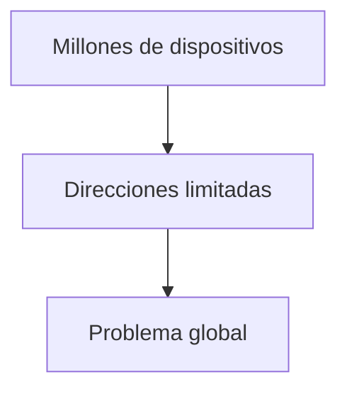
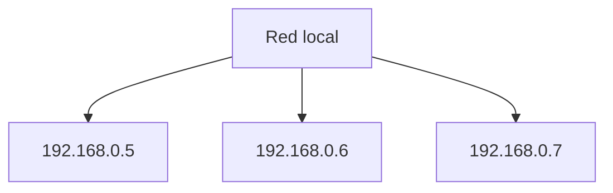
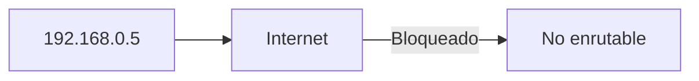
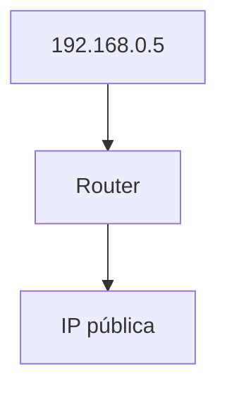
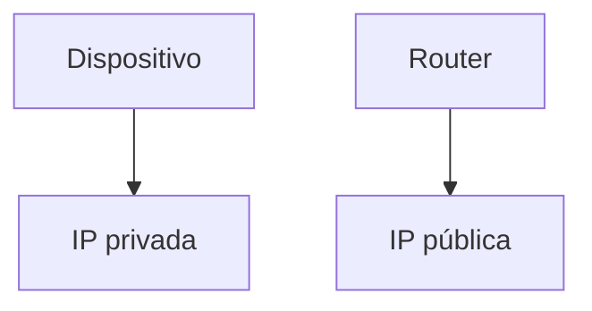
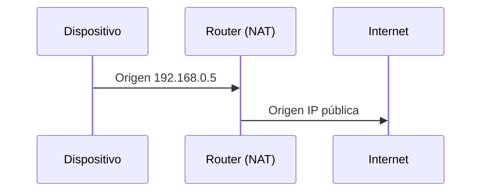
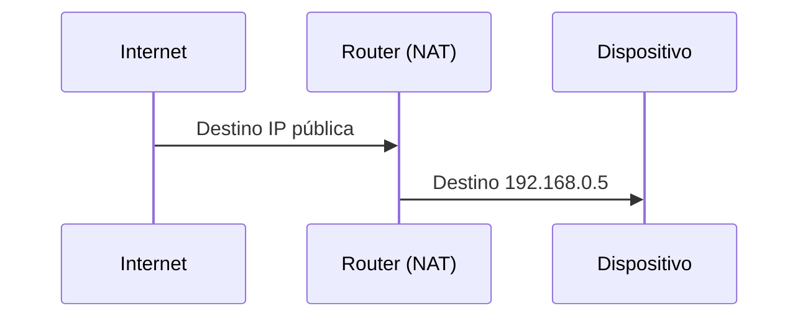
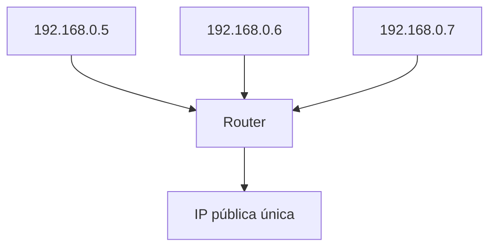
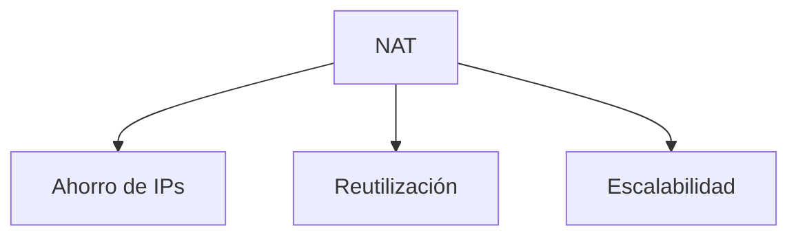

## El problema: escasez de direcciones IP

### Idea clave

No hay suficientes direcciones IPv4 para todos los dispositivos.



---

## Direcciones IP privadas

### Idea clave

Algunas direcciones no se usan en Internet global.

```
192.168.x.x
10.x.x.x
```



### Explicación

- Solo funcionan dentro de una red local
- No son enrutables en Internet
- Se pueden reutilizar en diferentes redes

---

## Qué significa “no enrutable”

### Idea clave

Estas direcciones no pueden viajar por Internet.



---

## Entonces… ¿cómo accedemos a Internet?

### Idea clave

Usamos NAT (Network Address Translation).


---

## Qué es NAT

### Idea clave

El router traduce direcciones privadas a una dirección pública.



---

## Dirección interna vs externa

### Idea clave

Un dispositivo tiene IP interna, el router tiene IP pública.



---

## Flujo de salida (hacia Internet)



### Explicación

- El router reemplaza la IP
- Internet solo ve la IP pública

---

## Flujo de entrada (respuesta)



### Explicación

- El router recuerda quién hizo la solicitud
- Reescribe la dirección de destino
- Entrega al dispositivo correcto

---

## Compartiendo una IP pública

### Idea clave

Muchos dispositivos usan una sola IP pública.



---

## Ventajas de NAT

### Idea clave

Permite escalar Internet eficientemente.



---

## Reutilización global

### Idea clave

La misma IP privada puede existir en muchas redes.


### Explicación

- No hay conflicto
- Cada red es independiente

---

## Insight clave 

NAT permite que miles de millones de dispositivos compartan un número limitado de direcciones públicas.

- Traduce direcciones automáticamente
- Oculta redes internas
- Hace viable el Internet actual

> Sin NAT, IPv4 ya habría colapsado

---

## Resumen

- Las direcciones privadas (192.168.x.x, 10.x.x.x) no son enrutable
- Solo funcionan dentro de redes locales
- NAT traduce IPs privadas a públicas
- El router actúa como intermediario
- Muchos dispositivos comparten una IP pública
- Las IPs privadas se reutilizan en todo el mundo
- NAT permite escalar Internet