## Cómo se obtiene una IP pública

### Idea clave

Para conectarte a Internet necesitas un ISP.

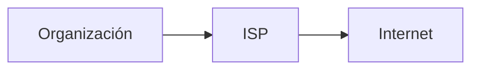

### Explicación

- Contratas conexión
- El ISP te asigna direcciones IP
- Puedes conectar tu red al mundo

---

## Asignación de direcciones

### Idea clave

Las direcciones IP se asignan en forma de bloques.

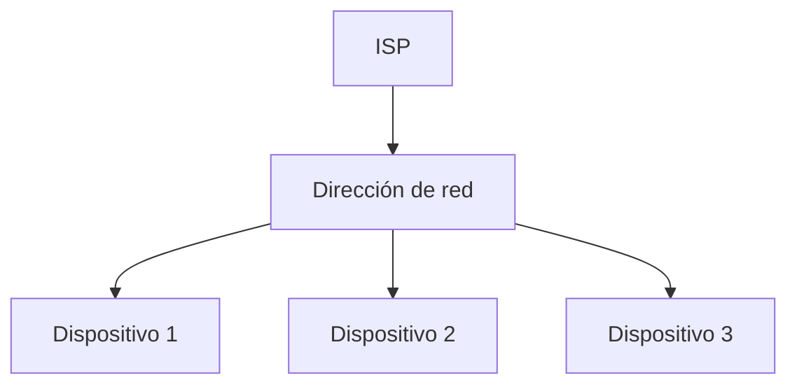

### Explicación

- No se asignan IPs individuales
- Se asignan rangos (redes)
- Tú distribuyes internamente

---

## Jerarquía de asignación

### Idea clave

Las direcciones IP se distribuyen en niveles.

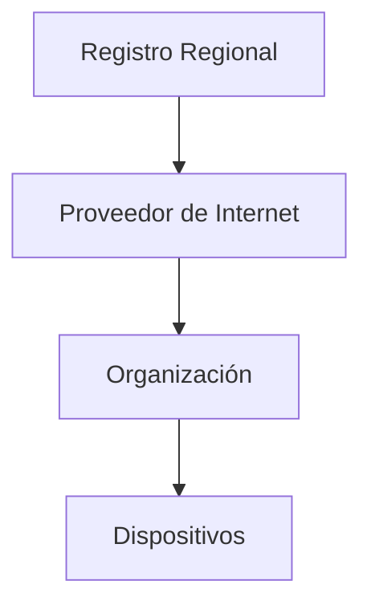

### Explicación

- Sistema jerárquico
- Evita conflictos
- Permite organización global

---

## Registros Regionales (RIR)

### Idea clave

El mundo se divide en regiones para gestionar IPs.

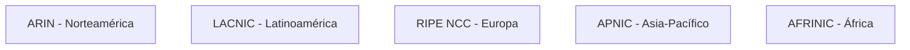

---

## Función de los RIR

### Idea clave

Los RIR gestionan direcciones a nivel global.

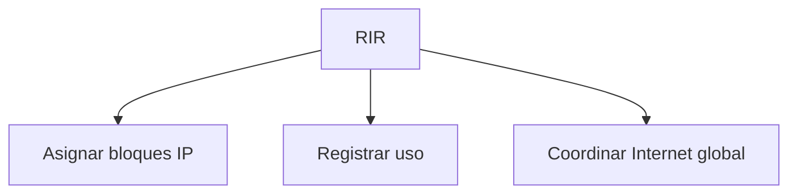

---

## Ejemplo de flujo completo

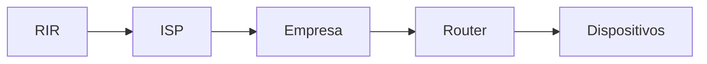

### Explicación

- La IP fluye desde arriba hacia abajo
- Cada nivel distribuye a su escala

---

## Problema histórico

### Idea clave

IPv4 no fue diseñado para la escala actual.

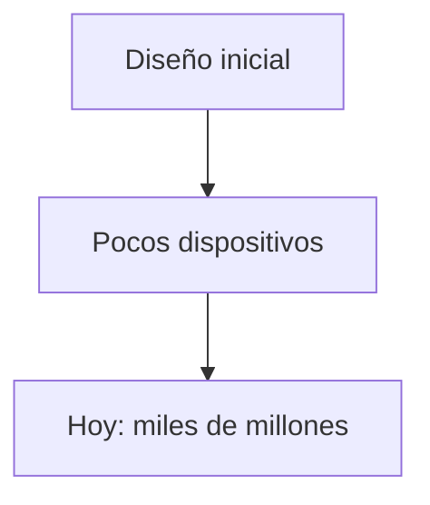

---

## Internet de las cosas (IoT)

### Idea clave

Cada vez más dispositivos necesitan IP.

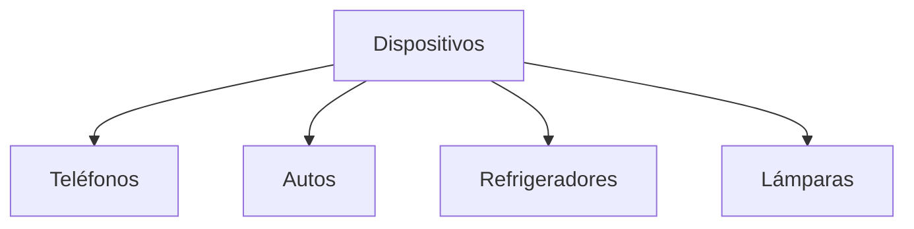

---

## Solución: IPv6

### Idea clave

IPv6 amplía enormemente el número de direcciones disponibles.

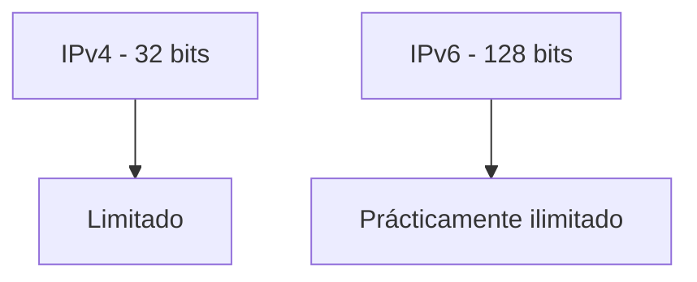

---

## Comparación IPv4 vs IPv6

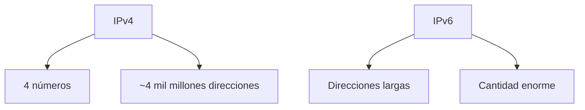

---

## Transición IPv4 → IPv6

### Idea clave

Ambos protocolos conviven actualmente.

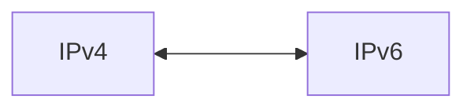

### Explicación

- No se puede cambiar todo de golpe
- Sistemas híbridos
- Migración gradual

---

## Rol de los RIR en la transición

### Idea clave

Los RIR impulsan la adopción de IPv6.

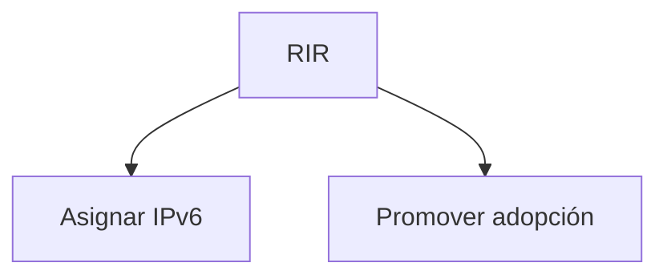

---

## Insight clave 

Internet funciona gracias a una coordinación global jerárquica.

- No es caótico
- Está organizado por niveles
- Permite crecimiento global

> Sin esta estructura, habría conflictos masivos de direcciones

---

## Resumen

- Para conectarte a Internet necesitas un ISP
- Los ISPs asignan bloques de direcciones IP
- Existe una jerarquía global de asignación
- Los RIR gestionan direcciones por región
- IPv4 se está quedando sin espacio
- IPv6 ofrece una solución escalable
- Ambos sistemas conviven actualmente
- La transición será gradual