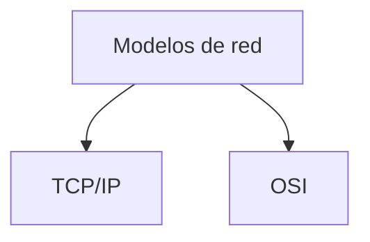
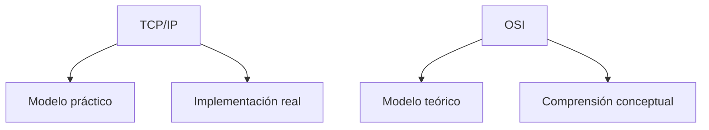
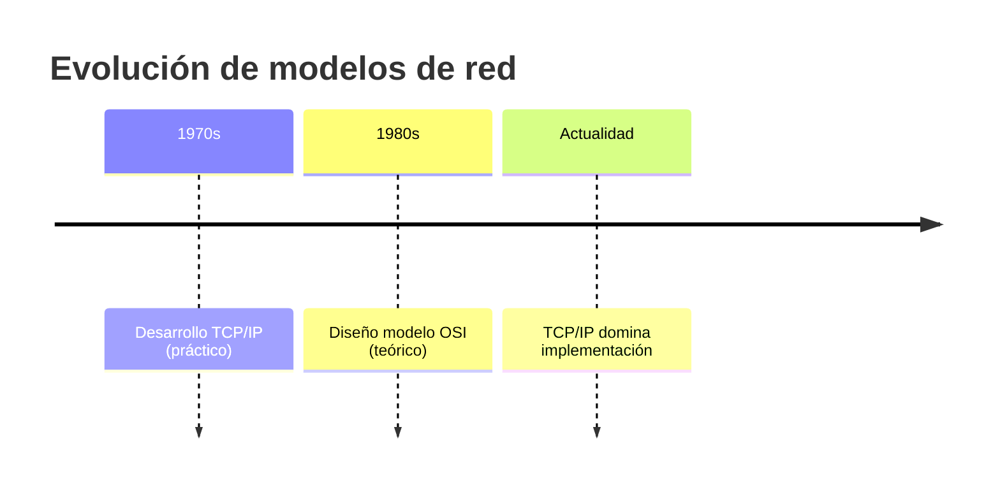
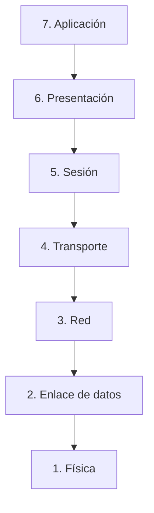
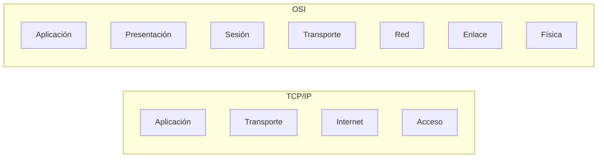
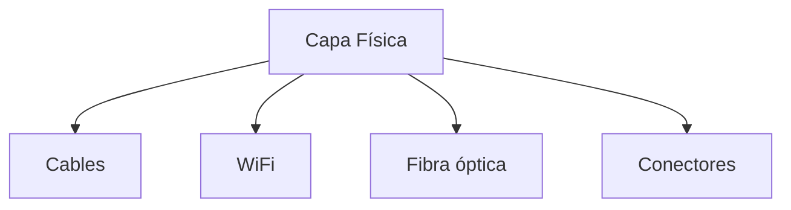
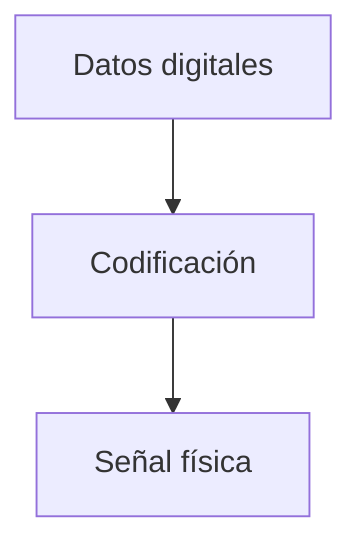
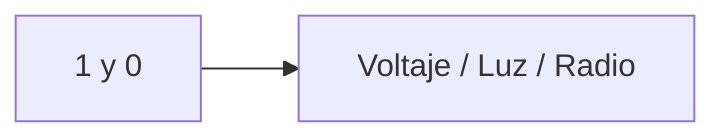
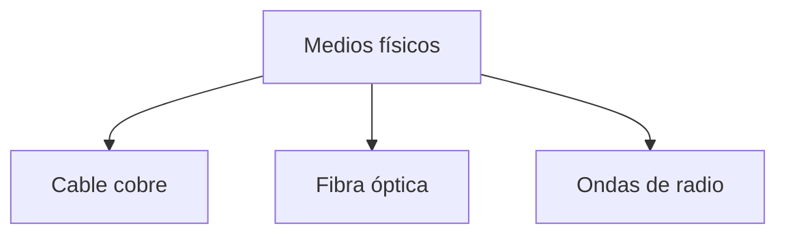
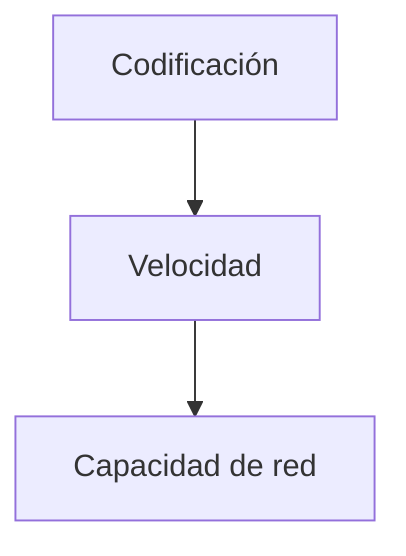

## Dos formas de entender redes

### Idea clave

Existen dos modelos principales: TCP/IP y OSI.

---

## Diferencia fundamental

### Idea clave

Cada modelo tiene un propósito distinto.

---

## Evolución de los modelos

---

## Número de capas

### Idea clave

OSI tiene más detalle que TCP/IP.

---

## Capas del modelo OSI

---

## Comparación con TCP/IP

---

## Enfoque del modelo OSI

### Idea clave

Divide el problema en más partes para entenderlo mejor.

- Más granular
- Más teórico
- Más descriptivo

---

## Capa Física

### Idea clave

Es la capa más cercana al mundo real.

---

## Qué maneja la capa física

### Elementos

---

## Problema clave

### Idea clave

Cómo representar bits en el mundo físico.

---

## Ejemplo de codificación

---

## Tipos de medios

---

## Velocidad de transmisión

### Idea clave

Depende de cómo se codifican los bits.

---

## Insight clave

### Idea clave

Todo Internet empieza en lo físico.

- Bits → señales
- Señales → medio
- Medio → transmisión

---

## Resumen

- Existen dos modelos: TCP/IP y OSI
- TCP/IP es práctico, OSI es teórico
- OSI tiene 7 capas
- TCP/IP tiene 4 capas
- La capa física es la base del modelo OSI
- Se encarga de cables, señales y medios
- Define cómo representar bits físicamente
- Determina la velocidad de transmisión