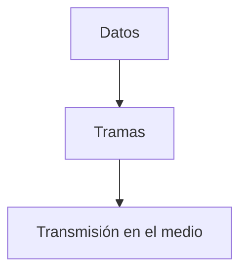
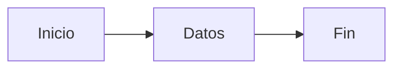
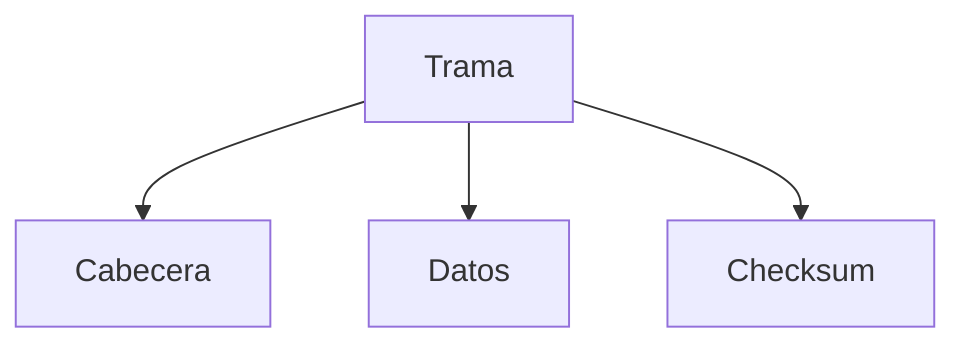
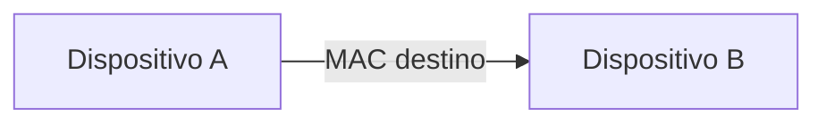
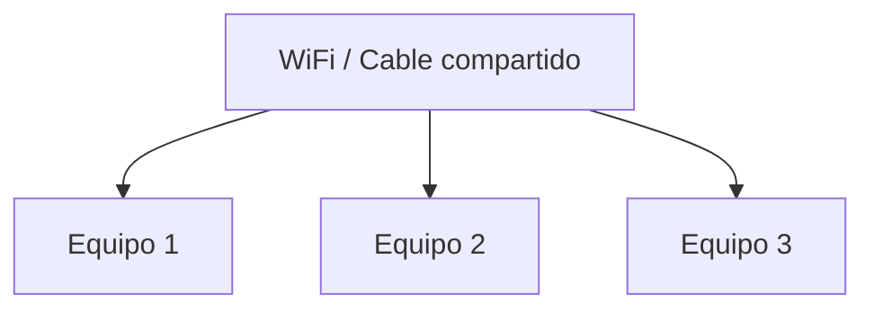
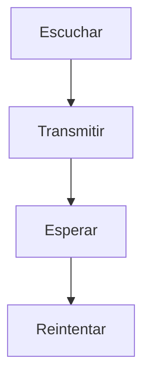
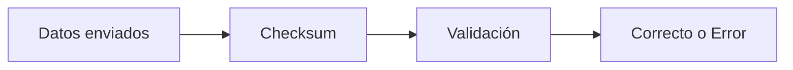
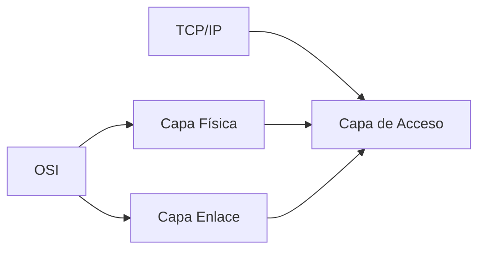

## Idea general

### Idea clave

La capa de Enlace de Datos organiza la comunicación entre dispositivos conectados físicamente.

---

## Qué problema resuelve

Cuando dos dispositivos están conectados físicamente:

- ¿Dónde empieza un paquete?
- ¿Dónde termina?
- ¿Quién puede transmitir?
- ¿Cómo detectamos errores?

---

## Delimitación de datos

### Idea clave

Define el inicio y fin de cada paquete (trama).

---

## Tramas (frames)

### Idea clave

La capa 2 trabaja con **tramas**, no paquetes.

---

## Direcciones en capa 2

### Idea clave

Cada dispositivo tiene una dirección física.

- Dirección MAC
- Identifica dispositivos en la red local

---

## Medio compartido

### Idea clave

Varios dispositivos pueden usar el mismo canal.

---

## Problema: colisiones

Si todos transmiten al mismo tiempo:

- Los datos se corrompen
- Nadie recibe correctamente

---

## Solución: coordinación

### Idea clave

La capa 2 define cómo compartir el medio.

---

## Ejemplo: WiFi / Ethernet

- Escuchar antes de transmitir
- Detectar colisiones
- Reintentar con retraso

---

## Detección de errores

### Idea clave

Se usa un **checksum** para validar datos.

---

## Qué hace el checksum

- Detecta errores en transmisión
- A veces permite corregirlos
- Asegura integridad básica

---

## Relación con TCP/IP

### Idea clave

En TCP/IP, esta capa está incluida en "Acceso".

---

## Insight clave

### Idea clave

La capa 2 convierte señales en comunicación organizada.

- Señales → bits
- Bits → tramas
- Tramas → comunicación confiable local

---

## Resumen

- La capa de Enlace de Datos coordina dispositivos en un mismo medio
- Define inicio y fin de tramas
- Usa direcciones MAC
- Gestiona el acceso al medio compartido
- Detecta errores con checksum
- En TCP/IP forma parte de la capa de Acceso