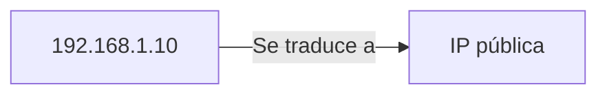
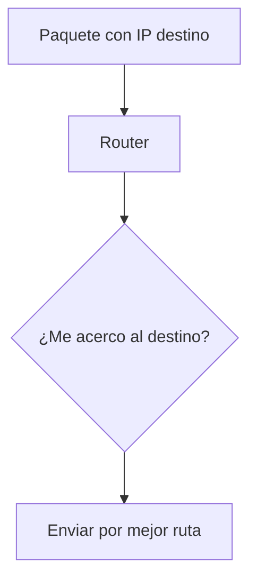
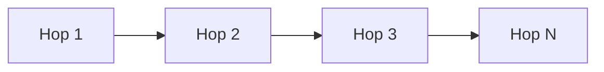
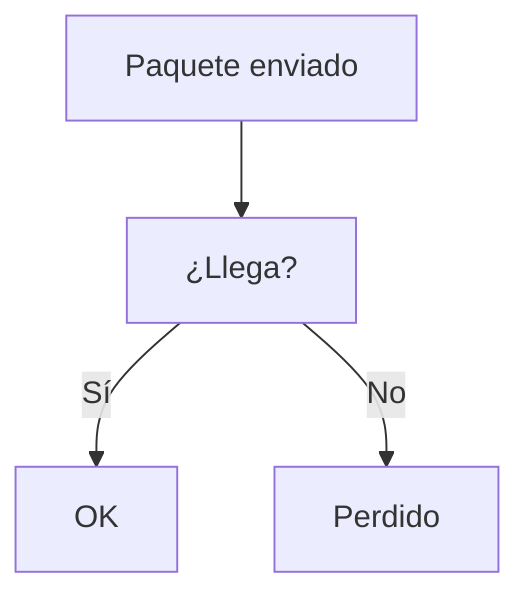
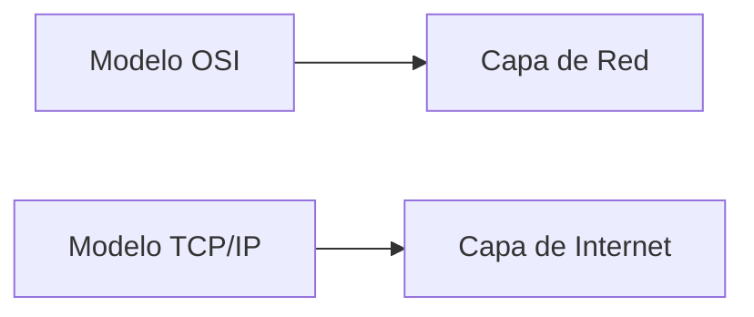

## Idea general

### Idea clave

La capa de Red se encarga de llevar los datos **desde cualquier origen hasta cualquier destino**, incluso a través de múltiples redes.

---

## Qué problema resuelve

Cuando los dispositivos están lejos:

- ¿Cómo llegan los datos hasta otro país?
- ¿Qué camino deben tomar?
- ¿Qué pasa si una ruta falla?

---

## Direccionamiento global

### Idea clave

Cada dispositivo tiene una dirección única en la red global.

- Dirección IP
- Identifica ubicación en Internet

---

## Qué hace un router

### Idea clave

Un router decide el **siguiente salto** del paquete.

---

## Enrutamiento

### Idea clave

Los paquetes no siguen una ruta fija.

- Cada router decide localmente
- Se busca acercarse al destino
- La ruta puede cambiar

---

## Múltiples saltos

### Idea clave

Un paquete viaja pasando por varios routers.

- 5 a 20 saltos típicamente
- Cada salto = decisión independiente

---

## No garantiza entrega

### Idea clave

La capa de Red **no es perfecta**.

- Puede perder paquetes
- Puede enviarlos desordenados
- Puede haber retrasos

---

## ¿Entonces quién arregla eso?

👉 La capa superior: **Transporte (TCP)**

---

## Analogía simple

### Idea clave

Viajar sin plan exacto.

- Tomas decisiones paso a paso
- Te acercas al destino
- A veces cambias de ruta

---

## Relación con TCP/IP

### Idea clave

Equivalente a la capa de Internet (IP)

---

## Insight clave

### Idea clave

La capa de Red **no busca perfección, busca eficiencia**.

- Entrega "lo mejor posible"
- Se adapta a fallos
- Deja la confiabilidad a otra capa

---

## Resumen

- La capa de Red maneja el direccionamiento global (IP)
- Los routers encaminan paquetes entre redes
- Los paquetes viajan en múltiples saltos
- No garantiza entrega ni orden
- Es equivalente a la capa de Internet en TCP/IP