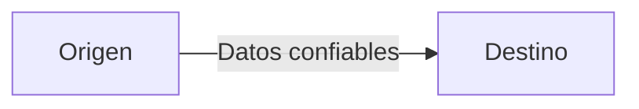
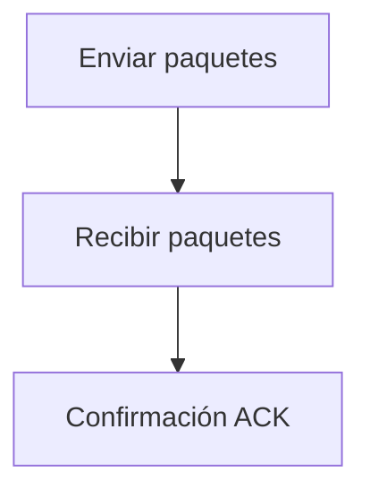
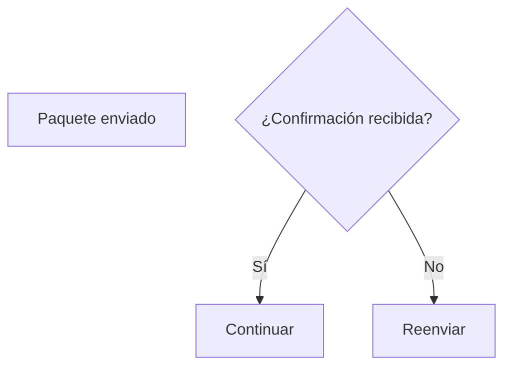
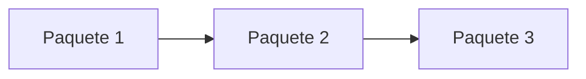
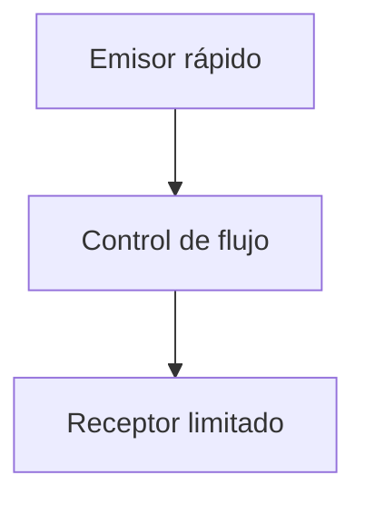
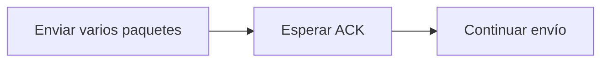
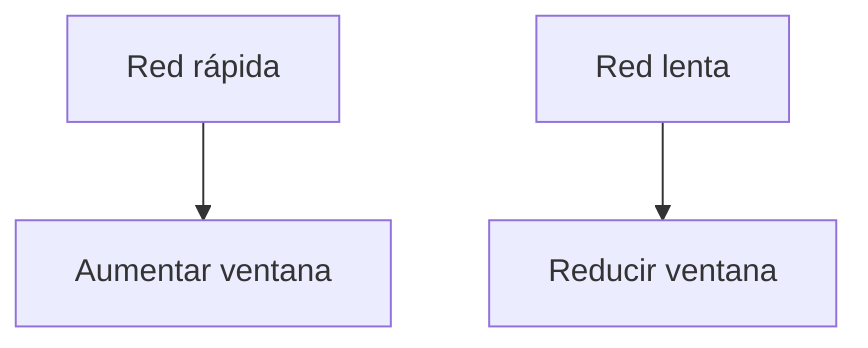
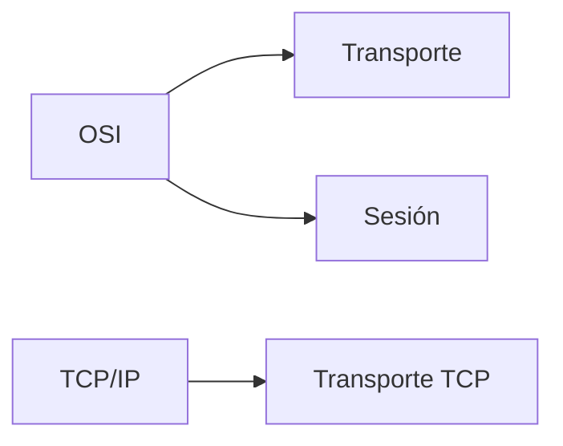

## Idea general

### Idea clave

La capa de Transporte asegura que los datos lleguen **completos, en orden y sin saturar la red**.

---

## Qué problema resuelve

La capa de Red puede:

- Perder paquetes
- Enviar paquetes desordenados
- Retrasar datos

> La capa de Transporte corrige todo esto.

---

## Entrega confiable

### Idea clave

Se asegura de que todos los datos lleguen correctamente.

---

## Manejo de pérdida de paquetes

### Idea clave

Si un paquete no llega, se vuelve a enviar.

---

## Reensamblado

### Idea clave

Ordena los paquetes correctamente.

---

## Control de flujo

### Idea clave

Evita saturar la red o el receptor.

---

## Tamaño de ventana

### Idea clave

Cantidad de datos enviados antes de esperar confirmación.

---

## Ajuste dinámico

### Idea clave

La ventana cambia según la red.

- Red rápida → ventana grande
- Red lenta → ventana pequeña

---

## Qué NO hace

### Idea clave

No decide rutas ni direcciones.

> Eso es trabajo de la capa de Red.

---

## Relación con TCP/IP

### Idea clave

Equivalente a TCP, pero en OSI algunas funciones se separan.

---

## Insight clave

### Idea clave

La capa de Transporte convierte una red imperfecta en una comunicación confiable.

- Detecta errores
- Reenvía datos
- Controla velocidad

---

## Resumen

- Gestiona pérdida de paquetes y reenvío
- Reensambla datos en orden
- Implementa control de flujo
- Usa tamaño de ventana dinámico
- Equivale a TCP en el modelo TCP/IP
- Parte de sus funciones se dividen con la capa de Sesión en OSI