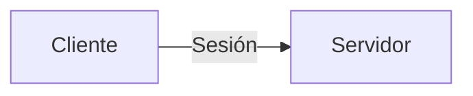
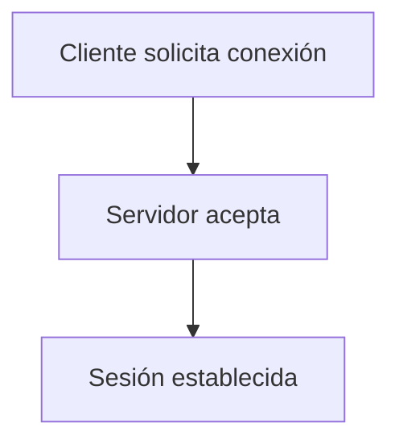
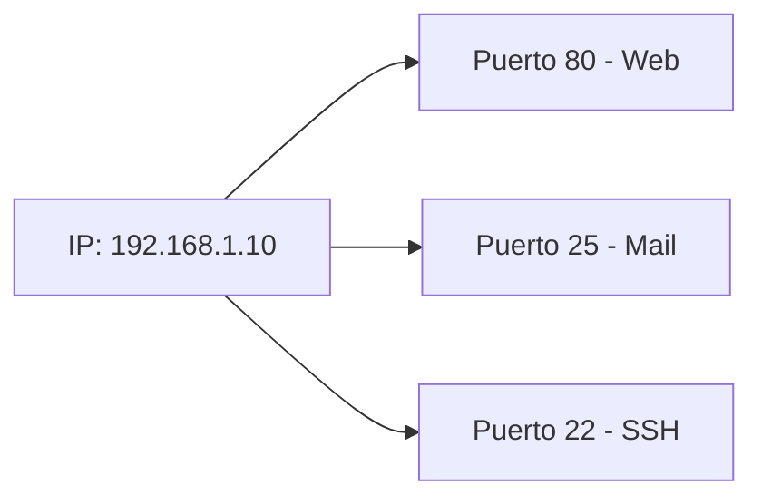
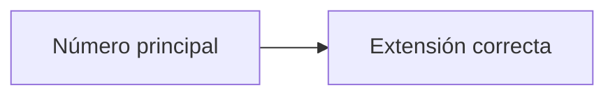
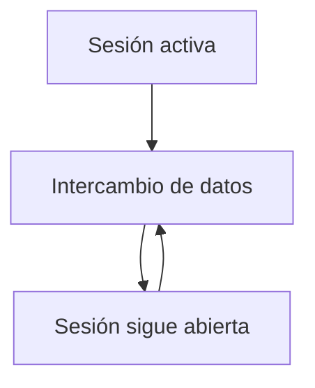
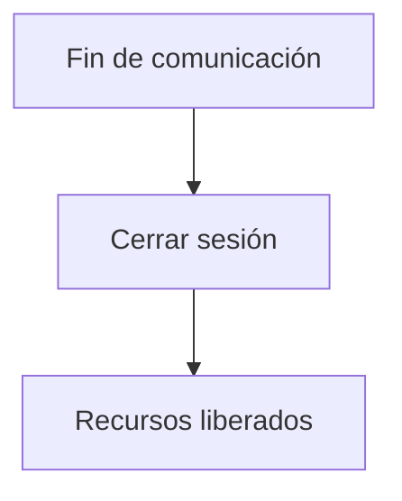
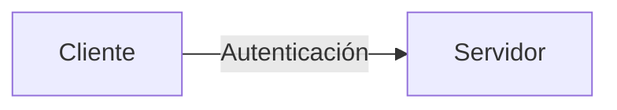
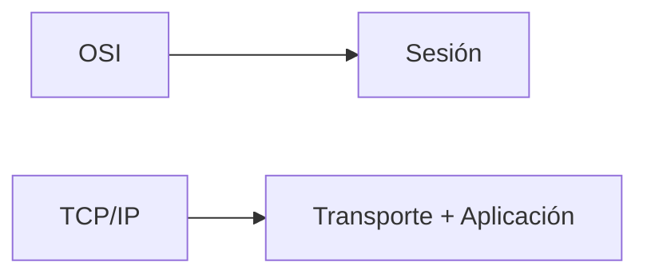

## Idea general

### Idea clave

La capa de Sesión se encarga de **abrir, mantener y cerrar conversaciones entre aplicaciones**.

---

## Qué problema resuelve

Aunque los datos ya pueden viajar correctamente:

- ¿Cómo inicia una conversación?
- ¿Cómo se mantiene activa?
- ¿Cómo se cierra correctamente?
- ¿Cómo conectar con la app correcta dentro del sistema?

---

## Establecimiento de sesión

### Idea clave

Antes de enviar datos, se establece una conexión lógica.

---

## Identificación de aplicaciones

### Idea clave

Usa **puertos** para identificar aplicaciones dentro de un mismo equipo.

- IP → identifica el dispositivo
- Puerto → identifica la aplicación

---

## Analogía simple

### Idea clave

Es como llamar por teléfono a una extensión específica.

---

## Mantenimiento de la sesión

### Idea clave

Mantiene activa la comunicación mientras sea necesaria.

---

## Cierre de sesión

### Idea clave

Finaliza la comunicación de forma ordenada.

---

## Seguridad en sesión

### Idea clave

Algunas funciones de seguridad se manejan aquí.

- Inicio de sesión
- Validación de conexión
- Parte del manejo de conexiones seguras

---

## Relación con TCP/IP

### Idea clave

En TCP/IP, esta capa no existe como tal.

- Sus funciones están integradas en:
    - Transporte (TCP)
    - Aplicación

---

## Insight clave

### Idea clave

La capa de Sesión organiza la conversación, no los datos.

- Decide **con quién hablas**
- Mantiene la conversación activa
- Se asegura de cerrarla correctamente

---

## Resumen

- Establece, mantiene y cierra conexiones entre aplicaciones
- Usa puertos para identificar servicios
- Permite que el cliente encuentre el servidor correcto
- Maneja aspectos básicos de seguridad
- En TCP/IP sus funciones están distribuidas