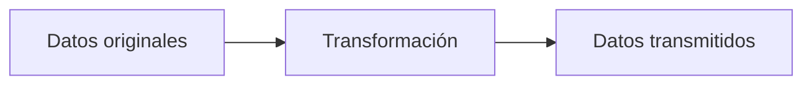
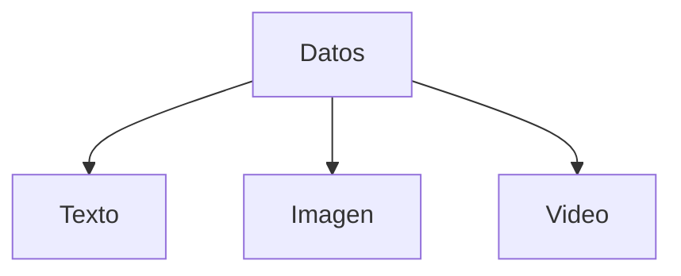
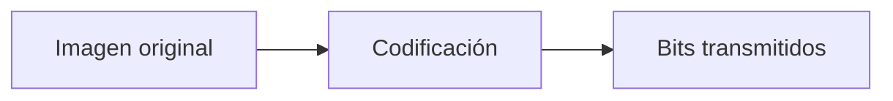
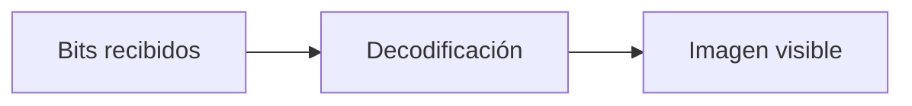
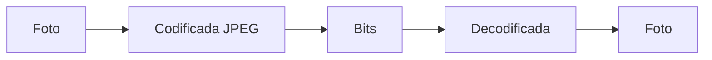
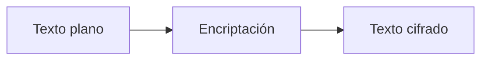
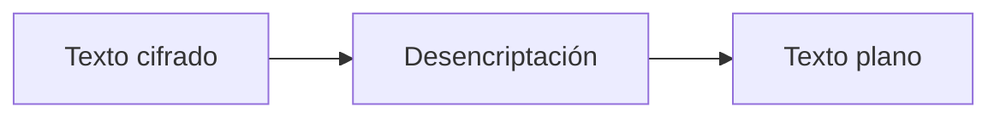
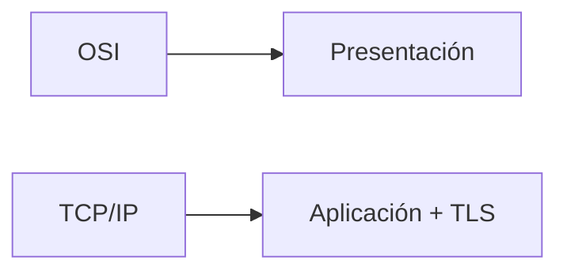

## Idea general

### Idea clave

La capa de Presentación se encarga de que los datos **tengan el formato correcto para ser entendidos por ambos extremos**.

---

## Qué problema resuelve

Aunque los datos ya llegan:

- ¿En qué formato están?
- ¿Cómo interpretarlos correctamente?
- ¿Cómo protegerlos?

---

## Formato de datos

### Idea clave

Define cómo se representan los datos.

Ejemplos:

- Texto → UTF-8
- Imágenes → JPEG, PNG
- Video → MP4

---

## Codificación

### Idea clave

Convierte datos a un formato estándar.

---

## Decodificación

### Idea clave

El receptor reconstruye los datos.

---

## Ejemplo: imágenes

### Idea clave

Un archivo de imagen no se envía como imagen, sino como datos codificados.

---

## Encriptación

### Idea clave

Protege los datos antes de enviarlos.

---

## Desencriptación

### Idea clave

Recupera los datos originales.

---

## Relación con seguridad

### Idea clave

Aquí ocurre gran parte del procesamiento de datos seguros.

- Cifrado
- Compresión (a veces)
- Formatos estándar

---

## Relación con TCP/IP

### Idea clave

No existe como capa separada.

- Sus funciones están en:
    - Aplicación
    - Transporte (TLS/SSL)

---

## Insight clave

### Idea clave

La capa de Presentación traduce los datos.

- Hace que ambos lados "hablen el mismo idioma"
- Asegura que los datos tengan sentido
- Protege la información

---

## Resumen

- Define cómo se representan los datos
- Codifica y decodifica información
- Maneja formatos (texto, imagen, video)
- Implementa encriptación y desencriptación
- En TCP/IP sus funciones están integradas en otras capas