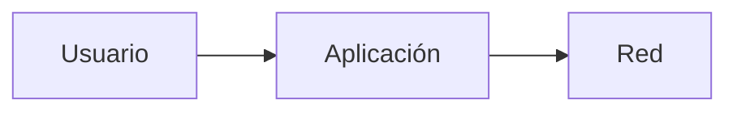
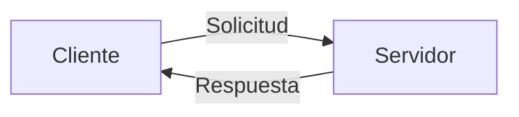
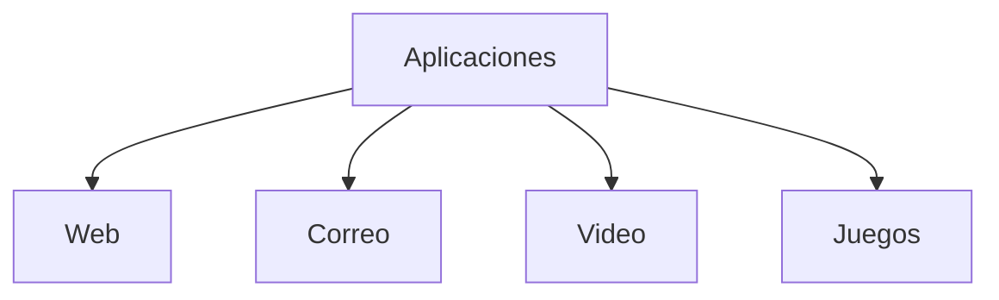
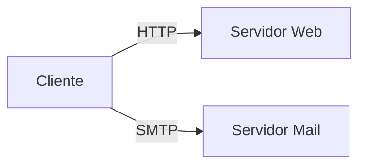
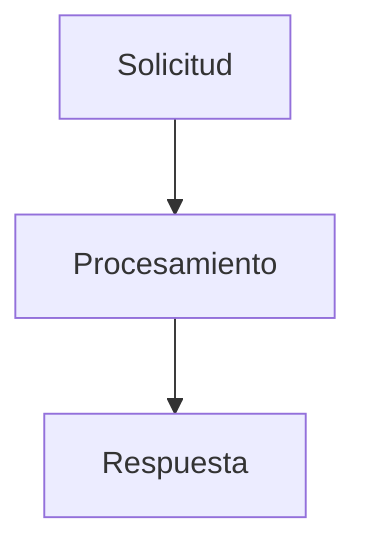
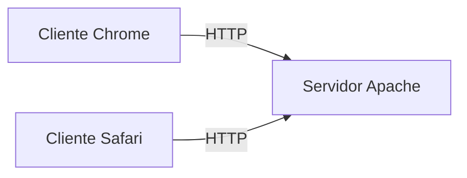
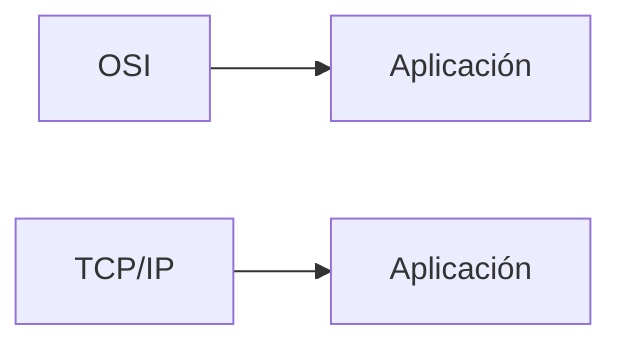

## Idea general

### Idea clave

La capa de Aplicación es donde viven las **aplicaciones que usamos** y donde ocurre la interacción directa con la red.

---

## Qué problema resuelve

Después de mover datos correctamente:

- ¿Qué hacemos con esos datos?
- ¿Cómo los usamos?
- ¿Cómo interactúan las aplicaciones entre sí?

---

## Modelo cliente / servidor

### Idea clave

Las aplicaciones funcionan en pares.

- Cliente → inicia la conexión
- Servidor → responde

---

## Ejemplos de aplicaciones

### Idea clave

Son las herramientas que usamos todos los días.

- Navegadores web
- Apps de correo
- Streaming de video
- Juegos en línea

---

## Protocolos de aplicación

### Idea clave

Definen **cómo se comunican** cliente y servidor.

- HTTP → páginas web
- HTTPS → web segura
- SMTP → envío de correo
- IMAP → lectura de correo

---

## Reglas de comunicación

### Idea clave

Cada protocolo define:

- Qué enviar
- En qué orden
- Cómo responder

---

## Interoperabilidad

### Idea clave

Permite que diferentes sistemas funcionen juntos.

- Diferentes empresas
- Diferentes sistemas operativos
- Diferentes implementaciones

---

## Relación con TCP/IP

### Idea clave

Es equivalente a la capa de Aplicación en TCP/IP.

---

## Insight clave

### Idea clave

La capa de Aplicación es donde la red se vuelve útil.

- Es lo que el usuario ve
- Es donde ocurre la experiencia
- Todo lo demás es soporte

---

## Resumen

- Contiene las aplicaciones que usan la red
- Funciona bajo el modelo cliente/servidor
- Usa protocolos estándar para comunicarse
- Permite interoperabilidad entre sistemas
- Equivale a la capa de Aplicación en TCP/IP