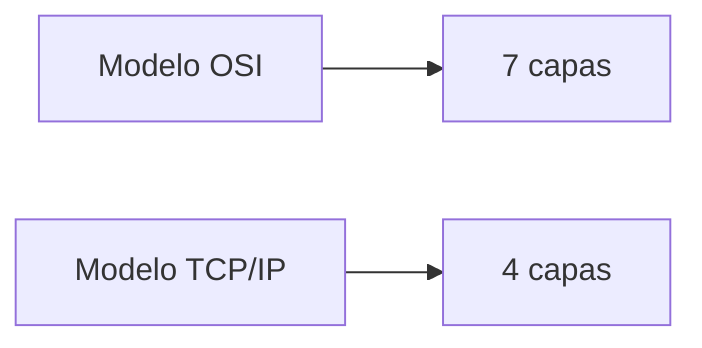
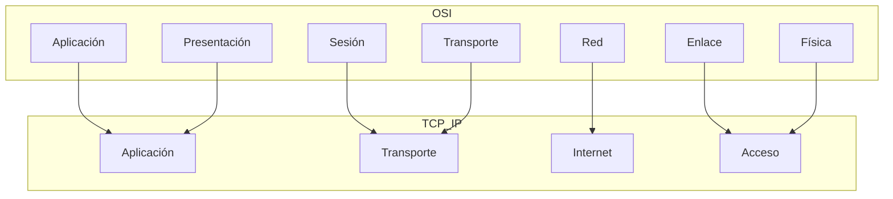
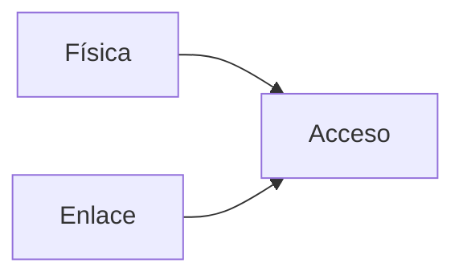
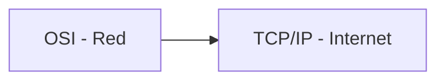
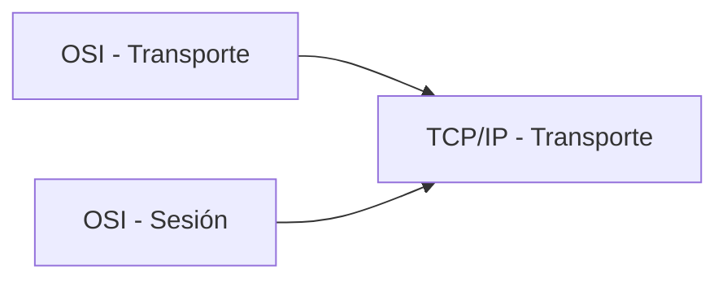
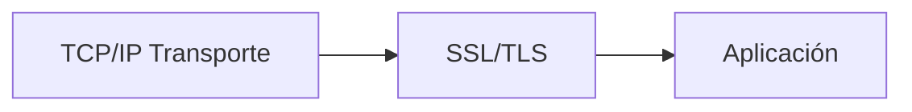
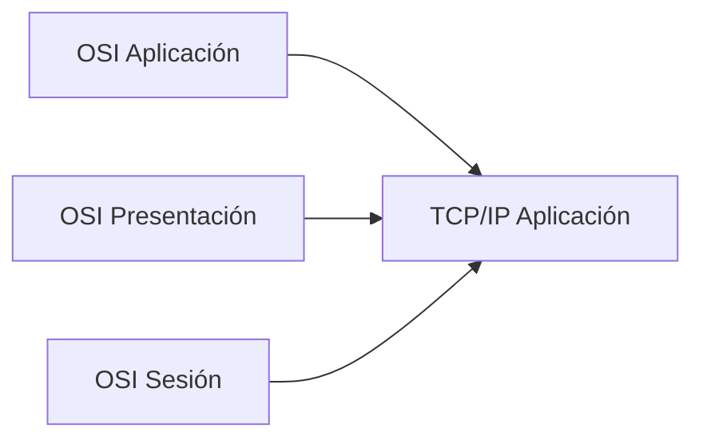
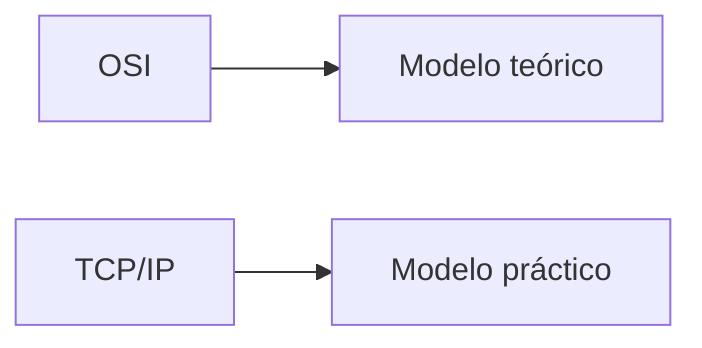

## Idea general

### Idea clave

OSI y TCP/IP describen lo mismo (cómo funciona la red), pero lo organizan de forma diferente.

---

## Comparación directa

### Idea clave

Las capas de ambos modelos se pueden mapear.

---

## Capa de Acceso

### Idea clave

TCP/IP combina dos capas de OSI.

- OSI: Física + Enlace de Datos
- TCP/IP: Acceso

En la práctica:

- WiFi
- Ethernet
- Fibra

Todo suele venir integrado en hardware.

---

## Capa de Red vs Internet

### Idea clave

Son prácticamente equivalentes.

- OSI: Red
- TCP/IP: Internet (IP)

Ambas:

- Usan direcciones IP
- Hacen routing
- Manejan múltiples saltos

---

## Capa de Transporte

### Idea clave

Se divide en OSI, pero se unifica en TCP/IP.

- OSI separa responsabilidades
- TCP/IP simplifica

---

## SSL / TLS

### Idea clave

No es una capa formal en TCP/IP, pero encaja entre capas.

En OSI corresponde a partes de:

- Sesión
- Presentación

---

## Capa de Aplicación

### Idea clave

TCP/IP agrupa varias capas de OSI.

En TCP/IP:

- Formato de datos
- Protocolos
- Lógica de aplicación
todo va junto.

---

## Diferencia filosófica

### Idea clave

Cada modelo tiene un propósito distinto.

---

## OSI

- Más detallado
- Más académico
- Mejor para aprender conceptos

---

## TCP/IP

- Más simple
- Más práctico
- Base del Internet real

---

## Insight clave

TCP/IP simplifica lo que OSI separa.

- Menos capas
- Más implementación real
- Menos abstracción

---

## Resumen

- OSI tiene 7 capas, TCP/IP tiene 4
- TCP/IP combina varias capas de OSI
- Red (OSI) ≈ Internet (TCP/IP)
- Transporte (TCP/IP) ≈ Transporte + Sesión (OSI)
- Aplicación (TCP/IP) ≈ Aplicación + Presentación + Sesión (OSI)
- OSI es teórico, TCP/IP es práctico